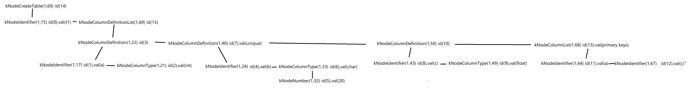

<center><h1>MiniSQL 个人报告</h1></center>

<center>吴修灏，3220104084</center>

## 1. 负责部分

- $\text{Lab 2}$ 的全部模块实现和测试。

- $\text{Lab 4}$ 的全部模块实现和测试。

- $\text{bonus}部分\text{Lab 7}$ 的全部模块实现和测试。

## 2. 个人报告

### 2.1 Lab2: Record Manager

#### 2.1.1 Record

- 列（`Column`）:用于定义和表示数据表中的某一个字段，即包含了这个字段的字段名、字段类型、是否唯一等等；
- 模式（`Schema`）:用于表示一个数据表或是一个索引的结构。一个`Schema`由一个或多个的`Column`构成；
- 域（`Field`）:对应于一条记录中某一个字段的数据信息，如存储数据的数据类型，是否是空，存储数据的值等等；
- 行（`Row`）:与元组的概念等价，用于存储记录或索引键，一个`Row`由一个或多个`Field`构成。


**Record对象的持久化存储**

为了持久化存储Record对象，需要提供这些对象与字节流之间相互转化的函数，即序列化和反序列化操作。序列化将内存中的逻辑数据转换成便于在文件中存储的物理数据，反序列化则从存储的物理数据中恢复逻辑数据。

在`Schema`和`Column`对象中引入魔数`MAGIC_NUM`，用于确认反序列化时生成的对象是否符合预期。

- 对于`Column`对象，存储`MAGIC_NUM`、`name_`、`type_`、`len_`（`kTypeChar`类型字段的最大字段长度）、`table_ind`、`nullable_`、`unique_`数据。
- 对于`Schema`对象，存储`MAGIC_NUM`、`column_count`（字段数）、`columns`(各`Column`对象本身存储的数据)、`is_manage_`数据。
- 对于`Field`对象，存储数据值。
- 对于`Row`对象，存储`null_bitmap`、`fields`(对各非空`Field`对象本身存储的数据进行序列化)。

**测试部分**

利用`test/tuple_test`进行测试，未进行额外测试。

**参考代码**

`column.cpp`
```cpp

uint32_t Column::SerializeTo(char *buf) const {
  uint32_t bytes_written=0;
  //write magic number
  MACH_WRITE_UINT32(buf+bytes_written, COLUMN_MAGIC_NUM);
  bytes_written+=sizeof(uint32_t);

  //write column name
  uint32_t name_length=name_.length();
  memcpy(buf+bytes_written,&name_length,sizeof(uint32_t));
  bytes_written+=sizeof(uint32_t);
  memcpy(buf+bytes_written,name_.c_str(),name_length);
  bytes_written+=name_length;
  
  //write type
  MACH_WRITE_TO(TypeId, buf+bytes_written, type_);
  bytes_written+=sizeof(TypeId);

  //write max byte length for kTypeChar
  if(type_==kTypeChar)
  {
    MACH_WRITE_UINT32(buf+bytes_written, len_);
    bytes_written+=sizeof(uint32_t);
  }

  //write index
  MACH_WRITE_UINT32(buf+bytes_written, table_ind_);
  bytes_written+=sizeof(uint32_t);

  //write nullable
  MACH_WRITE_TO(bool, buf+bytes_written, nullable_);
  bytes_written+=sizeof(bool);

  //write unique
  MACH_WRITE_TO(bool, buf+bytes_written, unique_);
  bytes_written+=sizeof(bool);
  return bytes_written;
}

uint32_t Column::GetSerializedSize() const {
  uint32_t written_bytes;
  written_bytes=sizeof(uint32_t) + sizeof(uint32_t)+name_.length() + sizeof(TypeId) + ((type_==kTypeChar)?sizeof(uint32_t):0) + sizeof(uint32_t) + sizeof(bool) + sizeof(bool);
  return written_bytes;
}

uint32_t Column::DeserializeFrom(char *buf, Column *&column) {
   if (column != nullptr) {
    LOG(WARNING) << "Pointer to column is not null in column deserialize."<<std::endl;
    return 0;
  }

  uint32_t bytes_read=0;

  //read magic number
  uint32_t magic_number=MACH_READ_UINT32(buf+bytes_read);
  bytes_read+=sizeof(uint32_t);
  //check magic number
  if(magic_number!=COLUMN_MAGIC_NUM)
  {
    LOG(WARNING) << "column magic number mismatch in column deserialize"<<std::endl;
    return 0;
  }

  //read column name
  uint32_t name_length=MACH_READ_UINT32(buf+bytes_read);
  bytes_read+=sizeof(uint32_t);
  std::string name(buf+bytes_read, buf+bytes_read+name_length);
  bytes_read+=name_length;

  //read type
  TypeId type=MACH_READ_FROM(TypeId, buf+bytes_read);
  bytes_read+=sizeof(TypeId);

  //read max byte length for kTypeChar
  uint32_t len=0;
  if(type==kTypeChar)
  {
    len=MACH_READ_UINT32(buf+bytes_read);
    bytes_read+=sizeof(uint32_t);
  }

  //read index
  uint32_t index=MACH_READ_UINT32(buf+bytes_read);
  bytes_read+=sizeof(uint32_t);

  //read nullable
  bool nullable=MACH_READ_FROM(bool, buf+bytes_read);
  bytes_read+=sizeof(bool);

  //read unique
  bool unique=MACH_READ_FROM(bool, buf+bytes_read);
  bytes_read+=sizeof(bool);

  if(type==kTypeChar)
  {
    column=new Column(name, type, len, index, nullable, unique);
  }
  else
  {
    column=new Column(name, type, index, nullable, unique);
  }

  return bytes_read;
}
```

`Schema.cpp`
```cpp
uint32_t Schema::SerializeTo(char *buf) const {
  uint32_t bytes_written=0;

  //write magic number
  MACH_WRITE_UINT32(buf+bytes_written, SCHEMA_MAGIC_NUM);
  bytes_written+=sizeof(uint32_t);

  //write column count
  uint32_t column_count=GetColumnCount();
  MACH_WRITE_UINT32(buf+bytes_written, column_count);
  bytes_written+=sizeof(uint32_t);

  //write columns
  for(const auto column:columns_)
  {
    bytes_written+=column->SerializeTo(buf+bytes_written);
  }
  
  //write is_manage_
  MACH_WRITE_TO(bool, buf+bytes_written, is_manage_);
  bytes_written+=sizeof(bool);
  return bytes_written;
}

uint32_t Schema::GetSerializedSize() const {
  uint32_t written_size=0;
  
  written_size+=sizeof(uint32_t);
  
  written_size+=sizeof(uint32_t);

  for(const auto column:columns_)
  {

    written_size+=column->GetSerializedSize();
  }

  written_size+=sizeof(bool);

  return written_size;
}

uint32_t Schema::DeserializeFrom(char *buf, Schema *&schema) {
  if (schema != nullptr) {
    LOG(WARNING) << "Pointer to schema is not null in schema deserialize."<<std::endl;
    return 0;
  }

  uint32_t bytes_read=0;

  //read magic number
  uint32_t magic_number=MACH_READ_UINT32(buf+bytes_read);
  bytes_read+=sizeof(uint32_t);
  if(magic_number!=SCHEMA_MAGIC_NUM)
  {
    LOG(WARNING) << "schema magic number mismatch in schema deserialize"<<std::endl;
    return 0;
  }

  //read column count
  uint32_t column_count=MACH_READ_UINT32(buf+bytes_read);
  bytes_read+=sizeof(uint32_t);

  //read columns
  std::vector<Column *>columns;
  columns.reserve(column_count);
  for(uint32_t i=0;i<column_count;++i)
  {
    Column *column=nullptr;
    uint32_t bytes_column_read=Column::DeserializeFrom(buf+bytes_read,column);
    if(!bytes_column_read)//Failed to deserialize column
    {
      for(auto col:columns)
      {
        delete col;
      }
      LOG(WARNING)<<"column deserialize failed in schema deserialize"<<std::endl;
      return 0;
    }
    columns.push_back(column);
    bytes_read+=bytes_column_read;
  }

  //read is_manage_
  bool is_manage=MACH_READ_FROM(bool, buf+bytes_read);
  bytes_read+=sizeof(bool);

  schema=new Schema(columns, is_manage);
  return bytes_read;
}
```

`row.cpp`
```cpp
uint32_t Row::SerializeTo(char *buf, Schema *schema) const {
  ASSERT(schema != nullptr, "Invalid schema before serialize.");
  ASSERT(schema->GetColumnCount() == fields_.size(), "Fields size do not match schema's column size.");

  uint32_t bytes_written=0;

  uint32_t field_count=GetFieldCount();

  //write null bitmap
  uint8_t null_bitmap[(field_count+7)/8];
  memset(null_bitmap,0,sizeof(null_bitmap));
  for(uint32_t i=0;i<field_count;++i)
  {
    if(fields_[i]->IsNull())
    {
      null_bitmap[i/8]|=(1<<(i%8));
    }
  }
  for(int i=0;i<(field_count+7)/8;++i)
  {
    MACH_WRITE_TO(uint8_t,buf+bytes_written,null_bitmap[i]);
    bytes_written+=sizeof(uint8_t);
  }

  //write field
  for(uint32_t i=0;i<field_count;++i)
  {
    if(fields_[i]->IsNull())continue;
    bytes_written+=fields_[i]->SerializeTo(buf+bytes_written);
  }
  return bytes_written;
}

uint32_t Row::DeserializeFrom(char *buf, Schema *schema) {
  ASSERT(schema != nullptr, "Invalid schema before serialize.");
  ASSERT(fields_.empty(), "Non empty field in row.");

  uint32_t bytes_read=0;

  uint32_t field_count=schema->GetColumnCount();

  //read null bitmap
  bool null_bitmap[(field_count+7)/8];
  for(int i=0;i<(field_count+7)/8;++i)
  {
    null_bitmap[i]=MACH_READ_FROM(uint8_t,buf+bytes_read);
    bytes_read+=sizeof(uint8_t);
  }

  for(uint32_t i=0;i<field_count;++i)
  {
    Field *field=nullptr;
    if(null_bitmap[i/8]&(1<<(i%8)))
    {
      field=new Field(schema->GetColumn(i)->GetType());
    }
    else
    {
      bytes_read+=Field::DeserializeFrom(buf+bytes_read,schema->GetColumn(i)->GetType(),&field,null_bitmap[i]);
    }
    fields_.push_back(field);
  }
  return bytes_read;
}

uint32_t Row::GetSerializedSize(Schema *schema) const {
  ASSERT(schema != nullptr, "Invalid schema before serialize.");
  ASSERT(schema->GetColumnCount() == fields_.size(), "Fields size do not match schema's column size.");
  uint32_t written_size=0;

  uint32_t field_count=fields_.size();

  written_size+=((field_count+7)/8)*sizeof(uint8_t);

  for(uint32_t i=0;i<field_count;++i)
  {
    if(fields_[i]->IsNull())continue;
    written_size+=fields_[i]->GetSerializedSize();
  }

  return written_size;
}
```

#### 2.1.2 TableHeap

堆表(`TableHeap`)是一种将记录以无序堆的形式进行组织的数据结构，由多个数据页（`TablePage`）构成，`TablePage`之间通过双向链表链接（`PrevPageId,NextPageId`）。`RowId`记录了该记录所在的`page_id`和`slot_num`，即所在的数据页和偏移。

每个数据也页由表头(`Table Page Header`)、空闲空间（`Free Space`）和已插入数据(`Inserted Tuples`)三部分组成。表头记录`PrevPageId, NextPageId, FreeSpacePointer`以及每条记录在当前数据页中的偏移和长度。

为实现`TableHeap`，需要完成如下功能

- 对于构造函数，申请一个空白数据页，并将`first_page_id`指向该数据页
- 对于`InsertTuple`操作，先判断序列化的大小是否超过一整个数据页可以放下的大小，如果序列化大小过大则直接返回`false`,表示插入失败。之后，我们遍历`TableHeap`中的每一个数据页，查看当前数据页是否可以放下这个`Tuple`，如果其中有一个数据页成功放下，返回`True`。否则，新建数据页，在其中放入`Tuple`，并将此数据页添加到`TableHeap`中。
- 对于`MarkDelete`, `ApplyDelete`, `RollbackDelete`,`GetTuple`操作，通过输入的`rid`获取对应的数据页，再执行数据页中实现的对应函数即可。
- 对于`UpdateTuple`操作，先尝试是否能在原位置执行更新，如果可以，返回`True`;否则，使用`InsertTuple`在`TableHeap`中插入更新后的数据，再`MarkDelete`原位置的数据。
- `Begin`函数遍历数据页，获取第一个存放`Tuple`的rid，并以`TableIterator`的格式返回。如果始终未找到，返回`End`。
- `End`函数返回`TableIterator`格式的`INVALID_ROWID`。
- 自行在框架中添加`GetNextTupleRid`函数，输入一条记录，利用其`rid`遍历后面的数据页，得到下一条记录的`rid`。

**参考代码**

```cpp
bool TableHeap::InsertTuple(Row &row, Txn *txn) {
  uint32_t serialized_size=row.GetSerializedSize(schema_);
  if(serialized_size>=TablePage::SIZE_MAX_ROW)return 0;
  page_id_t cur_page_id=first_page_id_,prev_page_id=INVALID_PAGE_ID;
  TablePage *page=reinterpret_cast<TablePage *>(buffer_pool_manager_->FetchPage(cur_page_id));
  if(page==nullptr)return 0;
  page->WLatch();
  bool p;
  while(!(p=page->InsertTuple(row,schema_,txn,lock_manager_,log_manager_)))
  {
    page->WUnlatch();
    buffer_pool_manager_->UnpinPage(cur_page_id,0);
    prev_page_id=cur_page_id;
    cur_page_id=page->GetNextPageId();
    if(cur_page_id==INVALID_PAGE_ID)break;
    page=reinterpret_cast<TablePage *>(buffer_pool_manager_->FetchPage(page->GetNextPageId()));
    if(page==nullptr)break;
    page->WLatch();
  }
  if(p)
  {
    page->WUnlatch();
    buffer_pool_manager_->UnpinPage(cur_page_id,1);
    return 1;
  }
  page=reinterpret_cast<TablePage *>(buffer_pool_manager_->NewPage(cur_page_id));
  if(page==nullptr)return 0;
  page->Init(cur_page_id,prev_page_id, log_manager_,txn);
  page->WLatch();
  page->InsertTuple(row,schema_,txn,lock_manager_,log_manager_);
  page->WUnlatch();
  buffer_pool_manager_->UnpinPage(cur_page_id,1);

  page=reinterpret_cast<TablePage *>(buffer_pool_manager_->FetchPage(prev_page_id));
  page->WLatch();
  page->SetNextPageId(cur_page_id);
  page->WUnlatch();
  buffer_pool_manager_->UnpinPage(prev_page_id,1);
  return 1;
}

bool TableHeap::MarkDelete(const RowId &rid, Txn *txn) {
  // Find the page which contains the tuple.
  auto page = reinterpret_cast<TablePage *>(buffer_pool_manager_->FetchPage(rid.GetPageId()));
  // If the page could not be found, then abort the recovery.
  if (page == nullptr) {
    return false;
  }
  // Otherwise, mark the tuple as deleted.
  page->WLatch();
  page->MarkDelete(rid, txn, lock_manager_, log_manager_);
  page->WUnlatch();
  buffer_pool_manager_->UnpinPage(page->GetTablePageId(), true);

  return true;
}

bool TableHeap::UpdateTuple(Row &row, const RowId &rid, Txn *txn) {
  row.SetRowId(rid);
  auto page = reinterpret_cast<TablePage *>(buffer_pool_manager_->FetchPage(rid.GetPageId()));
  if(!page)return 0;
  Row old_row(rid);
  page->WLatch();
  bool is_succeeded=page->UpdateTuple(row, &old_row, schema_, txn, lock_manager_, log_manager_);
  page->WUnlatch();
  if(is_succeeded)
  {
    buffer_pool_manager_->UnpinPage(rid.GetPageId(),true);
    return true;
  }
  else
  {
    buffer_pool_manager_->UnpinPage(rid.GetPageId(),false);
    if(InsertTuple(row,txn))
    {
      MarkDelete(rid,txn);
      return true;
    }
  }
  return is_succeeded;
}

void TableHeap::ApplyDelete(const RowId &rid, Txn *txn) {
  // Step1: Find the page which contains the tuple.
  auto page=reinterpret_cast<TablePage *>(buffer_pool_manager_->FetchPage(rid.GetPageId()));
  if(!page)
  {
    LOG(WARNING) << "Failed to get page in ApplyDelete"<<std::endl;
    return;
  }
  // Step2: Delete the tuple from the page.
  page->WLatch();
  page->ApplyDelete(rid, txn, log_manager_);
  page->WUnlatch();
  buffer_pool_manager_->UnpinPage(rid.GetPageId(),true);
}

void TableHeap::RollbackDelete(const RowId &rid, Txn *txn) {
  // Find the page which contains the tuple.
  auto page = reinterpret_cast<TablePage *>(buffer_pool_manager_->FetchPage(rid.GetPageId()));
  assert(page != nullptr);
  // Rollback to delete.
  page->WLatch();
  page->RollbackDelete(rid, txn, log_manager_);
  page->WUnlatch();
  buffer_pool_manager_->UnpinPage(page->GetTablePageId(), true);
}

bool TableHeap::GetTuple(Row *row, Txn *txn) {
  auto page=reinterpret_cast<TablePage *>(buffer_pool_manager_->FetchPage(row->GetRowId().GetPageId()));
  if(!page)return 0;
  page->RLatch();
  row->destroy();
  bool is_found=page->GetTuple(row,schema_, txn, lock_manager_);
  page->RUnlatch();
  buffer_pool_manager_->UnpinPage(row->GetRowId().GetPageId(),false);
  return is_found;
}

bool TableHeap::GetNextTupleRid(const RowId &rid, RowId *nxt_rid, Txn *txn)
{
  page_id_t cur_page_id=rid.GetPageId();
  TablePage *page=reinterpret_cast<TablePage *>(buffer_pool_manager_->FetchPage(cur_page_id));
  if(!page)
  {
    return 0;
  }
  page->RLatch();
  bool is_found=page->GetNextTupleRid(rid, nxt_rid);
  while(!is_found)
  {
    page_id_t nxt_page_id=page->GetNextPageId();
    page->RUnlatch();
    buffer_pool_manager_->UnpinPage(cur_page_id,false);
    if(nxt_page_id==INVALID_PAGE_ID)
    {
      return 0;
    }
    cur_page_id=nxt_page_id;
    page=reinterpret_cast<TablePage *>(buffer_pool_manager_->FetchPage(cur_page_id));
    if(!page)
    {
      return 0;
    }
    page->RLatch();
    is_found=page->GetFirstTupleRid(nxt_rid);
  }
  page->RUnlatch();
  buffer_pool_manager_->UnpinPage(cur_page_id, false);
  return 1;
}

void TableHeap::DeleteTable(page_id_t page_id) {
  if (page_id != INVALID_PAGE_ID) {
    auto temp_table_page = reinterpret_cast<TablePage *>(buffer_pool_manager_->FetchPage(page_id));  // 删除table_heap
    if (temp_table_page->GetNextPageId() != INVALID_PAGE_ID)
      DeleteTable(temp_table_page->GetNextPageId());
    buffer_pool_manager_->UnpinPage(page_id, false);
    buffer_pool_manager_->DeletePage(page_id);
  } else {
    DeleteTable(first_page_id_);
  }
}

TableIterator TableHeap::Begin(Txn *txn) {
  page_id_t cur_page_id=GetFirstPageId();
  while(cur_page_id!=INVALID_PAGE_ID)
  {
    TablePage *page=reinterpret_cast<TablePage *>(buffer_pool_manager_->FetchPage(cur_page_id));
    if(!page)
    {
      LOG(WARNING) << "Failed to get page in ApplyDelete"<<std::endl;
      return End();
    }
    page->RLatch();
    RowId first_rid;
    bool is_found=page->GetFirstTupleRid(&first_rid);
    if(is_found)
    {
      TableIterator first_iterator(this, first_rid, txn);
      page->RUnlatch();
      buffer_pool_manager_->UnpinPage(cur_page_id,false);
      return TableIterator(first_iterator);
    }
    page_id_t nxt_page_id=page->GetNextPageId();
    page->RUnlatch();
    buffer_pool_manager_->UnpinPage(cur_page_id, false);
    cur_page_id=nxt_page_id;
  }
  return End();
}

TableIterator TableHeap::End() { return TableIterator(nullptr, RowId(INVALID_PAGE_ID, 0), nullptr); }
```
#### 2.1.3 TableIterator

从`TableHeap`的第一条记录开始，依次遍历所有记录

TableIterator中存放对应的`TableHeap`，当前记录的`row`和`rid`,以及对应的事务`txn`。

- 带参数构造和拷贝构造中，创建一个新的`Row*`对象指向对应的`rid`
- 析构中，删除对应的`Row*`指针
- `==`和`!=`运算符重载中，判断两个`TableIterator`对象相等的依据是两者的`TableHeap`相同、`rid`相同或共同指向`INVALID_PAGE_ID`。
- 对于`*`和`->`运算符重载，返回对应的`Row`或`Row*`成员变量。
- 对于`=`运算符重载，将当前`TableIterator`的成员变量赋值为传入的变量。
- 对于`iter++`和`++iter`操作，利用`TableHeap`中实现的`GetNextTupleRid`函数找到下一个元组所在的位置，并指向那一个元组。如果始终未找到，返回`TableHeap::End()`。

**测试部分**

和`TableHeap`一同在`table_heap_test.cpp`中进行测试。然而，原测试仅测试了`InsertTuple`、`GetTuple`和迭代器相关的部分。添加对于`UpdataTuple`和`Delete`相关功能的测试

测试代码如下：
```cpp
static string db_file_name = "table_heap_test.db";
using Fields = std::vector<Field>;

TEST(TableHeapTest, TableHeapSampleTest) {
  // init testing instance
  remove(db_file_name.c_str());
  auto disk_mgr_ = new DiskManager(db_file_name);
  auto bpm_ = new BufferPoolManager(DEFAULT_BUFFER_POOL_SIZE, disk_mgr_);
  const int row_nums = 10000;
  // create schema
  std::vector<Column *> columns = {new Column("id", TypeId::kTypeInt, 0, false, false),
                                   new Column("name", TypeId::kTypeChar, 64, 1, true, false),
                                   new Column("account", TypeId::kTypeFloat, 2, true, false)};
  auto schema = std::make_shared<Schema>(columns);
  // create rows
  std::unordered_map<int64_t, Fields *> row_values;
  
  RowId row_ids[row_nums];

  uint32_t size = 0;
  TableHeap *table_heap = TableHeap::Create(bpm_, schema.get(), nullptr, nullptr, nullptr);
  for (int i = 0; i < row_nums; i++) {
    int32_t len = RandomUtils::RandomInt(0, 64);
    char *characters = new char[len];
    RandomUtils::RandomString(characters, len);
    Fields *fields =
        new Fields{Field(TypeId::kTypeInt, i), Field(TypeId::kTypeChar, const_cast<char *>(characters), len, true),
                   Field(TypeId::kTypeFloat, RandomUtils::RandomFloat(-999.f, 999.f))};
    Row row(*fields);
    ASSERT_TRUE(table_heap->InsertTuple(row, nullptr));
    if (row_values.find(row.GetRowId().Get()) != row_values.end()) {
      std::cout << row.GetRowId().Get() << std::endl;
      ASSERT_TRUE(false);
    } else {
      row_values.emplace(row.GetRowId().Get(), fields);
      row_ids[i]=row.GetRowId();
      size++;
    }
    delete[] characters;
  }

  ASSERT_EQ(row_nums, row_values.size());
  ASSERT_EQ(row_nums, size);

  std::unordered_map<int64_t, Fields *> row_values2;
  for (auto row_kv : row_values) {
    size--;
    Row row(RowId(row_kv.first));
    table_heap->GetTuple(&row, nullptr);
    ASSERT_EQ(schema.get()->GetColumnCount(), row.GetFields().size());
    for (size_t j = 0; j < schema.get()->GetColumnCount(); j++) {
      ASSERT_EQ(CmpBool::kTrue, row.GetField(j)->CompareEquals(row_kv.second->at(j)));
    }
    // free spaces
    delete row_kv.second;
  }
  ASSERT_EQ(size, 0);

  int count=0;
  for(int i=0;i<row_nums;++i)
  {
    int32_t len = RandomUtils::RandomInt(0, 64);
    char *characters = new char[len];
    RandomUtils::RandomString(characters, len);
    Fields *fields =
        new Fields{Field(TypeId::kTypeInt, i), Field(TypeId::kTypeChar, const_cast<char *>(characters), len, true),
                   Field(TypeId::kTypeFloat, RandomUtils::RandomFloat(-999.f, 999.f))};
    Row row(*fields);
    ASSERT_EQ(true, table_heap->UpdateTuple(row,row_ids[i],nullptr));
    ASSERT_EQ(false, row.GetRowId().GetPageId()==INVALID_PAGE_ID);
    row_values2.emplace(row.GetRowId().Get(),fields);
    delete[] characters;
    ++count;
  }
  ASSERT_EQ(true, count==row_nums);

  for(auto row_kv:row_values2)
  {
    Row row(RowId(row_kv.first));
    table_heap->GetTuple(&row, nullptr);
    ASSERT_EQ(schema.get()->GetColumnCount(), row.GetFields().size());
    for (size_t j = 0; j < schema.get()->GetColumnCount(); j++) {
      ASSERT_EQ(CmpBool::kTrue, row.GetField(j)->CompareEquals(row_kv.second->at(j)));
    }
    table_heap->ApplyDelete(row.GetRowId(),nullptr);
    ASSERT_EQ(false, table_heap->GetTuple(&row, nullptr));
    count--;
  }
  ASSERT_EQ(0,count);
}

```

**参考代码**

```cpp
TableIterator::TableIterator(TableHeap *table_heap, RowId rid, Txn *txn):table_heap_(table_heap),rid_(rid),txn_(txn),cur_row_(nullptr) {
  cur_row_=new Row(rid);
  if(table_heap!=nullptr)
  {
    table_heap->GetTuple(cur_row_, txn);
  }
}

TableIterator::TableIterator(const TableIterator &other):table_heap_(other.table_heap_),rid_(other.rid_),txn_(other.txn_),cur_row_(nullptr) {
    cur_row_=new Row(rid_);
    if(other.cur_row_!=nullptr)
    {
      *cur_row_=*other.cur_row_;
    }
}

TableIterator::~TableIterator() {
  delete cur_row_;
}

bool TableIterator::operator==(const TableIterator &itr) const {
  return (table_heap_==itr.table_heap_)&&((rid_.GetPageId()==INVALID_PAGE_ID&&itr.rid_.GetPageId()==INVALID_PAGE_ID)||rid_==itr.rid_);
}

bool TableIterator::operator!=(const TableIterator &itr) const {
  return !(*this==itr);
}

const Row &TableIterator::operator*() {
  ASSERT(cur_row_!=nullptr,"Dereferencing a null iterator");
  return *cur_row_;
}

Row *TableIterator::operator->() {
  ASSERT(cur_row_!=nullptr, "Accessing a null iterator");
  return cur_row_;
}

TableIterator &TableIterator::operator=(const TableIterator &itr) noexcept {
  if(this!=&itr)
  {
    table_heap_=itr.table_heap_;
    rid_=itr.rid_;
    txn_=itr.txn_;
    cur_row_->SetRowId(rid_);
    if(itr.cur_row_!=nullptr)*cur_row_=*itr.cur_row_;
  }
  return *this;
}

// ++iter
TableIterator &TableIterator::operator++() {
  ASSERT(cur_row_!=nullptr, "Incrementing a null iterator");
  RowId nxt_rid;
  if(table_heap_->GetNextTupleRid(rid_, &nxt_rid, txn_))
  {
    rid_=nxt_rid;
    cur_row_->SetRowId(rid_);
    if(table_heap_!=nullptr)table_heap_->GetTuple(cur_row_,txn_);
  }
  else
  {
    *this=TableIterator(nullptr, RowId(INVALID_PAGE_ID, 0), nullptr);
  }
  return *this;
}

// iter++
TableIterator TableIterator::operator++(int) {
  TableIterator tmp=TableIterator(*this);
  ++(*this);
  return TableIterator(tmp);
}
```


#### 2.1.5 clock_replacer

`clock_replacer` 时钟替换算法是 $\text{LRU}$ 的一种近似。我按照 $\text{LRU}$ 的框架，同样实现了 `Victim`，`Pin`，`Unpin` 和 `Size` 函数。

我的思路和 $\text{LRU}$ 类似，使用 `std::list<pair<frame_id_t, bool> >` 来实现一个环形的顺序结构，其中 `bool` 就是时钟替换算法中的 `reference bit`。`std::unordered_map<frame_id_t, list<pair<frame_id_t, bool> >::iterator>` 用于映射 `frame_id` 到 `list` 中的位置。这样我们就可以在平均时间 $O(1)$ 的时间复杂度内找到页面的位置，方便进行 `Pin` 和 `Unpin`。为了表示始终替换算法当前的位置，我使用了迭代器 `clock_pointer_`，指向当前的位置。

根据摊还分析，`Victim` 的时间复杂度为 $O(1)$。`Pin` 和 `Unpin` 的平均时间复杂度也为 $O(1)$，所以单次操作的时间复杂度为 $O(1)$。 

具体实现可参考代码。

**测试部分**

我仿照 `lru_replacer` 的测试代码，写了如下的测试：

```cpp
TEST(CLOCKReplacerTest, SampleTest) {
  CLOCKReplacer clock_replacer(7);

  // Scenario: unpin six elements, i.e. add them to the replacer.
  clock_replacer.Unpin(1);
  clock_replacer.Unpin(2);
  clock_replacer.Unpin(3);
  clock_replacer.Unpin(4);
  clock_replacer.Unpin(5);
  clock_replacer.Unpin(6);
  clock_replacer.Unpin(1);
  EXPECT_EQ(6, clock_replacer.Size());

  // Scenario: get three victims from the lru.
  int value;
  clock_replacer.Victim(&value);
  EXPECT_EQ(1, value);
  clock_replacer.Victim(&value);
  EXPECT_EQ(2, value);
  clock_replacer.Victim(&value);
  EXPECT_EQ(3, value);

  // Scenario: pin elements in the replacer.
  // Note that 3 has already been victimized, so pinning 3 should have no effect.
  clock_replacer.Pin(3);
  clock_replacer.Pin(4);
  EXPECT_EQ(2, clock_replacer.Size());

  // Scenario: unpin 4. We expect that the reference bit of 4 will be set to 1.
  clock_replacer.Unpin(4);

  // Scenario: continue looking for victims. We expect these victims.
  clock_replacer.Victim(&value);
  EXPECT_EQ(5, value);
  clock_replacer.Victim(&value);
  EXPECT_EQ(6, value);
  clock_replacer.Victim(&value);
  EXPECT_EQ(4, value);
}
```

测试通过。最后我们在完成了所有的模块后，将 `clock_replacer` 用于 `buffer_pool_manager` 中，也通过了所有的测试。

关于运行速度：实测并无太大的差别。可能是因为在两种算法的实现中，我们都用了 `unordered_map` 来映射 `frame_id` 到 `list` 中的位置，大大加速了查找的速度。不过相信在实际的数据库系统中，`clock_replacer` 的性能会更好一些。

**参考代码**

- `pushClock`

首先为了实现环形结构，我们需要一个 `pushClock` 函数，用于将时钟指针向前移动。我们只需要在 `clock_pointer_++` 之后判断是否到达了 `clock_list_.end()` 即可。如果是，则将指针指向 `clock_list_.begin()`。

```cpp
void CLOCKReplacer::pushClock() {
  clock_pointer_++;
  if (clock_pointer_ == clock_list_.end()) {
    clock_pointer_ = clock_list_.begin();
  }
}
```

- `Victim`

`Victim` 函数是时钟替换算法的核心。我们需要找到一个页面进行替换。我们需要找到第一个 `reference bit` 为 `false` 的页面，然后将其替换。如果没有找到，则将 `reference_bit` 置为 `false`，并将时钟指针向前移动。

```cpp
bool CLOCKReplacer::Victim(frame_id_t *frame_id) {
  if (clock_list_.empty()) {
    return false;
  }
  while (true) {
    if (clock_pointer_->second == false) {
      *frame_id = clock_pointer_->first;
      clock_pointer_ = clock_list_.erase(clock_pointer_);
      clock_map_.erase(*frame_id);
      if (clock_pointer_ == clock_list_.end()) {
        clock_pointer_ = clock_list_.begin();
      }
      return true;
    } else {
      clock_pointer_->second = false;
      pushClock();
    }
  }
}
```

- `Pin`

如果页面在 `clock_map_` 中，我们需要将其从 `clock_list_` 中删除。如果 `clock_pointer_` 指向了该页面，我们需要将时钟指针向前移动。

```cpp
void CLOCKReplacer::Pin(frame_id_t frame_id) {
  auto it = clock_map_.find(frame_id);
  if (it != clock_map_.end()) {
    if (it->second == clock_pointer_) {
      pushClock();
    }
    clock_list_.erase(it->second);
    clock_map_.erase(it);
  }
}
```

- `Unpin`

如果页面不在 `clock_map_` 中，我们需要将其插入到 `clock_list_` 中，并且 `reference_bit` 置为 `true`，而且得在当前时钟指针的位置之前插入。如果 `clock_list_` 为空，我们需要将时钟指针指向该位置。注意

```cpp
void CLOCKReplacer::Unpin(frame_id_t frame_id) {
  if (clock_map_.find(frame_id) == clock_map_.end()) {
    assert(clock_list_.size() < capacity_);
    list<pair<frame_id_t, bool> >::iterator it;
    if (clock_list_.empty()) {
      it = clock_pointer_ = clock_list_.insert(clock_list_.begin(), make_pair(frame_id, true));
    } else {
      it = clock_list_.insert(clock_pointer_, make_pair(frame_id, true));
    }
    clock_map_[frame_id] = it;
  } else {
    clock_map_[frame_id]->second = true;
  }
}
```

- `Size`

返回 `clock_list_` 的大小即可。

```cpp
size_t CLOCKReplacer::Size() {
  return clock_list_.size();
}
```

### 2.2 Lab3

我在队友编写的基础上进行了一些辅助 Debug。其中一个测试点的问题出在 `disk_manager`，也就是上述的易错点 $1$。由于不同的 `disk_manager` 之间没有共享元数据，所以导致了错误。

### 2.3 Lab4

我在队友编写的基础上进行了一些辅助 Debug。其中一个测试点的问题出在 `buffer_pool_manager`，也就是上述的易错点 $3$。队友发现对 `buffer_pool` 的一些修改没有被正确写回磁盘，导致 `catalog` 无法正确读取。因此我定位到了 `buffer_pool_manager` 的 `FlushPage` 函数，发现没有将脏页写回磁盘，从而意识到了问题。

### 2.4 Lab5

#### 2.4.1 parser & executor

这一部分框架里已经实现。

#### 2.4.2 execute_engine

`execute_engine` 是整个项目的核心部分。它负责解析 SQL 语句，生成执行计划，执行执行计划，输出结果。这一部分的实现主要是基于 `parser` 和 `executor` 的实现。`execute_engine` 会根据 SQL 语句的类型，调用不同的执行函数。

我需要完成的是 `ExecuteCreateTable`，`ExecuteDropTable`，`ExecuteShowIndexes`，`ExecuteCreateIndex`，`ExecuteDropIndex`，`ExecuteExecfile`，`ExecuteQuit` 等执行函数。其中 `ExecuteTrxBegin`，`ExecuteTrxCommit`，`ExecuteTrxRollback` 是事务相关，本次项目不需要实现。

每一个函数的输入是一个语法树节点 `ast` 和一个执行上下文 `context`。`context` 包含了当前的数据库信息。`ast` 包含了 SQL 语句的具体信息。

具体实现细节和思路我会在**参考代码**这一部分中一一解释和给出。

**测试部分**

对于 `execute_engine` 部分，框架没有配套的测试，只有对框架内已经实现的算子的测试。所以这个测试可以用来检验前面 $\text{Lab}\ 1\sim 4$ 的正确性。

一开始我们没有通过算子部分的测试，在 debug 的过程中我定位了 $\text{Lab 1}$ 的问题，也就是易错点 $2$。队友 $\text{Lab 4}$ 的上层接口期待底层的 `buffer_pool_manager` 能够正确处理 `INVALID_PAGE_ID`，但是我的实现中没有考虑到这一点，因此产生了 `Segmentation Fault`。在解决了这个问题后，我们通过了 $\text{Lab}\ 1 \sim 5$ 所有的测试。

**参考代码**

- `ExecuteCreateTable`

文档中并没有给出 `Create Table` 的具体语法树，而且由于我不熟悉语法树的结构，所以我使用了框架中内置的 `printTree` 函数（事实上在 `main` 中就有打印的部分）。由于结构错综复杂，为了方便代码编写，我将 `create table t1(a int, b char(20) unique, c float, primary key(a, c));` 的语法树绘图如下：



知道了结构后，我们就可以根据结构来编写代码。我总结出的细节如下：

- `unique` 和 `primary keys` 的处理。`unique` 和 `primary keys` 的列全部需要建立 `index`。注意建立 `index` 的时候传入的是 `vector<string>`。

- `primary keys` 的列需要设置为 `not null`。

- `char` 类型的长度需要合法。不能是小数、负数和 $0$。

- `type` 类型需要合法。

- 如果一个列没有设置 `unique`，那么其对应语法树节点的 `val_` 会指向 `nullptr`。所以如果不特殊判断会出现 `segmentation fault`。

具体实现如下：

```cpp
dberr_t ExecuteEngine::ExecuteCreateTable(pSyntaxNode ast, ExecuteContext *context) {
#ifdef ENABLE_EXECUTE_DEBUG
  LOG(INFO) << "ExecuteCreateTable" << std::endl;
#endif
  if (current_db_.empty()) {
    cout << "No database selected." << endl;
    return DB_FAILED;
  }
  vector<string> primary_key, unique_key;
  vector<Column *> columns;
  pSyntaxNode node = ast->child_;
  string table_name = node->val_;
  int index = 0;
  for (node = node->next_->child_; node != nullptr; node = node->next_, index++) {
    string column_name;
    TypeId type;
    uint32_t length = -1;
    bool unique = node->val_ != nullptr ? (strcmp(node->val_, "unique") == 0) : 0, nullable = 1;
    if (node->val_ != nullptr && !strcmp(node->val_, "primary keys")) {
      for (pSyntaxNode key = node->child_; key != nullptr; key = key->next_) {
        primary_key.push_back(key->val_);
      }    
    } else {
      pSyntaxNode name_node = node->child_;
      pSyntaxNode type_node = name_node->next_;
      column_name.assign(name_node->val_);
      type = to_type(type_node->val_);
      if (type == kTypeChar) {
        string len_str = type_node->child_->val_;
        if (len_str.find_first_of('.') != string::npos || len_str.find_first_of('-') != string::npos){
          cout << "Invalid length for char type." << endl;
          return DB_FAILED;
        }
        length = stoi(len_str);
        if (length <= 0) {
          cout << "Invalid length for char type." << endl;
          return DB_FAILED;
        }
      }
      if (type == kTypeInvalid) {
        cout << "Invalid type." << endl;
        return DB_FAILED;
      }
      if (~length) {
        columns.push_back(new Column(column_name, type, length, index, nullable, unique));
      } else {
        columns.push_back(new Column(column_name, type, index, nullable, unique));
      }
    }
    if (unique) {
      unique_key.push_back(column_name);
    }
  }
  if (!primary_key.empty()) {
    for (const auto &key : primary_key) {
      bool found = false;
      for (const auto &column : columns) {
        if (column->GetName() == key) {
          found = true;
          column->SetIsNullable(false);
          break;
        }
      }
      if (!found) {
        cout << "Primary key not found." << endl;
        return DB_FAILED;
      }
    }
  }
  auto *schema = new Schema(columns);
  auto *table = TableInfo::Create();
  auto err = context->GetCatalog()->CreateTable(table_name, schema, nullptr, table);
  if (err != DB_SUCCESS) {
    return err;
  }
  int cnt = 0;
  for (auto i : unique_key) {
    auto *index = IndexInfo::Create();
    auto err = context->GetCatalog()->CreateIndex(table_name, "unique_index_" + to_string(cnt++), {i}, nullptr, index, "bptree");
    if (err != DB_SUCCESS) {
      return err;
    }
  }
  auto *indexInfo = IndexInfo::Create();
  err = context->GetCatalog()->CreateIndex(table_name, "primary_key_index", primary_key, nullptr, indexInfo, "bptree");
  if (err != DB_SUCCESS) {
    return err;
  }
  cout << "Table " << table_name << " created successfully." << endl;
}
```

- `ExecuteDropTable`

`Drop Table` 的语法树非常简单，只需要调用 `DropTable` 函数即可。

```cpp
dberr_t ExecuteEngine::ExecuteDropTable(pSyntaxNode ast, ExecuteContext *context) {
#ifdef ENABLE_EXECUTE_DEBUG
  LOG(INFO) << "ExecuteDropTable" << std::endl;
#endif
  if (current_db_.empty()) {
    cout << "No database selected." << endl;
    return DB_FAILED;
  }
  string table_name = ast->child_->val_;
  auto err = context->GetCatalog()->DropTable(table_name);
  if (err != DB_SUCCESS) {
    return err;
  }
  cout << "Table " << table_name << " dropped successfully." << endl;
  return DB_SUCCESS;
}
```

- `ExecuteShowIndexes`

由于我们只能通过 `TableInfo` 来获取索引信息，所以我们需要遍历所有的表，然后遍历所有的索引，输出即可。

```cpp
dberr_t ExecuteEngine::ExecuteShowIndexes(pSyntaxNode ast, ExecuteContext *context) {
#ifdef ENABLE_EXECUTE_DEBUG
  LOG(INFO) << "ExecuteShowIndexes" << std::endl;
#endif
  if (current_db_.empty()) {
    cout << "No database selected." << endl;
    return DB_FAILED;
  }
  int count = 0;
  vector<TableInfo*> tables;
  context->GetCatalog()->GetTables(tables);
  for (const auto &table : tables) {
    vector<IndexInfo*> indexes;
    context->GetCatalog()->GetTableIndexes(table->GetTableName(), indexes);
    for (const auto &index : indexes) {
      cout << "Table: " << table->GetTableName() << " Index: " << index->GetIndexName() << endl;
      count++;
    }
  }
  if (count == 0) {
    cout << "Empty set (0.00 sec)" << endl;
  }
  cout << "Total " << count << " indexes." << endl;
  return DB_SUCCESS;
}
```

- `ExecuteCreateIndex`

`Create Index` 的语法树结构相对而言简单不少，因此我没有绘制语法树。不过本次实现中，我们只支持 `bptree` 索引，因此我在代码中固定了 `index_type`。

```cpp
dberr_t ExecuteEngine::ExecuteCreateIndex(pSyntaxNode ast, ExecuteContext *context) {
#ifdef ENABLE_EXECUTE_DEBUG
  LOG(INFO) << "ExecuteCreateIndex" << std::endl;
#endif
  if (current_db_.empty()) {
    cout << "No database selected." << endl;
    return DB_FAILED;
  }
  pSyntaxNode index_name_node = ast->child_;
  string index_name = index_name_node->val_;
  pSyntaxNode table_name_node = index_name_node->next_;
  string table_name = table_name_node->val_;
  vector<string> columns;
  for (pSyntaxNode column = table_name_node->next_->child_; column; column = column->next_) {
    columns.emplace_back(column->val_);
  }
  string index_type = "bptree"; // we only support bptree index now.
  auto *indexInfo = IndexInfo::Create();
  dberr_t err = context->GetCatalog()->CreateIndex(table_name, index_name, columns, nullptr, indexInfo, index_type);
  if (err != DB_SUCCESS) {
    return err;
  }
  cout << "Index " << index_name << " created successfully." << endl;
  return DB_SUCCESS;

}
```

- `ExecuteDropIndex`

`Drop Index` 的实现和 `Drop Table` 类似，只需要调用 `DropIndex` 函数即可。不过相同的是，我们得遍历所有的表，找到对应的索引，然后再删除。

```cpp
dberr_t ExecuteEngine::ExecuteDropIndex(pSyntaxNode ast, ExecuteContext *context) {
#ifdef ENABLE_EXECUTE_DEBUG
  LOG(INFO) << "ExecuteDropIndex" << std::endl;
#endif
  if (current_db_.empty()) {
    cout << "No database selected." << endl;
    return DB_FAILED;
  }
  vector<TableInfo*> tables;
  int count = 0;
  context->GetCatalog()->GetTables(tables);
  for (auto table: tables) {
    string table_name = table->GetTableName();
    vector<IndexInfo*> indexes;
    context->GetCatalog()->GetTableIndexes(table_name, indexes);
    for (auto index: indexes) {
      string index_name = index->GetIndexName();
      if (!index_name.compare(ast->child_->val_)) {
        dberr_t err = context->GetCatalog()->DropIndex(table_name, ast->child_->val_);
        if (err == DB_SUCCESS) {
          cout << "Index " << ast->child_->val_ << " deleted successfully." << endl;
        }
        return err;
      }
    }
  }
  return DB_INDEX_NOT_FOUND;
}
```

- `ExecuteExecfile`

`Execfile` 只需要模仿 `main.cpp` 中的实现即可。我们需要打开文件，然后逐行读取，然后调用 `Execute` 函数。

```cpp
extern "C" {
  int yyparse(void);
  #include "parser/minisql_lex.h"
  #include "parser/parser.h"
}
dberr_t ExecuteEngine::ExecuteExecfile(pSyntaxNode ast, ExecuteContext *context) {
#ifdef ENABLE_EXECUTE_DEBUG
  LOG(INFO) << "ExecuteExecfile" << std::endl;
#endif
  FILE* file = fopen(ast->child_->val_, "r");
  if (file == nullptr) {
    cout << "File " << ast->child_->val_ << " not found!" << endl;
    return DB_FAILED;
  }
  char input[1024];
  while (!feof(file)) {
    memset(input, 0, 1024);
    int i = 0;
    char ch = getc(file);
    while (!feof(file) && ch != ';') {
      input[i++] = ch;
      ch = getc(file);
    }
    if (feof(file)) {
      break;
    }

    input[i] = ch;
    YY_BUFFER_STATE bp = yy_scan_string(input);

    if (bp == nullptr) {
      cout << "Failed to create yy buffer state." << std::endl;
      return DB_FAILED;
    }

    yy_switch_to_buffer(bp);
    MinisqlParserInit();
    yyparse();

    if (MinisqlParserGetError()) {
      printf("%s\n", MinisqlParserGetErrorMessage());
    }

    auto result = this->Execute(MinisqlGetParserRootNode());
    MinisqlParserFinish();
    yy_delete_buffer(bp);
    yylex_destroy();

    ExecuteInformation(result);
  }
  return DB_SUCCESS;
}
```

- `ExecuteQuit`

初看并没有什么头绪，但是观察了 `main.cpp` 后，发现只需要返回 `DB_QUIT` 即可。

```cpp
dberr_t ExecuteEngine::ExecuteQuit(pSyntaxNode ast, ExecuteContext *context) {
#ifdef ENABLE_EXECUTE_DEBUG
  LOG(INFO) << "ExecuteQuit" << std::endl;
#endif
 return DB_QUIT;
}
```

### 2.5 Lab6

$\text{Lab 6}$ 是一个和前五个模块独立的，较为简单的实验。不过实验文档并没有给出具体的实现细节，只是给出了函数的声明。因此这次试验需要对「数据恢复」章节的内容有深入的了解。

#### 2.5.1 log_rec

`log_rec` 是一个日志记录器。它主要负责记录数据库的操作，包括 `insert`，`delete`，`update`，`begin`，`commit`，`abort` 等。我们需要实现 `CreateInsertLog`，`CreateDeleteLog`，`CreateUpdateLog`，`CreateBeginLog`，`CreateCommitLog`，`CreateAbortLog` 函数。

`LogRec` 的结构体定义如下：

```cpp
struct LogRec {
  LogRec() = default;
  LogRecType type_{LogRecType::kInvalid};
  lsn_t lsn_{INVALID_LSN};
  lsn_t prev_lsn_{INVALID_LSN};
  txn_id_t txn_id_{INVALID_TXN_ID};
  KeyType del_key_{};
  ValType del_val_{};
  KeyType old_key_{};
  ValType old_val_{-1};
  KeyType new_key_{};
  ValType new_val_{-1};
  KeyType ins_key_{};
  ValType ins_val_{-1};
  /* used for testing only */
  static std::unordered_map<txn_id_t, lsn_t> prev_lsn_map_;
  static lsn_t next_lsn_;
};
```

一些变量解释：

- `type_`：日志类型。其中 `LogRecType` 是一个枚举，包括 `kInvalid`，`kInsert`，`kDelete`，`kUpdate`，`kBegin`，`kCommit`，`kAbort`。

- `lsn_`：日志序列号。

- `prev_lsn_`：**当前日志对应的事务**的上一个日志的序列号。

- `txn_id_`：事务 ID。

- `del_key_`，`del_val_`：删除操作的键值。

- `old_key_`，`old_val_`，`new_key_`，`new_val_`：更新操作的键值。

- `ins_key_`，`ins_val_`：插入操作的键值。

- `prev_lsn_map_`：用于测试的 `prev_lsn` 映射。用于检索事务的上一个日志。

- `next_lsn_`：下一个日志的序列号，也就是当前总共有多少个日志。

**代码实现**

插入一个记录，需要记录 `txn_id`，`ins_key`，`ins_val`。我们需要创建一个新的日志，设置 `type_`，`lsn_`，`prev_lsn_`，`txn_id_`，`ins_key_`，`ins_val_`，然后返回。注意我们还需要修改 `prev_lsn_map_` 和 `next_lsn_`。

注意如果当前事务已经有了上一个日志，那么我们需要将 `prev_lsn_` 设置为上一个日志的 `lsn_`。否则我们将 `prev_lsn_` 设置为 `INVALID_LSN`。

其他的同理。

```cpp
static LogRecPtr CreateInsertLog(txn_id_t txn_id, KeyType ins_key, ValType ins_val) {
  LogRecPtr new_log = std::make_shared<LogRec>();
  new_log->type_ = LogRecType::kInsert;
  new_log->lsn_ = LogRec::next_lsn_++;
  new_log->prev_lsn_ = (LogRec::prev_lsn_map_.count(txn_id) ? LogRec::prev_lsn_map_[txn_id] : INVALID_LSN);
  LogRec::prev_lsn_map_[txn_id] = new_log->lsn_;
  new_log->txn_id_ = txn_id;
  new_log->ins_key_ = ins_key;
  new_log->ins_val_ = ins_val;
  return new_log;
}

static LogRecPtr CreateDeleteLog(txn_id_t txn_id, KeyType del_key, ValType del_val) {
  LogRecPtr new_log = std::make_shared<LogRec>();
  new_log->type_ = LogRecType::kDelete;
  new_log->lsn_ = LogRec::next_lsn_++;
  new_log->prev_lsn_ = (LogRec::prev_lsn_map_.count(txn_id) ? LogRec::prev_lsn_map_[txn_id] : INVALID_LSN);
  LogRec::prev_lsn_map_[txn_id] = new_log->lsn_;
  new_log->txn_id_ = txn_id;
  new_log->del_key_ = del_key;
  new_log->del_val_ = del_val;
  return new_log;
}

static LogRecPtr CreateUpdateLog(txn_id_t txn_id, KeyType old_key, ValType old_val, KeyType new_key, ValType new_val) {
  LogRecPtr new_log = std::make_shared<LogRec>();
  new_log->type_ = LogRecType::kUpdate;
  new_log->lsn_ = LogRec::next_lsn_++;
  new_log->prev_lsn_ = (LogRec::prev_lsn_map_.count(txn_id) ? LogRec::prev_lsn_map_[txn_id] : INVALID_LSN);
  LogRec::prev_lsn_map_[txn_id] = new_log->lsn_;
  new_log->txn_id_ = txn_id;
  new_log->old_key_ = old_key;
  new_log->old_val_ = old_val;
  new_log->new_key_ = new_key;
  new_log->new_val_ = new_val;
  return new_log;
}

static LogRecPtr CreateBeginLog(txn_id_t txn_id) {
  LogRecPtr new_log = std::make_shared<LogRec>();
  new_log->type_ = LogRecType::kBegin;
  new_log->lsn_ = LogRec::next_lsn_++;
  new_log->prev_lsn_ = (LogRec::prev_lsn_map_.count(txn_id) ? LogRec::prev_lsn_map_[txn_id] : INVALID_LSN);
  LogRec::prev_lsn_map_[txn_id] = new_log->lsn_;
  new_log->txn_id_ = txn_id;
  return new_log;
}

static LogRecPtr CreateCommitLog(txn_id_t txn_id) {
  LogRecPtr new_log = std::make_shared<LogRec>();
  new_log->type_ = LogRecType::kCommit;
  new_log->lsn_ = LogRec::next_lsn_++;
  new_log->prev_lsn_ = (LogRec::prev_lsn_map_.count(txn_id) ? LogRec::prev_lsn_map_[txn_id] : INVALID_LSN);
  LogRec::prev_lsn_map_[txn_id] = new_log->lsn_;
  new_log->txn_id_ = txn_id;
  return new_log;
}

static LogRecPtr CreateAbortLog(txn_id_t txn_id) {
  LogRecPtr new_log = std::make_shared<LogRec>();
  new_log->type_ = LogRecType::kAbort;
  new_log->lsn_ = LogRec::next_lsn_++;
  new_log->prev_lsn_ = (LogRec::prev_lsn_map_.count(txn_id) ? LogRec::prev_lsn_map_[txn_id] : INVALID_LSN);
  LogRec::prev_lsn_map_[txn_id] = new_log->lsn_;
  new_log->txn_id_ = txn_id;
  return new_log;
}
```

#### 2.5.2 recovery_manager

`recovery_manager` 是一个恢复管理器。它主要负责恢复数据库的操作，包括 `redo` 和 `undo`。我们需要实现 `Init`，`RedoPhase`，`UndoPhase` 函数。

其中已经给出的 `CheckPoint` 的结构体定义如下：

```cpp
struct CheckPoint {
  lsn_t checkpoint_lsn_{INVALID_LSN};
  ATT active_txns_{};
  KvDatabase persist_data_{};

  inline void AddActiveTxn(txn_id_t txn_id, lsn_t last_lsn) { active_txns_[txn_id] = last_lsn; }

  inline void AddData(KeyType key, ValType val) { persist_data_.emplace(std::move(key), val); }
};
```

一些变量解释：

- `checkpoint_lsn_`：检查点的序列号。

- `active_txns_`：当前活跃的事务。

- `persist_data_`：已经写入磁盘的数据。

**代码实现**

- `Init`

初始化恢复管理器。我们需要将 `active_txns_`，`persist_data_` 和 `checkpoint_lsn_` 设置为 `last_checkpoint` 的值。

```cpp
    void Init(CheckPoint &last_checkpoint) {
      active_txns_ = last_checkpoint.active_txns_;
      data_ = last_checkpoint.persist_data_;
      persist_lsn_ = last_checkpoint.checkpoint_lsn_;
    }
```

- `RedoPhase`

重做阶段。我们需要遍历 `checkpoint_lsn_` 之后的所有日志，然后根据日志的类型进行操作。

-  - 如果是 `kInsert`，则插入数据。

-  - 如果是 `kDelete`，则删除数据。

-  - 如果是 `kUpdate`，则更新数据。

-  - 如果是 `kBegin`，则将事务加入 `active_txns_`。

-  - 如果是 `kCommit`，则将事务从 `active_txns_` 中删除。

-  - 如果是 `kAbort`，则将事务从 `active_txns_` 中删除，并且进行 `Undo` 操作。这里和课堂上的讲解有所不同，课堂中的 `Abort` 写入日志时，都已经写入了对应的撤回操作。而根据框架中的测试数据，我们需要手动进行。因此我写了一个辅助的函数 `UndoPhase_`，用于撤回某个事务的所有操作。

- - 如果当前事务已经 `commit`，那么我们不需要进行 `Undo` 操作，将其从 `active_txns_` 中删除即可。

```cpp
    void RedoPhase() {
      for (auto &now_log : log_recs_) {
        if (now_log.first < persist_lsn_) {
          continue;
        }
        switch (now_log.second->type_) { 
          case LogRecType::kInvalid: {
            assert(("Invalid log rec!", 0));
            break;
          }
          case LogRecType::kInsert: {
            data_[now_log.second->ins_key_] = now_log.second->ins_val_;
            break;
          }
          case LogRecType::kDelete: {
            data_.erase(now_log.second->del_key_);
            break;
          }
          case LogRecType::kUpdate: {
            data_.erase(now_log.second->old_key_);
            data_[now_log.second->new_key_] = now_log.second->new_val_;
            break;
          }
          case LogRecType::kBegin: {
            active_txns_[now_log.second->txn_id_] = now_log.first;
            break;
          }
          case LogRecType::kCommit: {
            active_txns_.erase(now_log.second->txn_id_);
            break;
          }
          case LogRecType::kAbort: {
            active_txns_.erase(now_log.second->txn_id_);
            UndoPhase_(now_log.first);
            break;
          }
        }
      }
    }
```

- `UndoPhase`

撤回阶段。我们需要遍历所有的活跃事务，然后调用 `UndoPhase_` 函数。

```cpp
    void UndoPhase() {
      for (auto txn_ : active_txns_) {
        UndoPhase_(LogRec::prev_lsn_map_[txn_.first]);
      }
    }
```

- `UndoPhase_`

撤回某个事务的所有操作。我们需要从当前事务的最后一个日志开始，然后根据日志的类型进行操作。

-  - 如果是 `kInsert`，则删除数据。

-  - 如果是 `kDelete`，则插入数据。

-  - 如果是 `kUpdate`，则更新数据。

-  - 如果是 `kBegin`，则不进行任何操作。

-  - 如果是 `kCommit`，则不进行任何操作。

-  - 如果是 `kAbort`，则不进行任何操作。

```cpp
    void UndoPhase_(int tmp) {
      while (tmp != INVALID_TXN_ID) {
        LogRecPtr now_log = log_recs_[tmp];
        switch (now_log->type_) {
          case LogRecType::kInvalid: {
            assert(("Invalid log rec!", 0));
            break;
          }
          case LogRecType::kInsert: {
            data_.erase(now_log->ins_key_);
            break;
          }
          case LogRecType::kDelete: {
            data_[now_log->del_key_] = now_log->del_val_;
            break;
          }
          case LogRecType::kUpdate: {
            data_.erase(now_log->new_key_);
            data_[now_log->old_key_] = now_log->old_val_;
            break;
          }
          case LogRecType::kBegin: {
            break;
          }
          case LogRecType::kCommit: {
            break;
          }
          case LogRecType::kAbort: {
            break;
          }
        }
        tmp = now_log->prev_lsn_;
      }
    }
```

**测试部分**

框架的测试内容较少，而且没有对 `checkpoint` 前已经 `commit` 的事务进行测试。因此我在测试中加入了一些额外的测试，以确保 `Undo` 阶段的正确性。

```cpp

TEST_F(RecoveryManagerTest, MyRecoveryTest) {
  auto d0 = CreateBeginLog(0);                                // <T0 Start>
  auto d1 = CreateBeginLog(1);                                // <T1 Start>
  auto d2 = CreateUpdateLog(0, "X", 500, "X", 550);           // <T0, X, 500, 550>
  auto d3 = CreateUpdateLog(1, "Y", 300, "Y", 350);           // <T1, Y, 300, 350>
  auto d4 = CreateCommitLog(0);                               // <T0 Commit>
  auto d5 = CreateUpdateLog(1, "X", 550, "X", 600);           // <T1, X, 550, 600>
  auto d6 = CreateUpdateLog(1, "Z", 200, "Z", 250);           // <T1, Z, 200, 250>
  auto d7 = CreateBeginLog(3);                                // <T3, Start>
  ASSERT_EQ(INVALID_LSN, d0->prev_lsn_);
  ASSERT_EQ(d0->lsn_, d2->prev_lsn_);
  ASSERT_EQ(d2->lsn_, d4->prev_lsn_);
  ASSERT_EQ(d3->lsn_, d5->prev_lsn_);
  ASSERT_EQ(INVALID_LSN, d7->prev_lsn_);
  
  /*--------- CheckPoint ---------*/
  CheckPoint checkpoint;
  checkpoint.checkpoint_lsn_ = d5->lsn_;
  checkpoint.AddActiveTxn(1, d5->lsn_);
  checkpoint.AddActiveTxn(3, d7->lsn_);
  checkpoint.AddData("X", 600);
  checkpoint.AddData("Y", 350);
  checkpoint.AddData("Z", 200);
  /*--------- CheckPoint ---------*/

  auto d8 = CreateBeginLog(2);                                // <T2 Start>
  auto d9 = CreateUpdateLog(2, "W", 300, "W", 450);           // <T2, W, 300, 450>
  auto d10 = CreateCommitLog(2);                              // <T2 Commit>
  ASSERT_EQ(INVALID_LSN, d8->prev_lsn_);
  ASSERT_EQ(d8->lsn_, d9->prev_lsn_);
  ASSERT_EQ(d9->lsn_, d10->prev_lsn_);

  std::vector<LogRecPtr> logs = {d0, d1, d2, d3, d4, d5, d6, d7, d8, d9, d10};

  RecoveryManager recovery_mgr;
  recovery_mgr.Init(checkpoint);
  for (const auto &log : logs) {
    recovery_mgr.AppendLogRec(log);
  }
  auto &db = recovery_mgr.GetDatabase();

  recovery_mgr.RedoPhase();
  ASSERT_EQ(db["X"], 600); // Expected to remain unchanged as T1 is aborted.
  ASSERT_EQ(db["Y"], 350); 
  ASSERT_EQ(db["Z"], 250);
  ASSERT_EQ(db["W"], 450); 

  recovery_mgr.UndoPhase();
  ASSERT_EQ(db["X"], 550); 
  ASSERT_EQ(db["Y"], 300); 
  ASSERT_EQ(db["Z"], 200);
  ASSERT_EQ(db["W"], 450); 
}
```

最终测试通过。