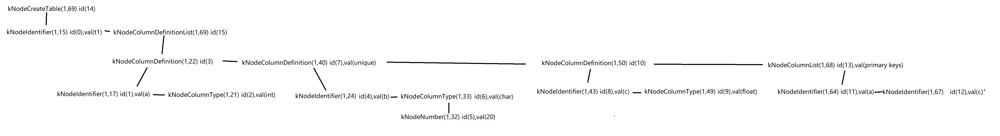

<center><h1>MiniSQL 小组报告</h1></center>

<center>谢集，吴修灏，杨正宇</center>


## Lab1

### 1.1 bitmap_page

`bitmap_page` 是一个简单的位图页面。`AllocatePage` 和 `DeallocatePage` 分别用于分配和释放位图页面。`IsPageFree` 用于判断页面是否空闲。`bitmap_page` 的内部结构类似于简单的 `std::bitset`，他的一个 `char` 可以用来管理 8 个页面。所以具体实现的时候需要用 `/8` 和 `%8` 来定位到具体的位置。 

`bitmap_page` 还提供了两个属性值 `page_allocated_` 和 `next_free_page_`，分别用于有多少个记录被分配和下一个**可能**空闲页面的位置。前者用于快速判断是否有空闲页面，后者用于快速找到空闲页面。我们可以在 `AllocatePage` 和 `DeallocatePage` 中轻松维护这两个属性值。

**测试部分**

由于该部分非常基础，而且后续的测试都有利用 `bitmap_page`，所以我没有额外写测试代码。

**参考代码**

```cpp
template <size_t PageSize>
bool BitmapPage<PageSize>::AllocatePage(uint32_t &page_offset) {
  if (page_allocated_ == GetMaxSupportedSize()) {
    return false;
  }
  for (size_t i = next_free_page_; i < GetMaxSupportedSize(); i++) {
    int byte_index = i / 8;
    int bit_index = i % 8;
    if (IsPageFreeLow(byte_index, bit_index)) {
      page_allocated_++;
      bytes[byte_index] |= (1 << bit_index);
      next_free_page_ = i + 1;
      page_offset = i;
      return true;
    }
  }
  return false;
}

template <size_t PageSize>
bool BitmapPage<PageSize>::DeAllocatePage(uint32_t page_offset) {
  int byte_index = page_offset / 8;
  int bit_index = page_offset % 8;
  if (!IsPageFreeLow(byte_index, bit_index)) {
    page_allocated_--;
    bytes[byte_index] &= ~(1 << bit_index);
    if (next_free_page_ > page_offset) {
      next_free_page_ = page_offset;
    }
    return true;
  } else {
    return false;
  }
}

template <size_t PageSize>
bool BitmapPage<PageSize>::IsPageFree(uint32_t page_offset) const {
  int byte_index = page_offset / 8;
  int bit_index = page_offset % 8;
  if (IsPageFreeLow(byte_index, bit_index)) {
    return true;
  }
  return false;
}
```

### 1.2 disk_manager

`disk_manager` 是一个简单的磁盘管理器。它主要负责管理磁盘上的页面，包括分配和释放页面，读写页面等。其实现主要是基于 `bitmap_page` 的实现。我们可以通过 `bitmap_page` 来管理磁盘上的页面，这样就可以实现页面的分配和释放。`AllocatePage` 会在磁盘上找到一个空闲页面，然后返回该页面的 `page_id`。`DeallocatePage` 会释放一个页面，使得该页面可以被重新分配。`IsPageFree` 用于判断页面是否空闲。`MapPageId` 用于将逻辑页面映射到物理页面。

这个模块设计的难点在于逻辑页号和物理页号，以及对元数据 `meta_data_` 的理解。类似小学数学找规律，我们可以通过一些简单的计算找到逻辑页号和物理页号之间的关系，以此得到 `MapPageId` 函数。而元数据 `meta_data_` 主要用于存储一些关于磁盘文件的信息，比如已经分配的页面数量，已经分配的扩展数量等等。我们使用 `reinterpret_cast` 来将 `meta_data_` 转换为 `DiskFileMetaPage` 类型，这样我们就可以方便的访问元数据。随后我们在 `AllocatePage` 和 `DeallocatePage` 中维护元数据即可。

> 易错点 $1$：`meta_data_` 在更改后需要重新写回磁盘。不然会导致后续新建的 `disk_manager` 无法获取到正确的元数据。

**测试部分**

由于该部分非常基础，而且后续的测试都有利用 `disk_manager`，所以我没有额外写测试代码。

**参考代码**

```cpp
page_id_t DiskManager::AllocatePage() {
  DiskFileMetaPage *meta_page = reinterpret_cast<DiskFileMetaPage *>(meta_data_);
  for (uint32_t i = 0; i <= meta_page->GetExtentNums(); i++) {
    int flag = 0;
    if (i == meta_page->GetExtentNums()) {
      meta_page->num_extents_++;
      meta_page->extent_used_page_[i] = 0;
      flag = 1;
      char bitmap_page[PAGE_SIZE];
      memset(bitmap_page, 0, PAGE_SIZE);
      WritePhysicalPage(1 + i * (1 + BITMAP_SIZE), bitmap_page);
    }
    if (meta_page->GetExtentUsedPage(i) < BITMAP_SIZE) {
      uint32_t page_offset;
      int bitmap_page_id = 1 + i * (1 + BITMAP_SIZE);
      char bitmap_page[PAGE_SIZE];
      ReadPhysicalPage(bitmap_page_id, bitmap_page);
      BitmapPage<PAGE_SIZE> *bitmap_page_ = reinterpret_cast<BitmapPage<PAGE_SIZE> *>(bitmap_page);
      if (bitmap_page_->AllocatePage(page_offset)) {
        meta_page->num_allocated_pages_++;
        meta_page->extent_used_page_[i]++;
        WritePhysicalPage(META_PAGE_ID, meta_data_);
        WritePhysicalPage(bitmap_page_id, bitmap_page);
        return i * BITMAP_SIZE + page_offset;
      }
    }
    if (flag) 
      break;
  }
  return INVALID_PAGE_ID;
}

void DiskManager::DeAllocatePage(page_id_t logical_page_id) {
  DiskFileMetaPage *meta_page = reinterpret_cast<DiskFileMetaPage *>(meta_data_);
  uint32_t extent_id = logical_page_id / BITMAP_SIZE;
  uint32_t page_offset = logical_page_id % BITMAP_SIZE;
  int bitmap_page_id = 1 + extent_id * (1 + BITMAP_SIZE);
  char bitmap_page[PAGE_SIZE];
  ReadPhysicalPage(bitmap_page_id, bitmap_page);
  if (reinterpret_cast<BitmapPage<PAGE_SIZE> *>(bitmap_page)->DeAllocatePage(page_offset)) {
    meta_page->num_allocated_pages_--;
    meta_page->extent_used_page_[extent_id]--;
    WritePhysicalPage(META_PAGE_ID, meta_data_);
    WritePhysicalPage(bitmap_page_id, bitmap_page);
  }
}

bool DiskManager::IsPageFree(page_id_t logical_page_id) {
  int bitmap_page_id = 1 + (logical_page_id / BITMAP_SIZE) * (1 + BITMAP_SIZE);
  char bitmap_page[PAGE_SIZE];
  ReadPhysicalPage(bitmap_page_id, bitmap_page);
  BitmapPage<PAGE_SIZE> *bitmap = reinterpret_cast<BitmapPage<PAGE_SIZE> *>(bitmap_page);
  return bitmap->IsPageFree(logical_page_id % BITMAP_SIZE);
}

page_id_t DiskManager::MapPageId(page_id_t logical_page_id) {
  return 2 + logical_page_id + logical_page_id / BITMAP_SIZE;
}
```

### 1.3 lru_replacer

`lru_replacer` 要求我们使用 $\text{LRU}$ 算法，管理 `buffer` 中页面替换。其中，`Victim` 会找到一个页面进行替换。`Pin` 会将一个页面固定。`Unpin` 会将一个页面解固。`Size` 会返回当前内存中的页面数量。

我的实现利用了 $\text{STL}$ 中的 `list` 和 `unordered_map`，分别定义 `lru_list_` 和 `lru_map_`。`lru_list_` 实现队列的功能，用于存储页面的顺序，`lru_map_` 则将页面的 `frame_id` 映射到 `list` 中的位置（迭代器）。这样我们就可以在平均时间 $O(1)$ 的时间复杂度内找到页面的位置，方便进行替换。

**测试部分**

由于该部分非常基础，而且后续的测试都有利用 `lru_replacer`，所以我没有额外写测试代码。

**参考代码**

```cpp
bool LRUReplacer::Victim(frame_id_t *frame_id) {
  if (lru_list_.empty()) {
    return false;
  }
  *frame_id = lru_list_.back();
  lru_list_.pop_back();
  lru_map_.erase(*frame_id);
  return true;
}

void LRUReplacer::Pin(frame_id_t frame_id) {
  auto it = lru_map_.find(frame_id);
  if (it != lru_map_.end()) {
    lru_list_.erase(it->second);
    lru_map_.erase(it);
  }
}

void LRUReplacer::Unpin(frame_id_t frame_id) {
  auto it = lru_map_.find(frame_id);
  if (it == lru_map_.end()) {
    lru_list_.push_front(frame_id);
    lru_map_[frame_id] = lru_list_.begin();
  }
}

size_t LRUReplacer::Size() {
  return lru_list_.size();
}
```

### 1.4 buffer_pool_manager

`buffer_pool_manager` 是一个缓冲池管理器。它主要负责管理内存中的页面，包括页面的读写，页面的分配和释放等。其实现主要是基于 `disk_manager` 和 `lru_replacer` 的实现。`FetchPage` 会在内存中找到一个页面，如果没有则会从磁盘中读取。`NewPage` 会在内存中分配一个新的页面。`DeletePage` 会释放一个页面。`UnpinPage` 会将一个页面解固。`FlushPage` 会将一个页面写回磁盘。

这个模块设计的难点在于各种边界条件的处理，以及细节的考虑。比如要获取的 `page_id` 是否合法？页面是否为脏页？页面是否被固定？页面是否在内存中？等等。尽管这个模块通过了基本的测试，但一些未交代清楚的边界条件对后续的模块编写产生了一定的困扰。比如下面两个易错点：

> 易错点 $2$：`FetchPage` 中，如果 `page_id` 为无效页号，需要返回 `nullptr`。

> 易错点 $3$：新创建的页面需要被标记为脏页。

**测试部分**

由于该部分非常基础，而且后续的测试都有利用 `buffer_pool_manager`，所以我没有额外写测试代码。但事实证明，如果我当时写了一些测试代码，可能会加速整个项目的进度。

**参考代码**

```cpp

Page *BufferPoolManager::FetchPage(page_id_t page_id) {
  if (page_id == INVALID_PAGE_ID) {
	return nullptr;
  }
  auto it = page_table_.find(page_id);
  if (it != page_table_.end()) {
    pages_[it->second].pin_count_ ++; 
    replacer_->Pin(it->second);
    return &pages_[it->second];
  }
  if (free_list_.size() || replacer_->Size()) {
    if (free_list_.size()) {
      frame_id_t frame_id = free_list_.front();
      free_list_.pop_front();
      page_table_[page_id] = frame_id;
      pages_[frame_id].page_id_ = page_id;
      pages_[frame_id].ResetMemory();
	  pages_[frame_id].is_dirty_ = false;
      pages_[frame_id].pin_count_ = 1;
      disk_manager_->ReadPage(page_id, pages_[frame_id].GetData());
      return &pages_[frame_id];
    } else {
      frame_id_t frame_id;
      replacer_->Victim(&frame_id);
      if (pages_[frame_id].IsDirty()) {
        disk_manager_->WritePage(pages_[frame_id].GetPageId(), pages_[frame_id].GetData());
      }
      page_table_.erase(pages_[frame_id].GetPageId());
      page_table_[page_id] = frame_id;
      pages_[frame_id].page_id_ = page_id;
      pages_[frame_id].ResetMemory();
	  pages_[frame_id].is_dirty_ = false;
      pages_[frame_id].pin_count_ = 1;
      disk_manager_->ReadPage(page_id, pages_[frame_id].GetData());
      return &pages_[frame_id];
    }
  }
  return nullptr;
}

Page *BufferPoolManager::NewPage(page_id_t &page_id) {
  if (free_list_.size() || replacer_->Size()) {
    page_id_t new_page_id = disk_manager_->AllocatePage();
    if (new_page_id == INVALID_PAGE_ID) {
      return nullptr;
    }
    if (free_list_.size()) {
      frame_id_t frame_id = free_list_.front();
      free_list_.pop_front();
      page_id = new_page_id;
      pages_[frame_id].page_id_ = new_page_id;
      page_table_[new_page_id] = frame_id;
      pages_[frame_id].ResetMemory();
	  pages_[frame_id].is_dirty_ = true;
      pages_[frame_id].pin_count_ = 1;
      return &pages_[frame_id];
    } else {
      frame_id_t frame_id;
      replacer_->Victim(&frame_id);
      if (pages_[frame_id].IsDirty()) {
        disk_manager_->WritePage(pages_[frame_id].GetPageId(), pages_[frame_id].GetData());
      }
      page_table_.erase(pages_[frame_id].GetPageId());
      page_id = new_page_id;
      pages_[frame_id].page_id_ = new_page_id;
      page_table_[new_page_id] = frame_id;
      pages_[frame_id].ResetMemory();
	  pages_[frame_id].is_dirty_ = true;
      pages_[frame_id].pin_count_ = 1;
      return &pages_[frame_id];
    }
  }
  return nullptr;
}

bool BufferPoolManager::DeletePage(page_id_t page_id) {
  disk_manager_->DeAllocatePage(page_id);
  auto it = page_table_.find(page_id);
  if (it == page_table_.end()) {
    return true;
  }
  if (pages_[it->second].pin_count_ != 0) {
    return false;
  }
  page_table_.erase(it);
  pages_[it->second].page_id_ = INVALID_PAGE_ID;
  pages_[it->second].pin_count_ = 0;
  pages_[it->second].ResetMemory();
  free_list_.push_back(it->second);
  return true;
}

bool BufferPoolManager::UnpinPage(page_id_t page_id, bool is_dirty) {
  auto it = page_table_.find(page_id);
  if (it == page_table_.end()) {
    return false;
  }
  if (pages_[it->second].pin_count_ == 0) {
    return false;
  }
  pages_[it->second].pin_count_ --;
  if (is_dirty) {
    pages_[it->second].is_dirty_ = true;
  }
  if (pages_[it->second].pin_count_ == 0) {
    replacer_->Unpin(it->second);
  }
  return true;
}
```

### 1.5 clock_replacer

`clock_replacer` 时钟替换算法是 $\text{LRU}$ 的一种近似。我按照 $\text{LRU}$ 的框架，同样实现了 `Victim`，`Pin`，`Unpin` 和 `Size` 函数。

我的思路和 $\text{LRU}$ 类似，使用 `std::list<pair<frame_id_t, bool> >` 来实现一个环形的顺序结构，其中 `bool` 就是时钟替换算法中的 `reference bit`。`std::unordered_map<frame_id_t, list<pair<frame_id_t, bool> >::iterator>` 用于映射 `frame_id` 到 `list` 中的位置。这样我们就可以在平均时间 $O(1)$ 的时间复杂度内找到页面的位置，方便进行 `Pin` 和 `Unpin`。为了表示始终替换算法当前的位置，我使用了迭代器 `clock_pointer_`，指向当前的位置。

根据摊还分析，`Victim` 的时间复杂度为 $O(1)$。`Pin` 和 `Unpin` 的平均时间复杂度也为 $O(1)$，所以单次操作的时间复杂度为 $O(1)$。 

具体实现可参考代码。

**测试部分**

我仿照 `lru_replacer` 的测试代码，写了如下的测试：

```cpp
TEST(CLOCKReplacerTest, SampleTest) {
  CLOCKReplacer clock_replacer(7);

  // Scenario: unpin six elements, i.e. add them to the replacer.
  clock_replacer.Unpin(1);
  clock_replacer.Unpin(2);
  clock_replacer.Unpin(3);
  clock_replacer.Unpin(4);
  clock_replacer.Unpin(5);
  clock_replacer.Unpin(6);
  clock_replacer.Unpin(1);
  EXPECT_EQ(6, clock_replacer.Size());

  // Scenario: get three victims from the lru.
  int value;
  clock_replacer.Victim(&value);
  EXPECT_EQ(1, value);
  clock_replacer.Victim(&value);
  EXPECT_EQ(2, value);
  clock_replacer.Victim(&value);
  EXPECT_EQ(3, value);

  // Scenario: pin elements in the replacer.
  // Note that 3 has already been victimized, so pinning 3 should have no effect.
  clock_replacer.Pin(3);
  clock_replacer.Pin(4);
  EXPECT_EQ(2, clock_replacer.Size());

  // Scenario: unpin 4. We expect that the reference bit of 4 will be set to 1.
  clock_replacer.Unpin(4);

  // Scenario: continue looking for victims. We expect these victims.
  clock_replacer.Victim(&value);
  EXPECT_EQ(5, value);
  clock_replacer.Victim(&value);
  EXPECT_EQ(6, value);
  clock_replacer.Victim(&value);
  EXPECT_EQ(4, value);
}
```

测试通过。最后我们在完成了所有的模块后，将 `clock_replacer` 用于 `buffer_pool_manager` 中，也通过了所有的测试。

关于运行速度：实测并无太大的差别。可能是因为在两种算法的实现中，我们都用了 `unordered_map` 来映射 `frame_id` 到 `list` 中的位置，大大加速了查找的速度。不过相信在实际的数据库系统中，`clock_replacer` 的性能会更好一些。

**参考代码**

- `pushClock`

首先为了实现环形结构，我们需要一个 `pushClock` 函数，用于将时钟指针向前移动。我们只需要在 `clock_pointer_++` 之后判断是否到达了 `clock_list_.end()` 即可。如果是，则将指针指向 `clock_list_.begin()`。

```cpp
void CLOCKReplacer::pushClock() {
  clock_pointer_++;
  if (clock_pointer_ == clock_list_.end()) {
    clock_pointer_ = clock_list_.begin();
  }
}
```

- `Victim`

`Victim` 函数是时钟替换算法的核心。我们需要找到一个页面进行替换。我们需要找到第一个 `reference bit` 为 `false` 的页面，然后将其替换。如果没有找到，则将 `reference_bit` 置为 `false`，并将时钟指针向前移动。

```cpp
bool CLOCKReplacer::Victim(frame_id_t *frame_id) {
  if (clock_list_.empty()) {
    return false;
  }
  while (true) {
    if (clock_pointer_->second == false) {
      *frame_id = clock_pointer_->first;
      clock_pointer_ = clock_list_.erase(clock_pointer_);
      clock_map_.erase(*frame_id);
      if (clock_pointer_ == clock_list_.end()) {
        clock_pointer_ = clock_list_.begin();
      }
      return true;
    } else {
      clock_pointer_->second = false;
      pushClock();
    }
  }
}
```

- `Pin`

如果页面在 `clock_map_` 中，我们需要将其从 `clock_list_` 中删除。如果 `clock_pointer_` 指向了该页面，我们需要将时钟指针向前移动。

```cpp
void CLOCKReplacer::Pin(frame_id_t frame_id) {
  auto it = clock_map_.find(frame_id);
  if (it != clock_map_.end()) {
    if (it->second == clock_pointer_) {
      pushClock();
    }
    clock_list_.erase(it->second);
    clock_map_.erase(it);
  }
}
```

- `Unpin`

如果页面不在 `clock_map_` 中，我们需要将其插入到 `clock_list_` 中，并且 `reference_bit` 置为 `true`，而且得在当前时钟指针的位置之前插入。如果 `clock_list_` 为空，我们需要将时钟指针指向该位置。注意

```cpp
void CLOCKReplacer::Unpin(frame_id_t frame_id) {
  if (clock_map_.find(frame_id) == clock_map_.end()) {
    assert(clock_list_.size() < capacity_);
    list<pair<frame_id_t, bool> >::iterator it;
    if (clock_list_.empty()) {
      it = clock_pointer_ = clock_list_.insert(clock_list_.begin(), make_pair(frame_id, true));
    } else {
      it = clock_list_.insert(clock_pointer_, make_pair(frame_id, true));
    }
    clock_map_[frame_id] = it;
  } else {
    clock_map_[frame_id]->second = true;
  }
}
```

- `Size`

返回 `clock_list_` 的大小即可。

```cpp
size_t CLOCKReplacer::Size() {
  return clock_list_.size();
}
```

## Lab2

### 2.1 Record

- 列（`Column`）:用于定义和表示数据表中的某一个字段，即包含了这个字段的字段名、字段类型、是否唯一等等；
- 模式（`Schema`）:用于表示一个数据表或是一个索引的结构。一个`Schema`由一个或多个的`Column`构成；
- 域（`Field`）:对应于一条记录中某一个字段的数据信息，如存储数据的数据类型，是否是空，存储数据的值等等；
- 行（`Row`）:与元组的概念等价，用于存储记录或索引键，一个`Row`由一个或多个`Field`构成。


**Record对象的持久化存储**

为了持久化存储Record对象，需要提供这些对象与字节流之间相互转化的函数，即序列化和反序列化操作。序列化将内存中的逻辑数据转换成便于在文件中存储的物理数据，反序列化则从存储的物理数据中恢复逻辑数据。

在`Schema`和`Column`对象中引入魔数`MAGIC_NUM`，用于确认反序列化时生成的对象是否符合预期。

- 对于`Column`对象，存储`MAGIC_NUM`、`name_`、`type_`、`len_`（`kTypeChar`类型字段的最大字段长度）、`table_ind`、`nullable_`、`unique_`数据。
- 对于`Schema`对象，存储`MAGIC_NUM`、`column_count`（字段数）、`columns`(各`Column`对象本身存储的数据)、`is_manage_`数据。
- 对于`Field`对象，存储数据值。
- 对于`Row`对象，存储`null_bitmap`、`fields`(对各非空`Field`对象本身存储的数据进行序列化)。

**测试部分**

利用`test/tuple_test`进行测试，未进行额外测试。

**参考代码**

`column.cpp`
```cpp

uint32_t Column::SerializeTo(char *buf) const {
  uint32_t bytes_written=0;
  //write magic number
  MACH_WRITE_UINT32(buf+bytes_written, COLUMN_MAGIC_NUM);
  bytes_written+=sizeof(uint32_t);

  //write column name
  uint32_t name_length=name_.length();
  memcpy(buf+bytes_written,&name_length,sizeof(uint32_t));
  bytes_written+=sizeof(uint32_t);
  memcpy(buf+bytes_written,name_.c_str(),name_length);
  bytes_written+=name_length;
  
  //write type
  MACH_WRITE_TO(TypeId, buf+bytes_written, type_);
  bytes_written+=sizeof(TypeId);

  //write max byte length for kTypeChar
  if(type_==kTypeChar)
  {
    MACH_WRITE_UINT32(buf+bytes_written, len_);
    bytes_written+=sizeof(uint32_t);
  }

  //write index
  MACH_WRITE_UINT32(buf+bytes_written, table_ind_);
  bytes_written+=sizeof(uint32_t);

  //write nullable
  MACH_WRITE_TO(bool, buf+bytes_written, nullable_);
  bytes_written+=sizeof(bool);

  //write unique
  MACH_WRITE_TO(bool, buf+bytes_written, unique_);
  bytes_written+=sizeof(bool);
  return bytes_written;
}

uint32_t Column::GetSerializedSize() const {
  uint32_t written_bytes;
  written_bytes=sizeof(uint32_t) + sizeof(uint32_t)+name_.length() + sizeof(TypeId) + ((type_==kTypeChar)?sizeof(uint32_t):0) + sizeof(uint32_t) + sizeof(bool) + sizeof(bool);
  return written_bytes;
}

uint32_t Column::DeserializeFrom(char *buf, Column *&column) {
   if (column != nullptr) {
    LOG(WARNING) << "Pointer to column is not null in column deserialize."<<std::endl;
    return 0;
  }

  uint32_t bytes_read=0;

  //read magic number
  uint32_t magic_number=MACH_READ_UINT32(buf+bytes_read);
  bytes_read+=sizeof(uint32_t);
  //check magic number
  if(magic_number!=COLUMN_MAGIC_NUM)
  {
    LOG(WARNING) << "column magic number mismatch in column deserialize"<<std::endl;
    return 0;
  }

  //read column name
  uint32_t name_length=MACH_READ_UINT32(buf+bytes_read);
  bytes_read+=sizeof(uint32_t);
  std::string name(buf+bytes_read, buf+bytes_read+name_length);
  bytes_read+=name_length;

  //read type
  TypeId type=MACH_READ_FROM(TypeId, buf+bytes_read);
  bytes_read+=sizeof(TypeId);

  //read max byte length for kTypeChar
  uint32_t len=0;
  if(type==kTypeChar)
  {
    len=MACH_READ_UINT32(buf+bytes_read);
    bytes_read+=sizeof(uint32_t);
  }

  //read index
  uint32_t index=MACH_READ_UINT32(buf+bytes_read);
  bytes_read+=sizeof(uint32_t);

  //read nullable
  bool nullable=MACH_READ_FROM(bool, buf+bytes_read);
  bytes_read+=sizeof(bool);

  //read unique
  bool unique=MACH_READ_FROM(bool, buf+bytes_read);
  bytes_read+=sizeof(bool);

  if(type==kTypeChar)
  {
    column=new Column(name, type, len, index, nullable, unique);
  }
  else
  {
    column=new Column(name, type, index, nullable, unique);
  }

  return bytes_read;
}
```

`Schema.cpp`
```cpp
uint32_t Schema::SerializeTo(char *buf) const {
  uint32_t bytes_written=0;

  //write magic number
  MACH_WRITE_UINT32(buf+bytes_written, SCHEMA_MAGIC_NUM);
  bytes_written+=sizeof(uint32_t);

  //write column count
  uint32_t column_count=GetColumnCount();
  MACH_WRITE_UINT32(buf+bytes_written, column_count);
  bytes_written+=sizeof(uint32_t);

  //write columns
  for(const auto column:columns_)
  {
    bytes_written+=column->SerializeTo(buf+bytes_written);
  }
  
  //write is_manage_
  MACH_WRITE_TO(bool, buf+bytes_written, is_manage_);
  bytes_written+=sizeof(bool);
  return bytes_written;
}

uint32_t Schema::GetSerializedSize() const {
  uint32_t written_size=0;
  
  written_size+=sizeof(uint32_t);
  
  written_size+=sizeof(uint32_t);

  for(const auto column:columns_)
  {

    written_size+=column->GetSerializedSize();
  }

  written_size+=sizeof(bool);

  return written_size;
}

uint32_t Schema::DeserializeFrom(char *buf, Schema *&schema) {
  if (schema != nullptr) {
    LOG(WARNING) << "Pointer to schema is not null in schema deserialize."<<std::endl;
    return 0;
  }

  uint32_t bytes_read=0;

  //read magic number
  uint32_t magic_number=MACH_READ_UINT32(buf+bytes_read);
  bytes_read+=sizeof(uint32_t);
  if(magic_number!=SCHEMA_MAGIC_NUM)
  {
    LOG(WARNING) << "schema magic number mismatch in schema deserialize"<<std::endl;
    return 0;
  }

  //read column count
  uint32_t column_count=MACH_READ_UINT32(buf+bytes_read);
  bytes_read+=sizeof(uint32_t);

  //read columns
  std::vector<Column *>columns;
  columns.reserve(column_count);
  for(uint32_t i=0;i<column_count;++i)
  {
    Column *column=nullptr;
    uint32_t bytes_column_read=Column::DeserializeFrom(buf+bytes_read,column);
    if(!bytes_column_read)//Failed to deserialize column
    {
      for(auto col:columns)
      {
        delete col;
      }
      LOG(WARNING)<<"column deserialize failed in schema deserialize"<<std::endl;
      return 0;
    }
    columns.push_back(column);
    bytes_read+=bytes_column_read;
  }

  //read is_manage_
  bool is_manage=MACH_READ_FROM(bool, buf+bytes_read);
  bytes_read+=sizeof(bool);

  schema=new Schema(columns, is_manage);
  return bytes_read;
}
```

`row.cpp`
```cpp
uint32_t Row::SerializeTo(char *buf, Schema *schema) const {
  ASSERT(schema != nullptr, "Invalid schema before serialize.");
  ASSERT(schema->GetColumnCount() == fields_.size(), "Fields size do not match schema's column size.");

  uint32_t bytes_written=0;

  uint32_t field_count=GetFieldCount();

  //write null bitmap
  uint8_t null_bitmap[(field_count+7)/8];
  memset(null_bitmap,0,sizeof(null_bitmap));
  for(uint32_t i=0;i<field_count;++i)
  {
    if(fields_[i]->IsNull())
    {
      null_bitmap[i/8]|=(1<<(i%8));
    }
  }
  for(int i=0;i<(field_count+7)/8;++i)
  {
    MACH_WRITE_TO(uint8_t,buf+bytes_written,null_bitmap[i]);
    bytes_written+=sizeof(uint8_t);
  }

  //write field
  for(uint32_t i=0;i<field_count;++i)
  {
    if(fields_[i]->IsNull())continue;
    bytes_written+=fields_[i]->SerializeTo(buf+bytes_written);
  }
  return bytes_written;
}

uint32_t Row::DeserializeFrom(char *buf, Schema *schema) {
  ASSERT(schema != nullptr, "Invalid schema before serialize.");
  ASSERT(fields_.empty(), "Non empty field in row.");

  uint32_t bytes_read=0;

  uint32_t field_count=schema->GetColumnCount();

  //read null bitmap
  bool null_bitmap[(field_count+7)/8];
  for(int i=0;i<(field_count+7)/8;++i)
  {
    null_bitmap[i]=MACH_READ_FROM(uint8_t,buf+bytes_read);
    bytes_read+=sizeof(uint8_t);
  }

  for(uint32_t i=0;i<field_count;++i)
  {
    Field *field=nullptr;
    if(null_bitmap[i/8]&(1<<(i%8)))
    {
      field=new Field(schema->GetColumn(i)->GetType());
    }
    else
    {
      bytes_read+=Field::DeserializeFrom(buf+bytes_read,schema->GetColumn(i)->GetType(),&field,null_bitmap[i]);
    }
    fields_.push_back(field);
  }
  return bytes_read;
}

uint32_t Row::GetSerializedSize(Schema *schema) const {
  ASSERT(schema != nullptr, "Invalid schema before serialize.");
  ASSERT(schema->GetColumnCount() == fields_.size(), "Fields size do not match schema's column size.");
  uint32_t written_size=0;

  uint32_t field_count=fields_.size();

  written_size+=((field_count+7)/8)*sizeof(uint8_t);

  for(uint32_t i=0;i<field_count;++i)
  {
    if(fields_[i]->IsNull())continue;
    written_size+=fields_[i]->GetSerializedSize();
  }

  return written_size;
}
```

### 2.2 TableHeap

堆表(`TableHeap`)是一种将记录以无序堆的形式进行组织的数据结构，由多个数据页（`TablePage`）构成，`TablePage`之间通过双向链表链接（`PrevPageId,NextPageId`）。`RowId`记录了该记录所在的`page_id`和`slot_num`，即所在的数据页和偏移。

每个数据也页由表头(`Table Page Header`)、空闲空间（`Free Space`）和已插入数据(`Inserted Tuples`)三部分组成。表头记录`PrevPageId, NextPageId, FreeSpacePointer`以及每条记录在当前数据页中的偏移和长度。

为实现`TableHeap`，需要完成如下功能

- 对于构造函数，申请一个空白数据页，并将`first_page_id`指向该数据页
- 对于`InsertTuple`操作，先判断序列化的大小是否超过一整个数据页可以放下的大小，如果序列化大小过大则直接返回`false`,表示插入失败。之后，我们遍历`TableHeap`中的每一个数据页，查看当前数据页是否可以放下这个`Tuple`，如果其中有一个数据页成功放下，返回`True`。否则，新建数据页，在其中放入`Tuple`，并将此数据页添加到`TableHeap`中。
- 对于`MarkDelete`, `ApplyDelete`, `RollbackDelete`,`GetTuple`操作，通过输入的`rid`获取对应的数据页，再执行数据页中实现的对应函数即可。
- 对于`UpdateTuple`操作，先尝试是否能在原位置执行更新，如果可以，返回`True`;否则，使用`InsertTuple`在`TableHeap`中插入更新后的数据，再`MarkDelete`原位置的数据。
- `Begin`函数遍历数据页，获取第一个存放`Tuple`的rid，并以`TableIterator`的格式返回。如果始终未找到，返回`End`。
- `End`函数返回`TableIterator`格式的`INVALID_ROWID`。
- 自行在框架中添加`GetNextTupleRid`函数，输入一条记录，利用其`rid`遍历后面的数据页，得到下一条记录的`rid`。

**参考代码**

```cpp
bool TableHeap::InsertTuple(Row &row, Txn *txn) {
  uint32_t serialized_size=row.GetSerializedSize(schema_);
  if(serialized_size>=TablePage::SIZE_MAX_ROW)return 0;
  page_id_t cur_page_id=first_page_id_,prev_page_id=INVALID_PAGE_ID;
  TablePage *page=reinterpret_cast<TablePage *>(buffer_pool_manager_->FetchPage(cur_page_id));
  if(page==nullptr)return 0;
  page->WLatch();
  bool p;
  while(!(p=page->InsertTuple(row,schema_,txn,lock_manager_,log_manager_)))
  {
    page->WUnlatch();
    buffer_pool_manager_->UnpinPage(cur_page_id,0);
    prev_page_id=cur_page_id;
    cur_page_id=page->GetNextPageId();
    if(cur_page_id==INVALID_PAGE_ID)break;
    page=reinterpret_cast<TablePage *>(buffer_pool_manager_->FetchPage(page->GetNextPageId()));
    if(page==nullptr)break;
    page->WLatch();
  }
  if(p)
  {
    page->WUnlatch();
    buffer_pool_manager_->UnpinPage(cur_page_id,1);
    return 1;
  }
  page=reinterpret_cast<TablePage *>(buffer_pool_manager_->NewPage(cur_page_id));
  if(page==nullptr)return 0;
  page->Init(cur_page_id,prev_page_id, log_manager_,txn);
  page->WLatch();
  page->InsertTuple(row,schema_,txn,lock_manager_,log_manager_);
  page->WUnlatch();
  buffer_pool_manager_->UnpinPage(cur_page_id,1);

  page=reinterpret_cast<TablePage *>(buffer_pool_manager_->FetchPage(prev_page_id));
  page->WLatch();
  page->SetNextPageId(cur_page_id);
  page->WUnlatch();
  buffer_pool_manager_->UnpinPage(prev_page_id,1);
  return 1;
}

bool TableHeap::MarkDelete(const RowId &rid, Txn *txn) {
  // Find the page which contains the tuple.
  auto page = reinterpret_cast<TablePage *>(buffer_pool_manager_->FetchPage(rid.GetPageId()));
  // If the page could not be found, then abort the recovery.
  if (page == nullptr) {
    return false;
  }
  // Otherwise, mark the tuple as deleted.
  page->WLatch();
  page->MarkDelete(rid, txn, lock_manager_, log_manager_);
  page->WUnlatch();
  buffer_pool_manager_->UnpinPage(page->GetTablePageId(), true);

  return true;
}

bool TableHeap::UpdateTuple(Row &row, const RowId &rid, Txn *txn) {
  row.SetRowId(rid);
  auto page = reinterpret_cast<TablePage *>(buffer_pool_manager_->FetchPage(rid.GetPageId()));
  if(!page)return 0;
  Row old_row(rid);
  page->WLatch();
  bool is_succeeded=page->UpdateTuple(row, &old_row, schema_, txn, lock_manager_, log_manager_);
  page->WUnlatch();
  if(is_succeeded)
  {
    buffer_pool_manager_->UnpinPage(rid.GetPageId(),true);
    return true;
  }
  else
  {
    buffer_pool_manager_->UnpinPage(rid.GetPageId(),false);
    if(InsertTuple(row,txn))
    {
      MarkDelete(rid,txn);
      return true;
    }
  }
  return is_succeeded;
}

void TableHeap::ApplyDelete(const RowId &rid, Txn *txn) {
  // Step1: Find the page which contains the tuple.
  auto page=reinterpret_cast<TablePage *>(buffer_pool_manager_->FetchPage(rid.GetPageId()));
  if(!page)
  {
    LOG(WARNING) << "Failed to get page in ApplyDelete"<<std::endl;
    return;
  }
  // Step2: Delete the tuple from the page.
  page->WLatch();
  page->ApplyDelete(rid, txn, log_manager_);
  page->WUnlatch();
  buffer_pool_manager_->UnpinPage(rid.GetPageId(),true);
}

void TableHeap::RollbackDelete(const RowId &rid, Txn *txn) {
  // Find the page which contains the tuple.
  auto page = reinterpret_cast<TablePage *>(buffer_pool_manager_->FetchPage(rid.GetPageId()));
  assert(page != nullptr);
  // Rollback to delete.
  page->WLatch();
  page->RollbackDelete(rid, txn, log_manager_);
  page->WUnlatch();
  buffer_pool_manager_->UnpinPage(page->GetTablePageId(), true);
}

bool TableHeap::GetTuple(Row *row, Txn *txn) {
  auto page=reinterpret_cast<TablePage *>(buffer_pool_manager_->FetchPage(row->GetRowId().GetPageId()));
  if(!page)return 0;
  page->RLatch();
  row->destroy();
  bool is_found=page->GetTuple(row,schema_, txn, lock_manager_);
  page->RUnlatch();
  buffer_pool_manager_->UnpinPage(row->GetRowId().GetPageId(),false);
  return is_found;
}

bool TableHeap::GetNextTupleRid(const RowId &rid, RowId *nxt_rid, Txn *txn)
{
  page_id_t cur_page_id=rid.GetPageId();
  TablePage *page=reinterpret_cast<TablePage *>(buffer_pool_manager_->FetchPage(cur_page_id));
  if(!page)
  {
    return 0;
  }
  page->RLatch();
  bool is_found=page->GetNextTupleRid(rid, nxt_rid);
  while(!is_found)
  {
    page_id_t nxt_page_id=page->GetNextPageId();
    page->RUnlatch();
    buffer_pool_manager_->UnpinPage(cur_page_id,false);
    if(nxt_page_id==INVALID_PAGE_ID)
    {
      return 0;
    }
    cur_page_id=nxt_page_id;
    page=reinterpret_cast<TablePage *>(buffer_pool_manager_->FetchPage(cur_page_id));
    if(!page)
    {
      return 0;
    }
    page->RLatch();
    is_found=page->GetFirstTupleRid(nxt_rid);
  }
  page->RUnlatch();
  buffer_pool_manager_->UnpinPage(cur_page_id, false);
  return 1;
}

void TableHeap::DeleteTable(page_id_t page_id) {
  if (page_id != INVALID_PAGE_ID) {
    auto temp_table_page = reinterpret_cast<TablePage *>(buffer_pool_manager_->FetchPage(page_id));  // 删除table_heap
    if (temp_table_page->GetNextPageId() != INVALID_PAGE_ID)
      DeleteTable(temp_table_page->GetNextPageId());
    buffer_pool_manager_->UnpinPage(page_id, false);
    buffer_pool_manager_->DeletePage(page_id);
  } else {
    DeleteTable(first_page_id_);
  }
}

TableIterator TableHeap::Begin(Txn *txn) {
  page_id_t cur_page_id=GetFirstPageId();
  while(cur_page_id!=INVALID_PAGE_ID)
  {
    TablePage *page=reinterpret_cast<TablePage *>(buffer_pool_manager_->FetchPage(cur_page_id));
    if(!page)
    {
      LOG(WARNING) << "Failed to get page in ApplyDelete"<<std::endl;
      return End();
    }
    page->RLatch();
    RowId first_rid;
    bool is_found=page->GetFirstTupleRid(&first_rid);
    if(is_found)
    {
      TableIterator first_iterator(this, first_rid, txn);
      page->RUnlatch();
      buffer_pool_manager_->UnpinPage(cur_page_id,false);
      return TableIterator(first_iterator);
    }
    page_id_t nxt_page_id=page->GetNextPageId();
    page->RUnlatch();
    buffer_pool_manager_->UnpinPage(cur_page_id, false);
    cur_page_id=nxt_page_id;
  }
  return End();
}

TableIterator TableHeap::End() { return TableIterator(nullptr, RowId(INVALID_PAGE_ID, 0), nullptr); }
```
### 2.3 TableIterator

从`TableHeap`的第一条记录开始，依次遍历所有记录

TableIterator中存放对应的`TableHeap`，当前记录的`row`和`rid`,以及对应的事务`txn`。

- 带参数构造和拷贝构造中，创建一个新的`Row*`对象指向对应的`rid`
- 析构中，删除对应的`Row*`指针
- `==`和`!=`运算符重载中，判断两个`TableIterator`对象相等的依据是两者的`TableHeap`相同、`rid`相同或共同指向`INVALID_PAGE_ID`。
- 对于`*`和`->`运算符重载，返回对应的`Row`或`Row*`成员变量。
- 对于`=`运算符重载，将当前`TableIterator`的成员变量赋值为传入的变量。
- 对于`iter++`和`++iter`操作，利用`TableHeap`中实现的`GetNextTupleRid`函数找到下一个元组所在的位置，并指向那一个元组。如果始终未找到，返回`TableHeap::End()`。

**测试部分**

和`TableHeap`一同在`table_heap_test.cpp`中进行测试。然而，原测试仅测试了`InsertTuple`、`GetTuple`和迭代器相关的部分。添加对于`UpdataTuple`和`Delete`相关功能的测试

测试代码如下：
```cpp
static string db_file_name = "table_heap_test.db";
using Fields = std::vector<Field>;

TEST(TableHeapTest, TableHeapSampleTest) {
  // init testing instance
  remove(db_file_name.c_str());
  auto disk_mgr_ = new DiskManager(db_file_name);
  auto bpm_ = new BufferPoolManager(DEFAULT_BUFFER_POOL_SIZE, disk_mgr_);
  const int row_nums = 10000;
  // create schema
  std::vector<Column *> columns = {new Column("id", TypeId::kTypeInt, 0, false, false),
                                   new Column("name", TypeId::kTypeChar, 64, 1, true, false),
                                   new Column("account", TypeId::kTypeFloat, 2, true, false)};
  auto schema = std::make_shared<Schema>(columns);
  // create rows
  std::unordered_map<int64_t, Fields *> row_values;
  
  RowId row_ids[row_nums];

  uint32_t size = 0;
  TableHeap *table_heap = TableHeap::Create(bpm_, schema.get(), nullptr, nullptr, nullptr);
  for (int i = 0; i < row_nums; i++) {
    int32_t len = RandomUtils::RandomInt(0, 64);
    char *characters = new char[len];
    RandomUtils::RandomString(characters, len);
    Fields *fields =
        new Fields{Field(TypeId::kTypeInt, i), Field(TypeId::kTypeChar, const_cast<char *>(characters), len, true),
                   Field(TypeId::kTypeFloat, RandomUtils::RandomFloat(-999.f, 999.f))};
    Row row(*fields);
    ASSERT_TRUE(table_heap->InsertTuple(row, nullptr));
    if (row_values.find(row.GetRowId().Get()) != row_values.end()) {
      std::cout << row.GetRowId().Get() << std::endl;
      ASSERT_TRUE(false);
    } else {
      row_values.emplace(row.GetRowId().Get(), fields);
      row_ids[i]=row.GetRowId();
      size++;
    }
    delete[] characters;
  }

  ASSERT_EQ(row_nums, row_values.size());
  ASSERT_EQ(row_nums, size);

  std::unordered_map<int64_t, Fields *> row_values2;
  for (auto row_kv : row_values) {
    size--;
    Row row(RowId(row_kv.first));
    table_heap->GetTuple(&row, nullptr);
    ASSERT_EQ(schema.get()->GetColumnCount(), row.GetFields().size());
    for (size_t j = 0; j < schema.get()->GetColumnCount(); j++) {
      ASSERT_EQ(CmpBool::kTrue, row.GetField(j)->CompareEquals(row_kv.second->at(j)));
    }
    // free spaces
    delete row_kv.second;
  }
  ASSERT_EQ(size, 0);

  int count=0;
  for(int i=0;i<row_nums;++i)
  {
    int32_t len = RandomUtils::RandomInt(0, 64);
    char *characters = new char[len];
    RandomUtils::RandomString(characters, len);
    Fields *fields =
        new Fields{Field(TypeId::kTypeInt, i), Field(TypeId::kTypeChar, const_cast<char *>(characters), len, true),
                   Field(TypeId::kTypeFloat, RandomUtils::RandomFloat(-999.f, 999.f))};
    Row row(*fields);
    ASSERT_EQ(true, table_heap->UpdateTuple(row,row_ids[i],nullptr));
    ASSERT_EQ(false, row.GetRowId().GetPageId()==INVALID_PAGE_ID);
    row_values2.emplace(row.GetRowId().Get(),fields);
    delete[] characters;
    ++count;
  }
  ASSERT_EQ(true, count==row_nums);

  for(auto row_kv:row_values2)
  {
    Row row(RowId(row_kv.first));
    table_heap->GetTuple(&row, nullptr);
    ASSERT_EQ(schema.get()->GetColumnCount(), row.GetFields().size());
    for (size_t j = 0; j < schema.get()->GetColumnCount(); j++) {
      ASSERT_EQ(CmpBool::kTrue, row.GetField(j)->CompareEquals(row_kv.second->at(j)));
    }
    table_heap->ApplyDelete(row.GetRowId(),nullptr);
    ASSERT_EQ(false, table_heap->GetTuple(&row, nullptr));
    count--;
  }
  ASSERT_EQ(0,count);
}

```

**参考代码**

```cpp
TableIterator::TableIterator(TableHeap *table_heap, RowId rid, Txn *txn):table_heap_(table_heap),rid_(rid),txn_(txn),cur_row_(nullptr) {
  cur_row_=new Row(rid);
  if(table_heap!=nullptr)
  {
    table_heap->GetTuple(cur_row_, txn);
  }
}

TableIterator::TableIterator(const TableIterator &other):table_heap_(other.table_heap_),rid_(other.rid_),txn_(other.txn_),cur_row_(nullptr) {
    cur_row_=new Row(rid_);
    if(other.cur_row_!=nullptr)
    {
      *cur_row_=*other.cur_row_;
    }
}

TableIterator::~TableIterator() {
  delete cur_row_;
}

bool TableIterator::operator==(const TableIterator &itr) const {
  return (table_heap_==itr.table_heap_)&&((rid_.GetPageId()==INVALID_PAGE_ID&&itr.rid_.GetPageId()==INVALID_PAGE_ID)||rid_==itr.rid_);
}

bool TableIterator::operator!=(const TableIterator &itr) const {
  return !(*this==itr);
}

const Row &TableIterator::operator*() {
  ASSERT(cur_row_!=nullptr,"Dereferencing a null iterator");
  return *cur_row_;
}

Row *TableIterator::operator->() {
  ASSERT(cur_row_!=nullptr, "Accessing a null iterator");
  return cur_row_;
}

TableIterator &TableIterator::operator=(const TableIterator &itr) noexcept {
  if(this!=&itr)
  {
    table_heap_=itr.table_heap_;
    rid_=itr.rid_;
    txn_=itr.txn_;
    cur_row_->SetRowId(rid_);
    if(itr.cur_row_!=nullptr)*cur_row_=*itr.cur_row_;
  }
  return *this;
}

// ++iter
TableIterator &TableIterator::operator++() {
  ASSERT(cur_row_!=nullptr, "Incrementing a null iterator");
  RowId nxt_rid;
  if(table_heap_->GetNextTupleRid(rid_, &nxt_rid, txn_))
  {
    rid_=nxt_rid;
    cur_row_->SetRowId(rid_);
    if(table_heap_!=nullptr)table_heap_->GetTuple(cur_row_,txn_);
  }
  else
  {
    *this=TableIterator(nullptr, RowId(INVALID_PAGE_ID, 0), nullptr);
  }
  return *this;
}

// iter++
TableIterator TableIterator::operator++(int) {
  TableIterator tmp=TableIterator(*this);
  ++(*this);
  return TableIterator(tmp);
}
```

## Lab3

### 3.1 B+树数据页

B+树中的每个结点（Node）都对应一个数据页，用于存储B+树结点中的数据。数据页分为 **页头（Page Header）** 和 **数据区（Data Area）** 两部分。页头用于存储数据页的元信息，数据区用于存储数据。页头的信息定义在`BPlusTreePage`中。根据B+树的形态，将数据页分为叶子页和非叶子页两种类型分别对应`BPlusTreeLeafPage`和`BPlusTreeInternalPage`。两者均继承自`BPlusTreePage`。在数据页中，序列化后的索引键值和对应的Value成对的存储在 `data_[]` 中，对于内点，存储的 Value 是子节点的 `page_id`；对于叶子点，存储的 Value 是数据表中该键值对应的 `row_id`。

### BPlusTreePage类
```cpp
class BPlusTreePage {
 public:
  bool IsLeafPage() const;

  bool IsRootPage() const;

  void SetPageType(IndexPageType page_type);

  int GetKeySize() const;

  void SetKeySize(int size);

  int GetSize() const;

  void SetSize(int size);

  void IncreaseSize(int amount);

  int GetMaxSize() const;

  void SetMaxSize(int max_size);

  int GetMinSize() const;

  page_id_t GetParentPageId() const;

  void SetParentPageId(page_id_t parent_page_id);

  page_id_t GetPageId() const;

  void SetPageId(page_id_t page_id);

  void SetLSN(lsn_t lsn = INVALID_LSN);

 private:
  // member variable, attributes that both internal and leaf page share
  IndexPageType page_type_; // page type
  int key_size_; // key size
  lsn_t lsn_; // log sequence number
  int size_; // number of keys in the page
  int max_size_; // max number of keys in the page
  page_id_t parent_page_id_; // parent page id
  page_id_t page_id_; // page id
};
```
两种page都共享private中的这7个属性，包含在页头中（leafpage多一个next_page_id_属性，在范围查找的时候有用）。

### BPlusTreeLeafPage类
```cpp
class BPlusTreeLeafPage : public BPlusTreePage {
 public:
  void Init(page_id_t page_id, page_id_t parent_id = INVALID_PAGE_ID, int key_size = UNDEFINED_SIZE,
            int max_size = UNDEFINED_SIZE);

  // helper methods
  page_id_t GetNextPageId() const;

  void SetNextPageId(page_id_t next_page_id);

  GenericKey *KeyAt(int index);

  void SetKeyAt(int index, GenericKey *key);

  RowId ValueAt(int index) const;

  void SetValueAt(int index, RowId value);

  int KeyIndex(const GenericKey *key, const KeyManager &comparator); // 返回 查找的key 所对应的 index

  void *PairPtrAt(int index); // 获取 data_[index] 位置指针

  void PairCopy(void *dest, void *src, int pair_num = 1);

  std::pair<GenericKey *, RowId> GetItem(int index);

  // insert and delete methods
  int Insert(GenericKey *key, const RowId &value, const KeyManager &comparator);

  bool Lookup(const GenericKey *key, RowId &value, const KeyManager &comparator);

  int RemoveAndDeleteRecord(const GenericKey *key, const KeyManager &comparator);

  // Split and Merge utility methods
  void MoveHalfTo(BPlusTreeLeafPage *recipient);

  void MoveAllTo(BPlusTreeLeafPage *recipient);

  void MoveFirstToEndOf(BPlusTreeLeafPage *recipient);

  void MoveLastToFrontOf(BPlusTreeLeafPage *recipient);

 private:
  void CopyNFrom(void *src, int size);

  void CopyLastFrom(GenericKey *key, const RowId value);

  void CopyFirstFrom(GenericKey *key, const RowId value);

  page_id_t next_page_id_{INVALID_PAGE_ID};

  char data_[PAGE_SIZE - LEAF_PAGE_HEADER_SIZE];
};
```
`BPlusTreeLeafPage`继承自`BPlusTreePage`，多了一个`next_page_id_`属性，用于指向下一个叶子页。


### BPlusTreeInternalPage类
```cpp
class BPlusTreeInternalPage : public BPlusTreePage {
 public:
  // must call initialize method after "create" a new node
  void Init(page_id_t page_id, page_id_t parent_id = INVALID_PAGE_ID, int key_size = UNDEFINED_SIZE,
            int max_size = UNDEFINED_SIZE);

  GenericKey *KeyAt(int index);

  void SetKeyAt(int index, GenericKey *key);

  int ValueIndex(const page_id_t &value) const;

  page_id_t ValueAt(int index) const;

  void SetValueAt(int index, page_id_t value);

  void *PairPtrAt(int index);

  void PairCopy(void *dest, void *src, int pair_num = 1);

  page_id_t Lookup(const GenericKey *key, const KeyManager &KP); // 查找 key 所对应的 value

  void PopulateNewRoot(const page_id_t &old_value, GenericKey *new_key, const page_id_t &new_value); // 将新的根节点设置为 old_value + new_key + new_value
  // PopulateNewRoot 只在分裂根节点的时候使用（此时要创建一个新的根）

  int InsertNodeAfter(const page_id_t &old_value, GenericKey *new_key, const page_id_t &new_value);

  void Remove(int index);

  page_id_t RemoveAndReturnOnlyChild();

  // Split and Merge utility methods
  void MoveAllTo(BPlusTreeInternalPage *recipient, GenericKey *middle_key, BufferPoolManager *buffer_pool_manager);

  void MoveHalfTo(BPlusTreeInternalPage *recipient, BufferPoolManager *buffer_pool_manager);

  void MoveFirstToEndOf(BPlusTreeInternalPage *recipient, GenericKey *middle_key,
                        BufferPoolManager *buffer_pool_manager);

  void MoveLastToFrontOf(BPlusTreeInternalPage *recipient, GenericKey *middle_key,
                         BufferPoolManager *buffer_pool_manager);

 private:
  void CopyNFrom(void *src, int size, BufferPoolManager *buffer_pool_manager);

  void CopyLastFrom(GenericKey *key, page_id_t value, BufferPoolManager *buffer_pool_manager);

  void CopyFirstFrom(page_id_t value, BufferPoolManager *buffer_pool_manager);

  char data_[PAGE_SIZE - INTERNAL_PAGE_HEADER_SIZE];
};
```
`BPlusTreeInternalPage`继承自`BPlusTreePage`，多了一个`data_[]`属性，用于存储子节点的`page_id`。他的函数中要多传入一个`BufferPoolManager`参数，用于在分裂和合并的时候对子节点的父节点进行修改

### 部分函数细节
1. `LeafPage::KeyIndex()`函数：二分查找key所对应的index，如果没有对应的，返回第一个大于key的index
```cpp
int LeafPage::KeyIndex(const GenericKey *key, const KeyManager &KM) {
  if(GetSize() == 0) {
    return 0;
  }
  int l = 0, r = GetSize() - 1, index = GetSize();
  // binary search
  while(l <= r) {
    int mid = (l + r) / 2;
    int cmp = KM.CompareKeys(key, KeyAt(mid));
    if(cmp == 0) {
      index = mid;
      break;
    }  else if(cmp < 0) { // key < KeyAt(mid)
      index = mid; //返回第一个大于key的index
      r = mid - 1;
    } else {
      l = mid + 1;
    }
  }
  return index;
}
```

2. `LeafPage::RemoveAndDeleteRecord()`函数：删除key对应的记录
```cpp
int LeafPage::RemoveAndDeleteRecord(const GenericKey *key, const KeyManager &KM) {
  int index = KeyIndex(key, KM);
  if (index < GetSize() && KM.CompareKeys(KeyAt(index), key) == 0) {
    PairCopy(PairPtrAt(index), PairPtrAt(index + 1), GetSize() - index - 1); //把index后的数据往前移
    IncreaseSize(-1);
    return GetSize();
  }
  LOG(ERROR) << "Key not found" << std::endl;
  return GetSize();
}
```


3. `InternalPage::Lookup()`函数：查找key所对应的value
```cpp
page_id_t InternalPage::Lookup(const GenericKey *key, const KeyManager &KM) {
  //return INVALID_PAGE_ID;
  int l = 1, r = GetSize() - 1, index = 0;
  int cmp;
  while (l <= r) {
    int mid = (l + r) / 2;
    cmp = KM.CompareKeys(key, KeyAt(mid));
    if (cmp == 0) {
      index = mid;
      break;
    } else if (cmp < 0) { //key < KeyAt(mid) 
      r = mid - 1;
    } else {  //key > KeyAt(mid)
      index = mid; //记录最后一个键不大于搜索键的位置
      l = mid + 1;
    }
  }
  return ValueAt(index);
}
```

4. `InternalPage::ICopyNFrom()`函数：将src中的size个数据复制到当前页中,并维护子节点的父节点信息
```cpp
void InternalPage::CopyNFrom(void *src, int size, BufferPoolManager *buffer_pool_manager) {
  PairCopy(PairPtrAt(GetSize()), src, size); 
  int new_pairs_offset = GetSize();
  IncreaseSize(size);
  //update parent page id of the child of the moved pages
  for (int index = new_pairs_offset; index < GetSize(); index++) {
    auto *page = buffer_pool_manager->FetchPage(ValueAt(index));
    if (page != nullptr) {
      auto *child = reinterpret_cast<BPlusTreePage *>(page->GetData());
      child->SetParentPageId(GetPageId());
      buffer_pool_manager->UnpinPage(child->GetPageId(), true);
    }
  }
}
```
注意要维护那些被移动的子节点的父节点信息

5. `InternalPage::MoveFirstToEndOf()`函数：将当前页的第一个键值对移动到recipient页的末尾
```cpp
void InternalPage::MoveFirstToEndOf(InternalPage *recipient, GenericKey *middle_key, BufferPoolManager *buffer_pool_manager) {

  SetKeyAt(0, middle_key); //0号位置的key变为middle_key
  GenericKey* key = KeyAt(0); //middle_key
  page_id_t value = ValueAt(0);
  recipient->CopyLastFrom(key, value, buffer_pool_manager);
  Remove(0);
}
```
0号位置的key是用来暂存的，不产生实际作用

```cpp
void InternalPage::CopyLastFrom(GenericKey *key, const page_id_t value, BufferPoolManager *buffer_pool_manager) {
  SetKeyAt(GetSize(), key);
  SetValueAt(GetSize(), value);
  auto child_page = reinterpret_cast<BPlusTreePage *>(buffer_pool_manager->FetchPage(value)->GetData());
  child_page->SetParentPageId(GetPageId());
  buffer_pool_manager->UnpinPage(child_page->GetPageId(), true); //更新子节点的父节点信息
  IncreaseSize(1);
}
```
父节点的middle_key的更新在上层模块完成，这层不考虑


### 3.2 B+树索引
在完成B+树结点的数据结构设计后，接下来需要完成B+树的创建、插入、删除、查找和释放等操作。注意，所设计的B+树只能支持Unique Key，这也意味着，当尝试向B+树插入一个重复的Key-Value键值对时，将不能执行插入操作并返回false状态。

当一些写操作导致B+树索引的根结点发生变化时，需要调用`BPLUSTREE_TYPE::UpdateRootPageId`完成`root_page_id`的变更和持久化。

#### BPlusTree类
```cpp
class BPlusTree {
  using InternalPage = BPlusTreeInternalPage;
  using LeafPage = BPlusTreeLeafPage;

 public:
  explicit BPlusTree(index_id_t index_id, BufferPoolManager *buffer_pool_manager, const KeyManager &comparator,
                     int leaf_max_size = UNDEFINED_SIZE, int internal_max_size = UNDEFINED_SIZE);

  // Returns true if this B+ tree has no keys and values.
  bool IsEmpty() const;

  // Insert a key-value pair into this B+ tree.
  bool Insert(GenericKey *key, const RowId &value, Txn *transaction = nullptr);

  // Remove a key and its value from this B+ tree.
  void Remove(const GenericKey *key, Txn *transaction = nullptr);

  // return the value associated with a given key
  bool GetValue(const GenericKey *key, std::vector<RowId> &result, Txn *transaction = nullptr);

  IndexIterator Begin();

  IndexIterator Begin(const GenericKey *key);

  IndexIterator End();

  // expose for test purpose
  Page *FindLeafPage(const GenericKey *key, page_id_t page_id = INVALID_PAGE_ID, bool leftMost = false);

  // used to check whether all pages are unpinned
  bool Check();

  // destroy the b plus tree
  void Destroy(page_id_t current_page_id = INVALID_PAGE_ID);

  void PrintTree(std::ofstream &out, Schema *schema) {
    if (IsEmpty()) {
      return;
    }
    out << "digraph G {" << std::endl;
    Page *root_page = buffer_pool_manager_->FetchPage(root_page_id_);
    auto *node = reinterpret_cast<BPlusTreePage *>(root_page->GetData());
    ToGraph(node, buffer_pool_manager_, out, schema);
    out << "}" << std::endl;
  }

 private:
  void StartNewTree(GenericKey *key, const RowId &value);

  bool InsertIntoLeaf(GenericKey *key, const RowId &value, Txn *transaction = nullptr);

  void InsertIntoParent(BPlusTreePage *old_node, GenericKey *key, BPlusTreePage *new_node, Txn *transaction = nullptr);

  LeafPage *Split(LeafPage *node, Txn *transaction);

  InternalPage *Split(InternalPage *node, Txn *transaction);

  template <typename N>
  bool CoalesceOrRedistribute(N *&node, Txn *transaction = nullptr);

  bool Coalesce(InternalPage *&neighbor_node, InternalPage *&node, InternalPage *&parent, int index,
                Txn *transaction = nullptr);

  bool Coalesce(LeafPage *&neighbor_node, LeafPage *&node, InternalPage *&parent, int index,
                Txn *transaction = nullptr);

  void Redistribute(LeafPage *neighbor_node, LeafPage *node, int index);

  void Redistribute(InternalPage *neighbor_node, InternalPage *node, int index);

  bool AdjustRoot(BPlusTreePage *node);

  void UpdateRootPageId(int insert_record = 0);

  /* Debug Routines for FREE!! */
  void ToGraph(BPlusTreePage *page, BufferPoolManager *bpm, std::ofstream &out, Schema *schema) const;

  void ToString(BPlusTreePage *page, BufferPoolManager *bpm) const;

  // member variable
  index_id_t index_id_;
  page_id_t root_page_id_{INVALID_PAGE_ID};
  BufferPoolManager *buffer_pool_manager_;
  KeyManager processor_;
  int leaf_max_size_;
  int internal_max_size_;
};
```

`BPlusTree`类是B+树的主要实现类，其中包含了B+树的增删改查等操作。

该类中的`index_id_`与`root_page_id_`分别表示索引的id和根节点的id。根节点的id放在`Index_Roots_Page`上，这个数据页用于根据`index_id`查找对应的根节点id。而对于根节点的修改，需要调用`UpdateRootPageId`函数来对`root_id`进行修改。

1. 构造函数：初始化B+树的一些参数
```cpp
BPlusTree::BPlusTree(index_id_t index_id, BufferPoolManager *buffer_pool_manager, const KeyManager &KM,
                     int leaf_max_size, int internal_max_size)
    : index_id_(index_id),
      buffer_pool_manager_(buffer_pool_manager),
      processor_(KM),
      leaf_max_size_(leaf_max_size),
      internal_max_size_(internal_max_size) {

	if (leaf_max_size == UNDEFINED_SIZE) leaf_max_size_ = (PAGE_SIZE - LEAF_PAGE_HEADER_SIZE) / (processor_.GetKeySize() + sizeof(RowId)) - 1;
	if (internal_max_size == UNDEFINED_SIZE) internal_max_size_ = (PAGE_SIZE - INTERNAL_PAGE_HEADER_SIZE) / (processor_.GetKeySize() + sizeof(page_id_t)) - 1;

	
  auto root_page = reinterpret_cast<IndexRootsPage *>(buffer_pool_manager_->FetchPage(INDEX_ROOTS_PAGE_ID)->GetData());
  if (!root_page->GetRootId(index_id, &root_page_id_)) {
    root_page_id_ = INVALID_PAGE_ID;
  }
	buffer_pool_manager_->UnpinPage(INDEX_ROOTS_PAGE_ID, false);
}
```
注意，如果传入的`leaf_max_size`和`internal_max_size`是默认值0，即`UNDEFINED_SIZE`，那么需要自己根据`keysize`进行计算

构造的时候，我们会先去`Index_Roots_Page`中查找对应的`root_page_id_`，如果没有找到，那么`root_page_id_`就是`INVALID_PAGE_ID`（代表空树）。这样可以避免重复创建B+树。


2. 查找操作：`GetValue`函数，根据key查找对应的value
```cpp
bool BPlusTree::GetValue(const GenericKey *key, std::vector<RowId> &result, Txn *transaction) {
  if (IsEmpty()) {
    return false;
  }
  auto leaf = reinterpret_cast<BPlusTreeLeafPage *>(FindLeafPage(key, root_page_id_, false)->GetData());
  if (leaf == nullptr) {
    LOG(ERROR) << "GetValue() : Can't find leaf page";
    return false;
  }
  RowId rid;
  if (leaf->Lookup(key, rid, processor_)) {
    result.push_back(rid);
    buffer_pool_manager_->UnpinPage(leaf->GetPageId(), false);
    return true;
  }
  buffer_pool_manager_->UnpinPage(leaf->GetPageId(), false);
  return false;
}
```
该函数首先调用了`FindLeafPage`函数找到对应的叶子页，然后调用叶子页的`Lookup`函数查找key对应的value。

`FindLeafPage`函数的实现如下：
```cpp
Page *BPlusTree::FindLeafPage(const GenericKey *key, page_id_t page_id, bool leftMost) {
  if (page_id == INVALID_PAGE_ID) page_id = root_page_id_; //默认从根节点开始查找
  auto page = reinterpret_cast<BPlusTreePage *>(buffer_pool_manager_->FetchPage(page_id)->GetData());
  while (!page->IsLeafPage()) {
    auto internal = reinterpret_cast<InternalPage *>(page);
    page_id_t child_page_id;
    if (leftMost) {
      child_page_id = internal->ValueAt(0);
    } else {
      child_page_id = internal->Lookup(key, processor_);
    }
    auto child_page = reinterpret_cast<BPlusTreePage *>(buffer_pool_manager_->FetchPage(child_page_id)->GetData());
    //LOG(INFO) << "[FindLeafPage] Internal page: " << page->GetPageId() << endl;
    buffer_pool_manager_->UnpinPage(page->GetPageId(), false);
    page = child_page;
  }
  return reinterpret_cast<Page *>(page);
}
```
`page`与`child_page`交替进行，直到找到叶子页为止。

3. 插入操作：`Insert`函数，插入key-value键值对
```cpp
bool BPlusTree::Insert(GenericKey *key, const RowId &value, Txn *transaction) {
  if (IsEmpty()) {
    //LOG(INFO) << "SB";
    StartNewTree(key, value);
    LOG(INFO) << "The tree is empty, and build the tree successfully";
    return true;
  } 
  else {
    //LOG(INFO) << "Insert into tree";
    return InsertIntoLeaf(key, value, transaction);
  }
}
```
如果B+树为空，那么直接调用`StartNewTree`函数创建新的树；否则调用`InsertIntoLeaf`函数插入键值对。

`StartNewTree`函数的实现如下：
```cpp
void BPlusTree::StartNewTree(GenericKey *key, const RowId &value) {
  auto *page = buffer_pool_manager_->NewPage(root_page_id_); //新分配一个页，得到了root_page_id_

  if (page == nullptr) {
    LOG(ERROR) << "No newpage build";
  }
  auto *root = reinterpret_cast<LeafPage *>(page->GetData());
  UpdateRootPageId(1); //新建b+树，应该把root_page_id_ 插入 到header_page
  root->Init(root_page_id_, INVALID_PAGE_ID, processor_.GetKeySize(), leaf_max_size_);  //todo
  root->Insert(key, value, processor_);
  buffer_pool_manager_->UnpinPage(root->GetPageId(), true);
} 
```

`InsertIntoLeaf`函数的实现如下：
```cpp
bool BPlusTree::InsertIntoLeaf(GenericKey *key, const RowId &value, Txn *transaction) {
  // find leaf
  auto *leaf_page = FindLeafPage(key, INVALID_PAGE_ID, false);
  if(leaf_page == nullptr) LOG(INFO) << "Not find leaf page";
  auto *leaf = reinterpret_cast<BPlusTreeLeafPage *>(leaf_page->GetData());
  RowId rid;
  if (leaf->Lookup(key, rid, processor_)) { // key已经存在
    LOG(ERROR) << "Key already exists";
    buffer_pool_manager_->UnpinPage(leaf->GetPageId(), false);  // leafpage需要被unpin
    return false; //只支持unique key
  }

  if (leaf->GetSize() < leaf->GetMaxSize()) { // leafpage未满，简单插入
    leaf->Insert(key, value, processor_);
    buffer_pool_manager_->UnpinPage(leaf->GetPageId(), true);
    return true;
  } 

  //LOG(WARNING) << "Need to split the leaf page";
  leaf->Insert(key, value, processor_); //先插入，再split，此时有maxsize+1个元素
  auto *new_leaf = Split(leaf, transaction);

  new_leaf->SetNextPageId(leaf->GetNextPageId());
  leaf->SetNextPageId(new_leaf->GetPageId());

  InsertIntoParent(leaf, new_leaf->KeyAt(0), new_leaf, transaction);

  buffer_pool_manager_->UnpinPage(leaf->GetPageId(), true);
  buffer_pool_manager_->UnpinPage(new_leaf->GetPageId(), true);

  return true;
}
```
先解决叶子层能解决的情况，解决不掉的丢给父节点处理。

`InsertIntoParent`函数的实现如下：
```cpp
void BPlusTree::InsertIntoParent(BPlusTreePage *old_node, GenericKey *key, BPlusTreePage *new_node, Txn *transaction) {
  if (old_node->IsRootPage()) {
    auto *page = buffer_pool_manager_->NewPage(root_page_id_);
    if (page != nullptr) {
      UpdateRootPageId(0); //如果老节点是根节点，那么需要建立新的根节点
      auto *root = reinterpret_cast<InternalPage *>(page->GetData());
      root->Init(root_page_id_, INVALID_PAGE_ID, processor_.GetKeySize(), internal_max_size_);
      root->PopulateNewRoot(old_node->GetPageId(), key, new_node->GetPageId());

      old_node->SetParentPageId(root_page_id_);
      new_node->SetParentPageId(root_page_id_);

      buffer_pool_manager_->UnpinPage(root->GetPageId(), true);

      buffer_pool_manager_->UnpinPage(old_node->GetPageId(), true);
      buffer_pool_manager_->UnpinPage(new_node->GetPageId(), true);
      return;
    }
  }
  else // old_node不是根节点
  {
    auto *page = buffer_pool_manager_->FetchPage(old_node->GetParentPageId()); //get the existing parent page
    if (page != nullptr) {
      auto *parent = reinterpret_cast<BPlusTreeInternalPage *>(page->GetData());
      if (parent->GetSize() < parent->GetMaxSize()) { //简单情况，直接插入
        parent->InsertNodeAfter(old_node->GetPageId(), key, new_node->GetPageId());
        new_node->SetParentPageId(parent->GetPageId());

        buffer_pool_manager_->UnpinPage(parent->GetPageId(), true);

        buffer_pool_manager_->UnpinPage(old_node->GetPageId(), true);
        buffer_pool_manager_->UnpinPage(new_node->GetPageId(), true);
        return;
      } else { // parent page is full
        //先插入，再split，此时有maxsize+1个元素
        parent->InsertNodeAfter(old_node->GetPageId(), key, new_node->GetPageId());
        auto *new_parent = Split(parent, transaction); //到这里，parent已经被split了，并且对孩子们都处理完成了
        //接下来要处理parent的parent
        InsertIntoParent(parent, new_parent->KeyAt(0), new_parent, transaction);
        
        buffer_pool_manager_->UnpinPage(new_parent->GetPageId(), true);

        buffer_pool_manager_->UnpinPage(parent->GetPageId(), true);


        buffer_pool_manager_->UnpinPage(old_node->GetPageId(), true);
        buffer_pool_manager_->UnpinPage(new_node->GetPageId(), true);
      }
    }
  }
}
```

4. 删除操作：`Remove`函数，删除key对应的键值对
```cpp
void BPlusTree::Remove(const GenericKey *key, Txn *transaction) {
  if (IsEmpty()) {
    return;
  }
  auto *leaf = reinterpret_cast<BPlusTreeLeafPage *>(FindLeafPage(key, INVALID_PAGE_ID, false)->GetData());
  if (leaf == nullptr) {
    LOG(ERROR) << "BPlusTree::Remove(const GenericKey *key, Txn *transaction): " << "FindLeafPage Error";
    return;
  } 
  if (leaf->GetSize() > leaf->GetMinSize()) {
    leaf->RemoveAndDeleteRecord(key, processor_);
    buffer_pool_manager_->UnpinPage(leaf->GetPageId(), true);
    return;
  } 
  // leaf page size <= min size
  //LOG(WARNING) << "Need to CoalesceOrRedistribute";
  leaf->RemoveAndDeleteRecord(key, processor_);
  //先删除，再CoalesceOrRedistribute，此时有minsize-1个元素
  CoalesceOrRedistribute(leaf, transaction); 
  buffer_pool_manager_->UnpinPage(leaf->GetPageId(), true); 
  
} 
```

`CoalesceOrRedistribute`函数的实现如下：
```cpp
template <typename N>
bool BPlusTree::CoalesceOrRedistribute(N *&node, Txn *transaction) {
  if (node->IsRootPage()) { //根节点，需要调整根节点
    bool deleted = AdjustRoot(node);
    buffer_pool_manager_->UnpinPage(node->GetPageId(), true);
    return deleted;
  }

  auto *parent = reinterpret_cast<InternalPage *>(buffer_pool_manager_->FetchPage(node->GetParentPageId())->GetData());
  int index = parent->ValueIndex(node->GetPageId());
  //先找到node在parent中的位置，并且确定neighbor
  page_id_t neighbor_page_id;
  if (index == 0) {
    neighbor_page_id = parent->ValueAt(1);
  } else {
    neighbor_page_id = parent->ValueAt(index - 1); 
  }

  auto *neighbor = reinterpret_cast<N *>(buffer_pool_manager_->FetchPage(neighbor_page_id)->GetData());

  if (neighbor->GetSize() + node->GetSize() > node->GetMaxSize()) {
    Redistribute(neighbor, node, index);
    buffer_pool_manager_->UnpinPage(neighbor->GetPageId(), true);
    buffer_pool_manager_->UnpinPage(parent->GetPageId(), false);
    buffer_pool_manager_->UnpinPage(node->GetPageId(), true);
    return false;
  } else {
    Coalesce(neighbor, node, parent, index, transaction);
    buffer_pool_manager_->UnpinPage(parent->GetPageId(), true);
    buffer_pool_manager_->UnpinPage(neighbor->GetPageId(), true);
    buffer_pool_manager_->UnpinPage(node->GetPageId(), true);
    return true;
  }
  
}
```
If sibling's size + input page's size > page's max size, then redistribute. Otherwise, merge.

`Coalesce`函数的实现如下：
```cpp
bool BPlusTree::Coalesce(InternalPage *&neighbor_node, InternalPage *&node, InternalPage *&parent, int index,
                         Txn *transaction) {
  if (index == 0) {
    // Move all entries from the node to the neighbor node
    neighbor_node->MoveAllTo(node, parent->KeyAt(1), buffer_pool_manager_);
    // Unpin the neighbor node
    buffer_pool_manager_->UnpinPage(neighbor_node->GetPageId(), true);
    // Remove the entry for the node from the parent
    parent->Remove(1);
  } else {
    node->MoveAllTo(neighbor_node, parent->KeyAt(index), buffer_pool_manager_);
    buffer_pool_manager_->UnpinPage(neighbor_node->GetPageId(), true);
    parent->Remove(index);
  }

  buffer_pool_manager_->UnpinPage(node->GetPageId(), true);
  // If the parent node is underfull after the removal, coalesce or redistribute it
  return CoalesceOrRedistribute(parent, transaction);
}
```
合并的时候，要把parent里面的middle_key也一起移动到neighbor中。以维持有序性，合并完成后把parent的middle_key删除。
由于合并后，parent的size可能小于minsize，所以要递归调用`CoalesceOrRedistribute`函数，来处理parent。

`Redistribute`函数的实现如下：
```cpp
void BPlusTree::Redistribute(InternalPage *neighbor_node, InternalPage *node, int index) {
  auto parent = reinterpret_cast<InternalPage *>(buffer_pool_manager_->FetchPage(node->GetParentPageId())->GetData());
  if (index == 0) {
    // move neighbor_node's first key & value pair into end of node
    neighbor_node->MoveFirstToEndOf(node, parent->KeyAt(1), buffer_pool_manager_);
    parent->SetKeyAt(1, neighbor_node->KeyAt(0));
  } else {
    // move neighbor_node's last key & value pair into head of node
    neighbor_node->MoveLastToFrontOf(node, parent->KeyAt(index), buffer_pool_manager_);
    parent->SetKeyAt(index, node->KeyAt(0));
  }
  buffer_pool_manager_->UnpinPage(parent->GetPageId(), true);
  buffer_pool_manager_->UnpinPage(neighbor_node->GetPageId(), true);
  buffer_pool_manager_->UnpinPage(node->GetPageId(), true);
}
```
Redistribute的时候，要把parent中的middle_key更新为neighbor中的middle_key，以维持有序性。

neighbor中的0号，是原来移动前的1号，他应该给父亲，父亲的mid给到node中。他现在为0号就相当于在neighbor里删掉了

Redistribute的时候，不需要递归调用`CoalesceOrRedistribute`函数，因为neighbor的size是大于minsize的，不会导致parent的size小于minsize。

5. 释放操作：`Destroy`函数，销毁B+树
```cpp
void BPlusTree::Destroy(page_id_t current_page_id) {  
  if (IsEmpty()) return;
  if (current_page_id == INVALID_PAGE_ID) {
    current_page_id = root_page_id_;
    root_page_id_ = INVALID_PAGE_ID;
    UpdateRootPageId(2); //删除根节点
  }
  auto page = reinterpret_cast<BPlusTreePage *>(buffer_pool_manager_->FetchPage(current_page_id)->GetData());
  if (!page->IsLeafPage()) {
    auto internal = reinterpret_cast<InternalPage *>(page);
    for (int i = 0; i < internal->GetSize(); i++) {
      Destroy(internal->ValueAt(i));
    }
  }
  buffer_pool_manager_->DeletePage(current_page_id);
  buffer_pool_manager_->UnpinPage(current_page_id, false);
}
```
递归删除所有的节点


6. `INDEX ITERATOR`
```cpp
IndexIterator BPlusTree::Begin() { 
  //return IndexIterator(); 
  auto page = FindLeafPage(nullptr, root_page_id_, true); //find the left most leaf page
  auto leaf = reinterpret_cast<BPlusTreeLeafPage *>(page->GetData());
  page_id_t page_id = leaf->GetPageId();
  buffer_pool_manager_->UnpinPage(page_id, false);
  return IndexIterator(page_id, buffer_pool_manager_, 0);
}
```

```cpp
IndexIterator BPlusTree::Begin(const GenericKey *key) { 
  //return IndexIterator(); 
  auto page = FindLeafPage(key, root_page_id_, false); //find the leaf page that contains the input key
  auto leaf = reinterpret_cast<BPlusTreeLeafPage *>(page->GetData());
  page_id_t page_id = leaf->GetPageId();
  int index = leaf->KeyIndex(key, processor_);
  buffer_pool_manager_->UnpinPage(page_id, false);
  return IndexIterator(page_id, buffer_pool_manager_, index);
}
```

```cpp
IndexIterator BPlusTree::End() { 
  return IndexIterator(); 
}
```
由于迭代器是左闭右开的，所以`End`函数直接返回一个默认的迭代器即可。

### B+树索引迭代器
```cpp
class IndexIterator {
  using LeafPage = BPlusTreeLeafPage;

 public:
  // you may define your own constructor based on your member variables
  explicit IndexIterator();

  explicit IndexIterator(page_id_t page_id, BufferPoolManager *bpm, int index = 0);

  ~IndexIterator();

  /** Return the key/value pair this iterator is currently pointing at. */
  std::pair<GenericKey *, RowId> operator*();

  /** Move to the next key/value pair.*/
  IndexIterator &operator++();

  /** Return whether two iterators are equal */
  bool operator==(const IndexIterator &itr) const;

  /** Return whether two iterators are not equal. */
  bool operator!=(const IndexIterator &itr) const;

 private:
  page_id_t current_page_id{INVALID_PAGE_ID};
  LeafPage *page{nullptr};
  int item_index{0};
  BufferPoolManager *buffer_pool_manager{nullptr};
  // add your own private member variables here
};
```

```cpp
IndexIterator &IndexIterator::operator++() {
  // Increase the current item index
  ++item_index;

  // Check if we need to move to the next page
  if (item_index >= page->GetSize()) {
    page_id_t next_page_id = page->GetNextPageId();
    
    // If there is a next page
    if (next_page_id != INVALID_PAGE_ID) {
      // Unpin the current page
      buffer_pool_manager->UnpinPage(current_page_id, false);
      
      // Move to the next page
      current_page_id = next_page_id;
      auto *next_page = buffer_pool_manager->FetchPage(next_page_id);
      
      // If the next page is not null
      if (next_page != nullptr) {
        // Cast the data to a LeafPage pointer
        auto *next_leaf_page = reinterpret_cast<LeafPage *>(next_page->GetData());
        
        // Update the page pointer and reset the item index
        page = next_leaf_page;
        item_index = 0;
      }
    } else {
      // If there is no next page, set the iterator to its default state
      buffer_pool_manager->UnpinPage(current_page_id, false);
      current_page_id = INVALID_PAGE_ID;
      page = nullptr;
      item_index = 0;
      *this = IndexIterator(); //把调用对象置为默认状态
    }
  }

  return *this;
}
```

### 5. 测试
####  b_plus_tree_test

将n改成10000，顺利通过测试，说明b+树的实现是正确的。

#### b_plus_tree_index_test

测试通过，说明索引的实现是正确的。

#### index_iterator_test

测试通过，说明迭代器的实现是正确的。


## Lab4

负责管理和维护数据库中的所有模式信息（元信息），包括：
- 数据库中所有表的定义信息，包括表的名称、表中字段数、主键、定义在表上的索引。
- 表中每个字段的定义信息，包括字段类型、是否唯一等。
- 数据库中所有索引的定义，包括所属表，索引建立在哪一个字段上等。

还需要为执行器Executor提供公共接口以供执行器获取目录信息并生成执行计划

### 4.1 元信息的持久化

表和索引以`TableInfo`和`IndexInfo`的逻辑数据形式展现。其中IndexInfo包含索引定义时的元信息`meta_data_`，索引对应的表信息`table_info`，索引的模式信息`key_schema_`和索引操作对象`index_`。除了`meta_data_`外，其它信息都是通过反序列化后的元信息生成的。

为简便处理，在序列化时，对于每一个表和索引都单独分配一个数据页用于存储序列化数据。因此，需要一个数据页和数据对象`CatalogMeta`来记录和管理每一个表和索引的元信息被存储在哪一个数据页中。`CatalogMeta`本身的信息会被序列化到`CATALOG_META_PAGE_ID`号数据页上。

- `CatalogMeta`的序列化：对`MAGIC_NUM`、`table_meta_pages`、`index_meta_pages`的相关数据进行序列化。
- `IndexMetadata`的序列化：对`MAGIC_NUM`、`index_id_`、`index_name_`、`table_id_`、`key_map`对应的相关数据进行序列化。
- `TableMetadata`的序列化：对`MAGIC_NUM`、`table_id_`、`table_name_`、`root_page_id_`、`schema_`数据进行序列化 
- `IndexInfo`的初始化：初始化`meta_data_`、`table_info`，然后利用`table_info`中的`schema`和`meta_data`中的`key mapping`得到`index`对应的`key schema`，最后建立`index`索引。

**参考代码**

`CatalogMeta`序列化：
```cpp

void CatalogMeta::SerializeTo(char *buf) const {
  ASSERT(GetSerializedSize() <= PAGE_SIZE, "Failed to serialize catalog metadata to disk.");
  MACH_WRITE_UINT32(buf, CATALOG_METADATA_MAGIC_NUM);
  buf += 4;
  MACH_WRITE_UINT32(buf, table_meta_pages_.size());
  buf += 4;
  MACH_WRITE_UINT32(buf, index_meta_pages_.size());
  buf += 4;
  for (auto iter : table_meta_pages_) {
    MACH_WRITE_TO(table_id_t, buf, iter.first);
    buf += 4;
    MACH_WRITE_TO(page_id_t, buf, iter.second);
    buf += 4;
  }
  for (auto iter : index_meta_pages_) {
    MACH_WRITE_TO(index_id_t, buf, iter.first);
    buf += 4;
    MACH_WRITE_TO(page_id_t, buf, iter.second);
    buf += 4;
  }
}

CatalogMeta *CatalogMeta::DeserializeFrom(char *buf) {
  // check valid
  uint32_t magic_num = MACH_READ_UINT32(buf);
  buf += 4;
  ASSERT(magic_num == CATALOG_METADATA_MAGIC_NUM, "Failed to deserialize catalog metadata from disk.");
  // get table and index nums
  uint32_t table_nums = MACH_READ_UINT32(buf);
  buf += 4;
  uint32_t index_nums = MACH_READ_UINT32(buf);
  buf += 4;
  // create metadata and read value
  CatalogMeta *meta = new CatalogMeta();
  for (uint32_t i = 0; i < table_nums; i++) {
    auto table_id = MACH_READ_FROM(table_id_t, buf);
    buf += 4;
    auto table_heap_page_id = MACH_READ_FROM(page_id_t, buf);
    buf += 4;
    meta->table_meta_pages_.emplace(table_id, table_heap_page_id);
  }
  for (uint32_t i = 0; i < index_nums; i++) {
    auto index_id = MACH_READ_FROM(index_id_t, buf);
    buf += 4;
    auto index_page_id = MACH_READ_FROM(page_id_t, buf);
    buf += 4;
    meta->index_meta_pages_.emplace(index_id, index_page_id);
  }
  return meta;
}

uint32_t CatalogMeta::GetSerializedSize() const {
  uint32_t buf=0;
  buf += 4;
  buf += 4;
  buf += 4;
  for (auto iter : table_meta_pages_) {
    buf += 4;
    buf += 4;
  }
  for (auto iter : index_meta_pages_) {
    buf += 4;
    buf += 4;
  }
  return buf;
}
```
`IndexMetadata`的序列化：
```cpp
uint32_t IndexMetadata::SerializeTo(char *buf) const {
  char *p = buf;
  uint32_t ofs = GetSerializedSize();
  ASSERT(ofs <= PAGE_SIZE, "Failed to serialize index info.");
  // magic num
  MACH_WRITE_UINT32(buf, INDEX_METADATA_MAGIC_NUM);
  buf += 4;
  // index id
  MACH_WRITE_TO(index_id_t, buf, index_id_);
  buf += 4;
  // index name
  MACH_WRITE_UINT32(buf, index_name_.length());
  buf += 4;
  MACH_WRITE_STRING(buf, index_name_);
  buf += index_name_.length();
  // table id
  MACH_WRITE_TO(table_id_t, buf, table_id_);
  buf += 4;
  // key count
  MACH_WRITE_UINT32(buf, key_map_.size());
  buf += 4;
  // key mapping in table
  for (auto &col_index : key_map_) {
    MACH_WRITE_UINT32(buf, col_index);
    buf += 4;
  }
  ASSERT(buf - p == ofs, "Unexpected serialize size.");
  return ofs;
}

/**
 * TODO: Student Implement
 */
uint32_t IndexMetadata::GetSerializedSize() const {
  uint32_t buf=0;
  buf += 4;
  // index id
  buf += 4;
  // index name
  buf += 4;
  buf += index_name_.length();
  // table id
  buf += 4;
  // key count
  buf += 4;
  // key mapping in table
  for (auto &col_index : key_map_) {
    buf += 4;
  }
  return buf;
}

uint32_t IndexMetadata::DeserializeFrom(char *buf, IndexMetadata *&index_meta) {
  if (index_meta != nullptr) {
    LOG(WARNING) << "Pointer object index info is not null in table info deserialize." << std::endl;
  }
  char *p = buf;
  // magic num
  uint32_t magic_num = MACH_READ_UINT32(buf);
  buf += 4;
  ASSERT(magic_num == INDEX_METADATA_MAGIC_NUM, "Failed to deserialize index info.");
  // index id
  index_id_t index_id = MACH_READ_FROM(index_id_t, buf);
  buf += 4;
  // index name
  uint32_t len = MACH_READ_UINT32(buf);
  buf += 4;
  std::string index_name(buf, len);
  buf += len;
  // table id
  table_id_t table_id = MACH_READ_FROM(table_id_t, buf);
  buf += 4;
  // index key count
  uint32_t index_key_count = MACH_READ_UINT32(buf);
  buf += 4;
  // key mapping in table
  std::vector<uint32_t> key_map;
  for (uint32_t i = 0; i < index_key_count; i++) {
    uint32_t key_index = MACH_READ_UINT32(buf);
    buf += 4;
    key_map.push_back(key_index);
  }
  // allocate space for index meta data
  index_meta = new IndexMetadata(index_id, index_name, table_id, key_map);
  return buf - p;
}
```
`TableMetadata`的序列化：
```cpp
uint32_t TableMetadata::SerializeTo(char *buf) const {
  char *p = buf;
  uint32_t ofs = GetSerializedSize();
  ASSERT(ofs <= PAGE_SIZE, "Failed to serialize table info.");
  // magic num
  MACH_WRITE_UINT32(buf, TABLE_METADATA_MAGIC_NUM);
  buf += 4;
  // table id
  MACH_WRITE_TO(table_id_t, buf, table_id_);
  buf += 4;
  // table name
  MACH_WRITE_UINT32(buf, table_name_.length());
  buf += 4;
  MACH_WRITE_STRING(buf, table_name_);
  buf += table_name_.length();
  // table heap root page id
  MACH_WRITE_TO(page_id_t, buf, root_page_id_);
  buf += 4;
  // table schema
  buf += schema_->SerializeTo(buf);
  ASSERT(buf - p == ofs, "Unexpected serialize size.");
  return ofs;
}

uint32_t TableMetadata::GetSerializedSize() const {
  return 4 + 4 + MACH_STR_SERIALIZED_SIZE(table_name_) + 4 + schema_->GetSerializedSize();
}

uint32_t TableMetadata::DeserializeFrom(char *buf, TableMetadata *&table_meta) {
  if (table_meta != nullptr) {
    LOG(WARNING) << "Pointer object table info is not null in table info deserialize." << std::endl;
  }
  char *p = buf;
  // magic num
  uint32_t magic_num = MACH_READ_UINT32(buf);
  buf += 4;
  ASSERT(magic_num == TABLE_METADATA_MAGIC_NUM, "Failed to deserialize table info.");
  // table id
  table_id_t table_id = MACH_READ_FROM(table_id_t, buf);
  buf += 4;
  // table name
  uint32_t len = MACH_READ_UINT32(buf);
  buf += 4;
  std::string table_name(buf, len);
  buf += len;
  // table heap root page id
  page_id_t root_page_id = MACH_READ_FROM(page_id_t, buf);
  buf += 4;
  // table schema
  TableSchema *schema = nullptr;
  buf += TableSchema::DeserializeFrom(buf, schema);
  // allocate space for table metadata
  table_meta = new TableMetadata(table_id, table_name, root_page_id, schema);
  return buf - p;
}
```
`IndexInfo`的初始化：

```cpp
void Init(IndexMetadata *meta_data, TableInfo *table_info, BufferPoolManager *buffer_pool_manager) {
    // Step1: init index metadata and table info
    this->meta_data_=meta_data;
    // Step2: mapping index key to key schema
    this->key_schema_=Schema::ShallowCopySchema(table_info->GetSchema(),meta_data->GetKeyMapping());
    // Step3: call CreateIndex to create the index
    this->index_=CreateIndex(buffer_pool_manager, "bptree");
  }
```

### 4.2 表和索引的管理

利用`CatalogManager`类维护和持久化数据库中所有表和索引的信息。

在数据库实例(`DBStorageEngine`)初次创建时(`init==True`)，初始化元数据；在后续重新打开数据库实例时，从数据库文件中加载所有表和索引的信息，构建`TableInfo`和`IndexInfo`信息置于内存中。

此外，还需要对上层模块提供对指定数据表的操作方式，`CreateTable`、`GetTable`、`GetTables`、`DropTable`、`GetTableIndexes`；对上层模块提供对指定索引的操作方式，如`CreateIndex`、`GetIndex`、`DropIndex`。

- 构造函数`CatalogManager`

初次创建时，初始化元数据；否则，先反序列化元数据，再从元数据的`table_meta_pages`和`index_meta_pages`中分别取出所有表和索引所在的数据页，并构建`TableInfo`和`IndexInfo`信息置于内存(`tables_`和`indexes_`)中。

```cpp
CatalogManager::CatalogManager(BufferPoolManager *buffer_pool_manager, LockManager *lock_manager,
                               LogManager *log_manager, bool init)
    : buffer_pool_manager_(buffer_pool_manager), lock_manager_(lock_manager), log_manager_(log_manager) {
      next_index_id_.store(0);
      next_table_id_.store(0);
      if(init)
      {
        catalog_meta_=new CatalogMeta();
      }
      else
      {
        Page *metapage=buffer_pool_manager_->FetchPage(CATALOG_META_PAGE_ID);
        char* buf=metapage->GetData();
        catalog_meta_=CatalogMeta::DeserializeFrom(buf);
        buffer_pool_manager_->UnpinPage(CATALOG_META_PAGE_ID,false);
        for(auto iter : catalog_meta_->table_meta_pages_)
        {
          page_id_t table_page_id=iter.second;
          Page* table_page=buffer_pool_manager_->FetchPage(table_page_id);
          char *buf2=table_page->GetData();
          TableMetadata *table_metadata;
          TableMetadata::DeserializeFrom(buf2, table_metadata);
          TableHeap *table_heap=TableHeap::Create(buffer_pool_manager_,table_metadata->GetFirstPageId(),table_metadata->GetSchema(),log_manager_,lock_manager_);
          table_names_[table_metadata->GetTableName()]=table_metadata->GetTableId();
          TableInfo *table_info=TableInfo::Create();
          table_info->Init(table_metadata,table_heap);
          tables_[table_metadata->GetTableId()]=table_info;
          buffer_pool_manager->UnpinPage(table_page_id, false);
        }
        for(auto iter : catalog_meta_->index_meta_pages_)
        {
          page_id_t index_page_id=iter.second;
          Page* index_page=buffer_pool_manager_->FetchPage(index_page_id);
          char *buf2=index_page->GetData();
          IndexMetadata *index_metadata;
          IndexMetadata::DeserializeFrom(buf2, index_metadata);
          std::string table_name=tables_[index_metadata->GetTableId()]->GetTableName();
          index_names_[table_name][index_metadata->GetIndexName()]=index_metadata->GetIndexId();
          IndexInfo *index_info=IndexInfo::Create();
          index_info->Init(index_metadata,tables_[index_metadata->GetTableId()],buffer_pool_manager_);
          indexes_[index_metadata->GetIndexId()]=index_info;
          buffer_pool_manager_->UnpinPage(index_page_id, false);
        }
      }
}
```

- 析构函数`~CatalogManager`

刷新元数据页后删除当前内存中的表和索引信息
```cpp
dberr_t CatalogManager::FlushCatalogMetaPage() const {
  Page* meta_page=buffer_pool_manager_->FetchPage(CATALOG_META_PAGE_ID);
  if(meta_page==nullptr)return DB_FAILED;
  char *buf=meta_page->GetData();
  catalog_meta_->SerializeTo(buf);
  buffer_pool_manager_->FlushPage(CATALOG_META_PAGE_ID);
  buffer_pool_manager_->UnpinPage(CATALOG_META_PAGE_ID,false);
  return DB_SUCCESS;
}
```

- `CreateTable`

先判断名称为`table_name`的数据表是否已经被创建。若尚未被创建，给`Table`分配新的`table_id`和用于存储数据的数据页(`new_page_id`)，将`table_metadata`序列化到`new_page`中并在元数据中添加相关信息。
```cpp
dberr_t CatalogManager::CreateTable(const string &table_name, TableSchema *schema, Txn *txn, TableInfo *&table_info) {
  if(table_names_.find(table_name)!=table_names_.end())
  {
    return DB_TABLE_ALREADY_EXIST;
  }
  table_id_t new_table_id=catalog_meta_->GetNextTableId();
  table_names_[table_name]=new_table_id;

  Schema* now_schema=Schema::DeepCopySchema(schema);
  page_id_t new_page_id;
  Page *new_table_page=buffer_pool_manager_->NewPage(new_page_id);
  char *buf=new_table_page->GetData();
  catalog_meta_->table_meta_pages_[new_table_id]=new_page_id;
  TableMetadata *new_table_metadata=TableMetadata::Create(new_table_id, table_name,new_page_id,now_schema);
  new_table_metadata->SerializeTo(buf);
  TableHeap *new_table_heap=TableHeap::Create(buffer_pool_manager_, now_schema, txn, log_manager_, lock_manager_);
  table_info=TableInfo::Create();
  table_info->Init(new_table_metadata, new_table_heap);

  tables_[new_table_id]=table_info;
  buffer_pool_manager_->UnpinPage(new_page_id,true);
  return DB_SUCCESS;
}
```

- `GetTable`和`GetTables`

如果要求的`Table(s)`存在，从`tables_`中取出对应的`TableInfo(s)`并返回。
```cpp
dberr_t CatalogManager::GetTable(const string &table_name, TableInfo *&table_info) {
  auto it=table_names_.find(table_name);
  if(it==table_names_.end())
  {
    return DB_TABLE_NOT_EXIST;
  }
  table_info=tables_[it->second];
  return DB_SUCCESS;
}

dberr_t CatalogManager::GetTables(vector<TableInfo *> &tables) const {
  tables.reserve(tables_.size());
  for(auto iter : tables_)
  {
   tables.push_back(iter.second); 
  }
  return DB_SUCCESS;
}
```

- `CreateIndex`

先判断表名为`table_name`的数据表是否存在，再判断表中是否已经建立名为`index_name`的索引。若尚未建立，从`table_name`的表中获取`TableInfo`，从`TableInfo`中获取数据表的`Schema`，再从`Schema`中获取`Index`所需的`key_map`。给`Index`分配新的`index_id`和数据页`new_page_id`。将`index_metadata`序列化到数据页中，将数据表中元组插入索引当中，再在元数据中添加相关的信息。
```cpp
dberr_t CatalogManager::CreateIndex(const std::string &table_name, const string &index_name,
                                    const std::vector<std::string> &index_keys, Txn *txn, IndexInfo *&index_info,
                                    const string &index_type) {//建立索引时，如果表中有数据，把数据插入索引
  if(table_names_.find(table_name)==table_names_.end())
  {
    return DB_TABLE_NOT_EXIST;
  }
  if(index_names_[table_name].find(index_name)!=index_names_[table_name].end())
  {
    return DB_INDEX_ALREADY_EXIST;
  }

  TableInfo *table_info=tables_[table_names_[table_name]];
  Schema *now_schema=table_info->GetSchema();
  std::vector<uint32_t>key_map;
  for(auto iter : index_keys)
  {
    uint32_t col_index;
    if(now_schema->GetColumnIndex(iter, col_index)==DB_COLUMN_NAME_NOT_EXIST)return DB_COLUMN_NAME_NOT_EXIST;
    else key_map.push_back(col_index);
  }

  index_id_t new_index_id=catalog_meta_->GetNextIndexId();
  index_names_[table_name][index_name]=new_index_id;

  page_id_t new_page_id;
  Page *new_index_page=buffer_pool_manager_->NewPage(new_page_id);
  char *buf=new_index_page->GetData();
  catalog_meta_->index_meta_pages_[new_index_id]=new_page_id;

  IndexMetadata *new_index_metadata=IndexMetadata::Create(new_index_id,index_name, table_names_[table_name],key_map);
  new_index_metadata->SerializeTo(buf);
  index_info=IndexInfo::Create();
  index_info->Init(new_index_metadata,table_info, buffer_pool_manager_);
  TableIterator new_table_iterator=table_info->GetTableHeap()->Begin(txn);
  while(new_table_iterator!=table_info->GetTableHeap()->End())
  {
    Row key_row;
    new_table_iterator->GetKeyFromRow(table_info->GetSchema(),index_info->GetIndexKeySchema(),key_row);
    dberr_t Ins_message=index_info->GetIndex()->InsertEntry(key_row,new_table_iterator->GetRowId(),txn);
    if(Ins_message==DB_FAILED)return DB_FAILED;
    new_table_iterator++;
  }//向索引中插入数据
  indexes_[new_index_id]=index_info;

  buffer_pool_manager_->UnpinPage(new_page_id,true);

  return DB_SUCCESS;
}
```

- `LoadTable`

先判断当前`Table`是否已经被加载到内存中。若没有，从输入的数据页中反序列化`TableInfo`，再更新元数据中的相关信息。
```cpp
dberr_t CatalogManager::LoadTable(const table_id_t table_id, const page_id_t page_id) {
  if(tables_.find(table_id)!=tables_.end())return DB_TABLE_ALREADY_EXIST;
  catalog_meta_->table_meta_pages_[table_id]=page_id;
  Page *now_table_page=buffer_pool_manager_->FetchPage(page_id);
  char *buf=now_table_page->GetData();
  TableMetadata *now_table_metadata;
  TableMetadata::DeserializeFrom(buf, now_table_metadata);
  TableHeap *now_table_heap=TableHeap::Create(buffer_pool_manager_,page_id,now_table_metadata->GetSchema(),log_manager_, lock_manager_);
  table_names_[now_table_metadata->GetTableName()]=now_table_metadata->GetTableId();
  TableInfo *now_table_info=TableInfo::Create();
  now_table_info->Init(now_table_metadata,now_table_heap);
  tables_[table_id]=now_table_info;
  buffer_pool_manager_->UnpinPage(page_id, false);
  return DB_SUCCESS;
}
```

- `GetIndex`和`GetTableIndexes`

先判断对应的数据表是否存在，再判断对应的索引是否存在。如果存在，从`indexes_`中获取相应的`IndexInfo`并返回。
```cpp
dberr_t CatalogManager::GetIndex(const std::string &table_name, const std::string &index_name,
                                 IndexInfo *&index_info) const {
  if(index_names_.find(table_name)==index_names_.end())return DB_TABLE_NOT_EXIST;
  auto it=index_names_.at(table_name).find(index_name);
  if(it==index_names_.at(table_name).end())return DB_INDEX_NOT_FOUND;
  index_info=indexes_.at(it->second);
  return DB_SUCCESS;
}

dberr_t CatalogManager::GetTableIndexes(const std::string &table_name, std::vector<IndexInfo *> &indexes) const {
  if(index_names_.find(table_name)==index_names_.end())return DB_TABLE_NOT_EXIST;
  for(auto iter : index_names_.at(table_name))
  {
    indexes.push_back(indexes_.at(iter.second));
  }
  return DB_SUCCESS;
```

- `DropTable`

先判断对应的数据表是否存在。若存在，先删掉建立在表上的所有索引(`DropIndex`)，再删掉存储数据表的数据页，再在元数据中删除对应的数据表信息。
```cpp
dberr_t CatalogManager::DropTable(const string &table_name) {
  if(table_names_.find(table_name)==table_names_.end())return DB_TABLE_NOT_EXIST;
  std::vector<IndexInfo *>Indexes;
  if(GetTableIndexes(table_name, Indexes)==DB_SUCCESS)
  {
    for(auto iter : Indexes)
    {
      DropIndex(table_name, iter->GetIndexName());
    }
  }
  table_id_t now_table_id=table_names_[table_name];
  page_id_t now_page_id=catalog_meta_->table_meta_pages_[now_table_id];
  buffer_pool_manager_->DeletePage(now_page_id);
  catalog_meta_->table_meta_pages_.erase(now_table_id);
  tables_.erase(now_table_id);
  table_names_.erase(table_name);
  return DB_SUCCESS;
}
```

- `DropIndex`

先判断对应的索引是否存在，再删掉索引中表的数据，再删掉存储索引的数据页，再在元数据中删除对应的索引信息。
```cpp
dberr_t CatalogManager::DropIndex(const string &table_name, const string &index_name) {
  if(index_names_.find(table_name)==index_names_.end())return DB_TABLE_NOT_EXIST;
  auto it=index_names_.at(table_name).find(index_name);
  if(it==index_names_.at(table_name).end())return DB_INDEX_NOT_FOUND;
  index_id_t now_index_id=it->second;

  IndexInfo *index_info=indexes_[now_index_id];
  TableInfo *table_info=tables_[table_names_[table_name]];

  TableIterator new_table_iterator=table_info->GetTableHeap()->Begin(nullptr);
  while(new_table_iterator!=table_info->GetTableHeap()->End())
  {
    Row key_row;
    new_table_iterator->GetKeyFromRow(table_info->GetSchema(),index_info->GetIndexKeySchema(),key_row);
    dberr_t Ins_message=index_info->GetIndex()->RemoveEntry(key_row,new_table_iterator->GetRowId(),nullptr);
    if(Ins_message==DB_FAILED)return DB_FAILED;
    new_table_iterator++;
  }//向索引中删除数据

  page_id_t now_page_id=catalog_meta_->index_meta_pages_[now_index_id];
  buffer_pool_manager_->DeletePage(now_page_id);
  catalog_meta_->index_meta_pages_.erase(now_index_id);
  indexes_.erase(now_index_id);
  index_names_.at(table_name).erase(index_name);
  return DB_SUCCESS;
}
```
- `FlushCatalogMetaPage`
  
将`catalog_meta`写入`CATALOG_META_PAGE`中，再刷新数据页。

```cpp
dberr_t CatalogManager::FlushCatalogMetaPage() const {
  Page* meta_page=buffer_pool_manager_->FetchPage(CATALOG_META_PAGE_ID);
  if(meta_page==nullptr)return DB_FAILED;
  char *buf=meta_page->GetData();
  catalog_meta_->SerializeTo(buf);
  buffer_pool_manager_->FlushPage(CATALOG_META_PAGE_ID);
  buffer_pool_manager_->UnpinPage(CATALOG_META_PAGE_ID,false);
  return DB_SUCCESS;
}
```

- `LoadIndex`

先判断当前`Index`是否已经被加载到内存中。若没有，从输入的数据页中反序列化`IndexInfo`，再更新元数据中的相关信息。
```cpp
dberr_t CatalogManager::LoadIndex(const index_id_t index_id, const page_id_t page_id) {
  if(indexes_.find(index_id)!=indexes_.end())return DB_INDEX_ALREADY_EXIST;
  catalog_meta_->index_meta_pages_[index_id]=page_id;
  Page *now_index_page=buffer_pool_manager_->FetchPage(page_id);
  char *buf=now_index_page->GetData();
  IndexMetadata *now_index_metadata;
  IndexMetadata::DeserializeFrom(buf, now_index_metadata);
  std::string table_name=tables_[now_index_metadata->GetTableId()]->GetTableName();
  index_names_[table_name][now_index_metadata->GetIndexName()]=now_index_metadata->GetIndexId();
  IndexInfo *now_index_info=IndexInfo::Create();
  now_index_info->Init(now_index_metadata, tables_[now_index_metadata->GetTableId()],buffer_pool_manager_);
  indexes_[index_id]=now_index_info;
  buffer_pool_manager_->UnpinPage(page_id, false);
  return DB_SUCCESS;
}
```
**测试代码**

运行`catalog_test.cpp`进行测试，未额外添加测试代码。


## Lab5

### 5.1 parser & executor

这一部分框架里已经实现。

### 5.2 execute_engine

`execute_engine` 是整个项目的核心部分。它负责解析 SQL 语句，生成执行计划，执行执行计划，输出结果。这一部分的实现主要是基于 `parser` 和 `executor` 的实现。`execute_engine` 会根据 SQL 语句的类型，调用不同的执行函数。

我需要完成的是 `ExecuteCreateTable`，`ExecuteDropTable`，`ExecuteShowIndexes`，`ExecuteCreateIndex`，`ExecuteDropIndex`，`ExecuteExecfile`，`ExecuteQuit` 等执行函数。其中 `ExecuteTrxBegin`，`ExecuteTrxCommit`，`ExecuteTrxRollback` 是事务相关，本次项目不需要实现。

每一个函数的输入是一个语法树节点 `ast` 和一个执行上下文 `context`。`context` 包含了当前的数据库信息。`ast` 包含了 SQL 语句的具体信息。

具体实现细节和思路我会在**参考代码**这一部分中一一解释和给出。

**测试部分**

对于 `execute_engine` 部分，框架没有配套的测试，只有对框架内已经实现的算子的测试。所以这个测试可以用来检验前面 $\text{Lab}\ 1\sim 4$ 的正确性。

一开始我们没有通过算子部分的测试，在 debug 的过程中我定位了 $\text{Lab 1}$ 的问题，也就是易错点 $2$。队友 $\text{Lab 4}$ 的上层接口期待底层的 `buffer_pool_manager` 能够正确处理 `INVALID_PAGE_ID`，但是我的实现中没有考虑到这一点，因此产生了 `Segmentation Fault`。在解决了这个问题后，我们通过了 $\text{Lab}\ 1 \sim 5$ 所有的测试。

**参考代码**

- `ExecuteCreateTable`

文档中并没有给出 `Create Table` 的具体语法树，而且由于我不熟悉语法树的结构，所以我使用了框架中内置的 `printTree` 函数（事实上在 `main` 中就有打印的部分）。由于结构错综复杂，为了方便代码编写，我将 `create table t1(a int, b char(20) unique, c float, primary key(a, c));` 的语法树绘图如下：



知道了结构后，我们就可以根据结构来编写代码。我总结出的细节如下：

- `unique` 和 `primary keys` 的处理。`unique` 和 `primary keys` 的列全部需要建立 `index`。注意建立 `index` 的时候传入的是 `vector<string>`。

- `primary keys` 的列需要设置为 `not null`。

- `char` 类型的长度需要合法。不能是小数、负数和 $0$。

- `type` 类型需要合法。

- 如果一个列没有设置 `unique`，那么其对应语法树节点的 `val_` 会指向 `nullptr`。所以如果不特殊判断会出现 `segmentation fault`。

具体实现如下：

```cpp
dberr_t ExecuteEngine::ExecuteCreateTable(pSyntaxNode ast, ExecuteContext *context) {
#ifdef ENABLE_EXECUTE_DEBUG
  LOG(INFO) << "ExecuteCreateTable" << std::endl;
#endif
  if (current_db_.empty()) {
    cout << "No database selected." << endl;
    return DB_FAILED;
  }
  vector<string> primary_key, unique_key;
  vector<Column *> columns;
  pSyntaxNode node = ast->child_;
  string table_name = node->val_;
  int index = 0;
  for (node = node->next_->child_; node != nullptr; node = node->next_, index++) {
    string column_name;
    TypeId type;
    uint32_t length = -1;
    bool unique = node->val_ != nullptr ? (strcmp(node->val_, "unique") == 0) : 0, nullable = 1;
    if (node->val_ != nullptr && !strcmp(node->val_, "primary keys")) {
      for (pSyntaxNode key = node->child_; key != nullptr; key = key->next_) {
        primary_key.push_back(key->val_);
      }    
    } else {
      pSyntaxNode name_node = node->child_;
      pSyntaxNode type_node = name_node->next_;
      column_name.assign(name_node->val_);
      type = to_type(type_node->val_);
      if (type == kTypeChar) {
        string len_str = type_node->child_->val_;
        if (len_str.find_first_of('.') != string::npos || len_str.find_first_of('-') != string::npos){
          cout << "Invalid length for char type." << endl;
          return DB_FAILED;
        }
        length = stoi(len_str);
        if (length <= 0) {
          cout << "Invalid length for char type." << endl;
          return DB_FAILED;
        }
      }
      if (type == kTypeInvalid) {
        cout << "Invalid type." << endl;
        return DB_FAILED;
      }
      if (~length) {
        columns.push_back(new Column(column_name, type, length, index, nullable, unique));
      } else {
        columns.push_back(new Column(column_name, type, index, nullable, unique));
      }
    }
    if (unique) {
      unique_key.push_back(column_name);
    }
  }
  if (!primary_key.empty()) {
    for (const auto &key : primary_key) {
      bool found = false;
      for (const auto &column : columns) {
        if (column->GetName() == key) {
          found = true;
          column->SetIsNullable(false);
          break;
        }
      }
      if (!found) {
        cout << "Primary key not found." << endl;
        return DB_FAILED;
      }
    }
  }
  auto *schema = new Schema(columns);
  auto *table = TableInfo::Create();
  auto err = context->GetCatalog()->CreateTable(table_name, schema, nullptr, table);
  if (err != DB_SUCCESS) {
    return err;
  }
  int cnt = 0;
  for (auto i : unique_key) {
    auto *index = IndexInfo::Create();
    auto err = context->GetCatalog()->CreateIndex(table_name, "unique_index_" + to_string(cnt++), {i}, nullptr, index, "bptree");
    if (err != DB_SUCCESS) {
      return err;
    }
  }
  auto *indexInfo = IndexInfo::Create();
  err = context->GetCatalog()->CreateIndex(table_name, "primary_key_index", primary_key, nullptr, indexInfo, "bptree");
  if (err != DB_SUCCESS) {
    return err;
  }
  cout << "Table " << table_name << " created successfully." << endl;
}
```

- `ExecuteDropTable`

`Drop Table` 的语法树非常简单，只需要调用 `DropTable` 函数即可。

```cpp
dberr_t ExecuteEngine::ExecuteDropTable(pSyntaxNode ast, ExecuteContext *context) {
#ifdef ENABLE_EXECUTE_DEBUG
  LOG(INFO) << "ExecuteDropTable" << std::endl;
#endif
  if (current_db_.empty()) {
    cout << "No database selected." << endl;
    return DB_FAILED;
  }
  string table_name = ast->child_->val_;
  auto err = context->GetCatalog()->DropTable(table_name);
  if (err != DB_SUCCESS) {
    return err;
  }
  cout << "Table " << table_name << " dropped successfully." << endl;
  return DB_SUCCESS;
}
```

- `ExecuteShowIndexes`

由于我们只能通过 `TableInfo` 来获取索引信息，所以我们需要遍历所有的表，然后遍历所有的索引，输出即可。

```cpp
dberr_t ExecuteEngine::ExecuteShowIndexes(pSyntaxNode ast, ExecuteContext *context) {
#ifdef ENABLE_EXECUTE_DEBUG
  LOG(INFO) << "ExecuteShowIndexes" << std::endl;
#endif
  if (current_db_.empty()) {
    cout << "No database selected." << endl;
    return DB_FAILED;
  }
  int count = 0;
  vector<TableInfo*> tables;
  context->GetCatalog()->GetTables(tables);
  for (const auto &table : tables) {
    vector<IndexInfo*> indexes;
    context->GetCatalog()->GetTableIndexes(table->GetTableName(), indexes);
    for (const auto &index : indexes) {
      cout << "Table: " << table->GetTableName() << " Index: " << index->GetIndexName() << endl;
      count++;
    }
  }
  if (count == 0) {
    cout << "Empty set (0.00 sec)" << endl;
  }
  cout << "Total " << count << " indexes." << endl;
  return DB_SUCCESS;
}
```

- `ExecuteCreateIndex`

`Create Index` 的语法树结构相对而言简单不少，因此我没有绘制语法树。不过本次实现中，我们只支持 `bptree` 索引，因此我在代码中固定了 `index_type`。

```cpp
dberr_t ExecuteEngine::ExecuteCreateIndex(pSyntaxNode ast, ExecuteContext *context) {
#ifdef ENABLE_EXECUTE_DEBUG
  LOG(INFO) << "ExecuteCreateIndex" << std::endl;
#endif
  if (current_db_.empty()) {
    cout << "No database selected." << endl;
    return DB_FAILED;
  }
  pSyntaxNode index_name_node = ast->child_;
  string index_name = index_name_node->val_;
  pSyntaxNode table_name_node = index_name_node->next_;
  string table_name = table_name_node->val_;
  vector<string> columns;
  for (pSyntaxNode column = table_name_node->next_->child_; column; column = column->next_) {
    columns.emplace_back(column->val_);
  }
  string index_type = "bptree"; // we only support bptree index now.
  auto *indexInfo = IndexInfo::Create();
  dberr_t err = context->GetCatalog()->CreateIndex(table_name, index_name, columns, nullptr, indexInfo, index_type);
  if (err != DB_SUCCESS) {
    return err;
  }
  cout << "Index " << index_name << " created successfully." << endl;
  return DB_SUCCESS;

}
```

- `ExecuteDropIndex`

`Drop Index` 的实现和 `Drop Table` 类似，只需要调用 `DropIndex` 函数即可。不过相同的是，我们得遍历所有的表，找到对应的索引，然后再删除。

```cpp
dberr_t ExecuteEngine::ExecuteDropIndex(pSyntaxNode ast, ExecuteContext *context) {
#ifdef ENABLE_EXECUTE_DEBUG
  LOG(INFO) << "ExecuteDropIndex" << std::endl;
#endif
  if (current_db_.empty()) {
    cout << "No database selected." << endl;
    return DB_FAILED;
  }
  vector<TableInfo*> tables;
  int count = 0;
  context->GetCatalog()->GetTables(tables);
  for (auto table: tables) {
    string table_name = table->GetTableName();
    vector<IndexInfo*> indexes;
    context->GetCatalog()->GetTableIndexes(table_name, indexes);
    for (auto index: indexes) {
      string index_name = index->GetIndexName();
      if (!index_name.compare(ast->child_->val_)) {
        dberr_t err = context->GetCatalog()->DropIndex(table_name, ast->child_->val_);
        if (err == DB_SUCCESS) {
          cout << "Index " << ast->child_->val_ << " deleted successfully." << endl;
        }
        return err;
      }
    }
  }
  return DB_INDEX_NOT_FOUND;
}
```

- `ExecuteExecfile`

`Execfile` 只需要模仿 `main.cpp` 中的实现即可。我们需要打开文件，然后逐行读取，然后调用 `Execute` 函数。

```cpp
extern "C" {
  int yyparse(void);
  #include "parser/minisql_lex.h"
  #include "parser/parser.h"
}
dberr_t ExecuteEngine::ExecuteExecfile(pSyntaxNode ast, ExecuteContext *context) {
#ifdef ENABLE_EXECUTE_DEBUG
  LOG(INFO) << "ExecuteExecfile" << std::endl;
#endif
  FILE* file = fopen(ast->child_->val_, "r");
  if (file == nullptr) {
    cout << "File " << ast->child_->val_ << " not found!" << endl;
    return DB_FAILED;
  }
  char input[1024];
  while (!feof(file)) {
    memset(input, 0, 1024);
    int i = 0;
    char ch = getc(file);
    while (!feof(file) && ch != ';') {
      input[i++] = ch;
      ch = getc(file);
    }
    if (feof(file)) {
      break;
    }

    input[i] = ch;
    YY_BUFFER_STATE bp = yy_scan_string(input);

    if (bp == nullptr) {
      cout << "Failed to create yy buffer state." << std::endl;
      return DB_FAILED;
    }

    yy_switch_to_buffer(bp);
    MinisqlParserInit();
    yyparse();

    if (MinisqlParserGetError()) {
      printf("%s\n", MinisqlParserGetErrorMessage());
    }

    auto result = this->Execute(MinisqlGetParserRootNode());
    MinisqlParserFinish();
    yy_delete_buffer(bp);
    yylex_destroy();

    ExecuteInformation(result);
  }
  return DB_SUCCESS;
}
```

- `ExecuteQuit`

初看并没有什么头绪，但是观察了 `main.cpp` 后，发现只需要返回 `DB_QUIT` 即可。

```cpp
dberr_t ExecuteEngine::ExecuteQuit(pSyntaxNode ast, ExecuteContext *context) {
#ifdef ENABLE_EXECUTE_DEBUG
  LOG(INFO) << "ExecuteQuit" << std::endl;
#endif
 return DB_QUIT;
}
```

## Lab6

$\text{Lab 6}$ 是一个和前五个模块独立的，较为简单的实验。不过实验文档并没有给出具体的实现细节，只是给出了函数的声明。因此这次试验需要对「数据恢复」章节的内容有深入的了解。

### 6.1 log_rec

`log_rec` 是一个日志记录器。它主要负责记录数据库的操作，包括 `insert`，`delete`，`update`，`begin`，`commit`，`abort` 等。我们需要实现 `CreateInsertLog`，`CreateDeleteLog`，`CreateUpdateLog`，`CreateBeginLog`，`CreateCommitLog`，`CreateAbortLog` 函数。

`LogRec` 的结构体定义如下：

```cpp
struct LogRec {
  LogRec() = default;
  LogRecType type_{LogRecType::kInvalid};
  lsn_t lsn_{INVALID_LSN};
  lsn_t prev_lsn_{INVALID_LSN};
  txn_id_t txn_id_{INVALID_TXN_ID};
  KeyType del_key_{};
  ValType del_val_{};
  KeyType old_key_{};
  ValType old_val_{-1};
  KeyType new_key_{};
  ValType new_val_{-1};
  KeyType ins_key_{};
  ValType ins_val_{-1};
  /* used for testing only */
  static std::unordered_map<txn_id_t, lsn_t> prev_lsn_map_;
  static lsn_t next_lsn_;
};
```

一些变量解释：

- `type_`：日志类型。其中 `LogRecType` 是一个枚举，包括 `kInvalid`，`kInsert`，`kDelete`，`kUpdate`，`kBegin`，`kCommit`，`kAbort`。

- `lsn_`：日志序列号。

- `prev_lsn_`：**当前日志对应的事务**的上一个日志的序列号。

- `txn_id_`：事务 ID。

- `del_key_`，`del_val_`：删除操作的键值。

- `old_key_`，`old_val_`，`new_key_`，`new_val_`：更新操作的键值。

- `ins_key_`，`ins_val_`：插入操作的键值。

- `prev_lsn_map_`：用于测试的 `prev_lsn` 映射。用于检索事务的上一个日志。

- `next_lsn_`：下一个日志的序列号，也就是当前总共有多少个日志。

**代码实现**

插入一个记录，需要记录 `txn_id`，`ins_key`，`ins_val`。我们需要创建一个新的日志，设置 `type_`，`lsn_`，`prev_lsn_`，`txn_id_`，`ins_key_`，`ins_val_`，然后返回。注意我们还需要修改 `prev_lsn_map_` 和 `next_lsn_`。

注意如果当前事务已经有了上一个日志，那么我们需要将 `prev_lsn_` 设置为上一个日志的 `lsn_`。否则我们将 `prev_lsn_` 设置为 `INVALID_LSN`。

其他的同理。

```cpp
static LogRecPtr CreateInsertLog(txn_id_t txn_id, KeyType ins_key, ValType ins_val) {
  LogRecPtr new_log = std::make_shared<LogRec>();
  new_log->type_ = LogRecType::kInsert;
  new_log->lsn_ = LogRec::next_lsn_++;
  new_log->prev_lsn_ = (LogRec::prev_lsn_map_.count(txn_id) ? LogRec::prev_lsn_map_[txn_id] : INVALID_LSN);
  LogRec::prev_lsn_map_[txn_id] = new_log->lsn_;
  new_log->txn_id_ = txn_id;
  new_log->ins_key_ = ins_key;
  new_log->ins_val_ = ins_val;
  return new_log;
}

static LogRecPtr CreateDeleteLog(txn_id_t txn_id, KeyType del_key, ValType del_val) {
  LogRecPtr new_log = std::make_shared<LogRec>();
  new_log->type_ = LogRecType::kDelete;
  new_log->lsn_ = LogRec::next_lsn_++;
  new_log->prev_lsn_ = (LogRec::prev_lsn_map_.count(txn_id) ? LogRec::prev_lsn_map_[txn_id] : INVALID_LSN);
  LogRec::prev_lsn_map_[txn_id] = new_log->lsn_;
  new_log->txn_id_ = txn_id;
  new_log->del_key_ = del_key;
  new_log->del_val_ = del_val;
  return new_log;
}

static LogRecPtr CreateUpdateLog(txn_id_t txn_id, KeyType old_key, ValType old_val, KeyType new_key, ValType new_val) {
  LogRecPtr new_log = std::make_shared<LogRec>();
  new_log->type_ = LogRecType::kUpdate;
  new_log->lsn_ = LogRec::next_lsn_++;
  new_log->prev_lsn_ = (LogRec::prev_lsn_map_.count(txn_id) ? LogRec::prev_lsn_map_[txn_id] : INVALID_LSN);
  LogRec::prev_lsn_map_[txn_id] = new_log->lsn_;
  new_log->txn_id_ = txn_id;
  new_log->old_key_ = old_key;
  new_log->old_val_ = old_val;
  new_log->new_key_ = new_key;
  new_log->new_val_ = new_val;
  return new_log;
}

static LogRecPtr CreateBeginLog(txn_id_t txn_id) {
  LogRecPtr new_log = std::make_shared<LogRec>();
  new_log->type_ = LogRecType::kBegin;
  new_log->lsn_ = LogRec::next_lsn_++;
  new_log->prev_lsn_ = (LogRec::prev_lsn_map_.count(txn_id) ? LogRec::prev_lsn_map_[txn_id] : INVALID_LSN);
  LogRec::prev_lsn_map_[txn_id] = new_log->lsn_;
  new_log->txn_id_ = txn_id;
  return new_log;
}

static LogRecPtr CreateCommitLog(txn_id_t txn_id) {
  LogRecPtr new_log = std::make_shared<LogRec>();
  new_log->type_ = LogRecType::kCommit;
  new_log->lsn_ = LogRec::next_lsn_++;
  new_log->prev_lsn_ = (LogRec::prev_lsn_map_.count(txn_id) ? LogRec::prev_lsn_map_[txn_id] : INVALID_LSN);
  LogRec::prev_lsn_map_[txn_id] = new_log->lsn_;
  new_log->txn_id_ = txn_id;
  return new_log;
}

static LogRecPtr CreateAbortLog(txn_id_t txn_id) {
  LogRecPtr new_log = std::make_shared<LogRec>();
  new_log->type_ = LogRecType::kAbort;
  new_log->lsn_ = LogRec::next_lsn_++;
  new_log->prev_lsn_ = (LogRec::prev_lsn_map_.count(txn_id) ? LogRec::prev_lsn_map_[txn_id] : INVALID_LSN);
  LogRec::prev_lsn_map_[txn_id] = new_log->lsn_;
  new_log->txn_id_ = txn_id;
  return new_log;
}
```

### 6.2 recovery_manager

`recovery_manager` 是一个恢复管理器。它主要负责恢复数据库的操作，包括 `redo` 和 `undo`。我们需要实现 `Init`，`RedoPhase`，`UndoPhase` 函数。

其中已经给出的 `CheckPoint` 的结构体定义如下：

```cpp
struct CheckPoint {
  lsn_t checkpoint_lsn_{INVALID_LSN};
  ATT active_txns_{};
  KvDatabase persist_data_{};

  inline void AddActiveTxn(txn_id_t txn_id, lsn_t last_lsn) { active_txns_[txn_id] = last_lsn; }

  inline void AddData(KeyType key, ValType val) { persist_data_.emplace(std::move(key), val); }
};
```

一些变量解释：

- `checkpoint_lsn_`：检查点的序列号。

- `active_txns_`：当前活跃的事务。

- `persist_data_`：已经写入磁盘的数据。

**代码实现**

- `Init`

初始化恢复管理器。我们需要将 `active_txns_`，`persist_data_` 和 `checkpoint_lsn_` 设置为 `last_checkpoint` 的值。

```cpp
    void Init(CheckPoint &last_checkpoint) {
      active_txns_ = last_checkpoint.active_txns_;
      data_ = last_checkpoint.persist_data_;
      persist_lsn_ = last_checkpoint.checkpoint_lsn_;
    }
```

- `RedoPhase`

重做阶段。我们需要遍历 `checkpoint_lsn_` 之后的所有日志，然后根据日志的类型进行操作。

-  - 如果是 `kInsert`，则插入数据。

-  - 如果是 `kDelete`，则删除数据。

-  - 如果是 `kUpdate`，则更新数据。

-  - 如果是 `kBegin`，则将事务加入 `active_txns_`。

-  - 如果是 `kCommit`，则将事务从 `active_txns_` 中删除。

-  - 如果是 `kAbort`，则将事务从 `active_txns_` 中删除，并且进行 `Undo` 操作。这里和课堂上的讲解有所不同，课堂中的 `Abort` 写入日志时，都已经写入了对应的撤回操作。而根据框架中的测试数据，我们需要手动进行。因此我写了一个辅助的函数 `UndoPhase_`，用于撤回某个事务的所有操作。

- - 如果当前事务已经 `commit`，那么我们不需要进行 `Undo` 操作，将其从 `active_txns_` 中删除即可。

```cpp
    void RedoPhase() {
      for (auto &now_log : log_recs_) {
        if (now_log.first < persist_lsn_) {
          continue;
        }
        switch (now_log.second->type_) { 
          case LogRecType::kInvalid: {
            assert(("Invalid log rec!", 0));
            break;
          }
          case LogRecType::kInsert: {
            data_[now_log.second->ins_key_] = now_log.second->ins_val_;
            break;
          }
          case LogRecType::kDelete: {
            data_.erase(now_log.second->del_key_);
            break;
          }
          case LogRecType::kUpdate: {
            data_.erase(now_log.second->old_key_);
            data_[now_log.second->new_key_] = now_log.second->new_val_;
            break;
          }
          case LogRecType::kBegin: {
            active_txns_[now_log.second->txn_id_] = now_log.first;
            break;
          }
          case LogRecType::kCommit: {
            active_txns_.erase(now_log.second->txn_id_);
            break;
          }
          case LogRecType::kAbort: {
            active_txns_.erase(now_log.second->txn_id_);
            UndoPhase_(now_log.first);
            break;
          }
        }
      }
    }
```

- `UndoPhase`

撤回阶段。我们需要遍历所有的活跃事务，然后调用 `UndoPhase_` 函数。

```cpp
    void UndoPhase() {
      for (auto txn_ : active_txns_) {
        UndoPhase_(LogRec::prev_lsn_map_[txn_.first]);
      }
    }
```

- `UndoPhase_`

撤回某个事务的所有操作。我们需要从当前事务的最后一个日志开始，然后根据日志的类型进行操作。

-  - 如果是 `kInsert`，则删除数据。

-  - 如果是 `kDelete`，则插入数据。

-  - 如果是 `kUpdate`，则更新数据。

-  - 如果是 `kBegin`，则不进行任何操作。

-  - 如果是 `kCommit`，则不进行任何操作。

-  - 如果是 `kAbort`，则不进行任何操作。

```cpp
    void UndoPhase_(int tmp) {
      while (tmp != INVALID_TXN_ID) {
        LogRecPtr now_log = log_recs_[tmp];
        switch (now_log->type_) {
          case LogRecType::kInvalid: {
            assert(("Invalid log rec!", 0));
            break;
          }
          case LogRecType::kInsert: {
            data_.erase(now_log->ins_key_);
            break;
          }
          case LogRecType::kDelete: {
            data_[now_log->del_key_] = now_log->del_val_;
            break;
          }
          case LogRecType::kUpdate: {
            data_.erase(now_log->new_key_);
            data_[now_log->old_key_] = now_log->old_val_;
            break;
          }
          case LogRecType::kBegin: {
            break;
          }
          case LogRecType::kCommit: {
            break;
          }
          case LogRecType::kAbort: {
            break;
          }
        }
        tmp = now_log->prev_lsn_;
      }
    }
```

**测试部分**

框架的测试内容较少，而且没有对 `checkpoint` 前已经 `commit` 的事务进行测试。因此我在测试中加入了一些额外的测试，以确保 `Undo` 阶段的正确性。

```cpp

TEST_F(RecoveryManagerTest, MyRecoveryTest) {
  auto d0 = CreateBeginLog(0);                                // <T0 Start>
  auto d1 = CreateBeginLog(1);                                // <T1 Start>
  auto d2 = CreateUpdateLog(0, "X", 500, "X", 550);           // <T0, X, 500, 550>
  auto d3 = CreateUpdateLog(1, "Y", 300, "Y", 350);           // <T1, Y, 300, 350>
  auto d4 = CreateCommitLog(0);                               // <T0 Commit>
  auto d5 = CreateUpdateLog(1, "X", 550, "X", 600);           // <T1, X, 550, 600>
  auto d6 = CreateUpdateLog(1, "Z", 200, "Z", 250);           // <T1, Z, 200, 250>
  auto d7 = CreateBeginLog(3);                                // <T3, Start>
  ASSERT_EQ(INVALID_LSN, d0->prev_lsn_);
  ASSERT_EQ(d0->lsn_, d2->prev_lsn_);
  ASSERT_EQ(d2->lsn_, d4->prev_lsn_);
  ASSERT_EQ(d3->lsn_, d5->prev_lsn_);
  ASSERT_EQ(INVALID_LSN, d7->prev_lsn_);
  
  /*--------- CheckPoint ---------*/
  CheckPoint checkpoint;
  checkpoint.checkpoint_lsn_ = d5->lsn_;
  checkpoint.AddActiveTxn(1, d5->lsn_);
  checkpoint.AddActiveTxn(3, d7->lsn_);
  checkpoint.AddData("X", 600);
  checkpoint.AddData("Y", 350);
  checkpoint.AddData("Z", 200);
  /*--------- CheckPoint ---------*/

  auto d8 = CreateBeginLog(2);                                // <T2 Start>
  auto d9 = CreateUpdateLog(2, "W", 300, "W", 450);           // <T2, W, 300, 450>
  auto d10 = CreateCommitLog(2);                              // <T2 Commit>
  ASSERT_EQ(INVALID_LSN, d8->prev_lsn_);
  ASSERT_EQ(d8->lsn_, d9->prev_lsn_);
  ASSERT_EQ(d9->lsn_, d10->prev_lsn_);

  std::vector<LogRecPtr> logs = {d0, d1, d2, d3, d4, d5, d6, d7, d8, d9, d10};

  RecoveryManager recovery_mgr;
  recovery_mgr.Init(checkpoint);
  for (const auto &log : logs) {
    recovery_mgr.AppendLogRec(log);
  }
  auto &db = recovery_mgr.GetDatabase();

  recovery_mgr.RedoPhase();
  ASSERT_EQ(db["X"], 600); // Expected to remain unchanged as T1 is aborted.
  ASSERT_EQ(db["Y"], 350); 
  ASSERT_EQ(db["Z"], 250);
  ASSERT_EQ(db["W"], 450); 

  recovery_mgr.UndoPhase();
  ASSERT_EQ(db["X"], 550); 
  ASSERT_EQ(db["Y"], 300); 
  ASSERT_EQ(db["Z"], 200);
  ASSERT_EQ(db["W"], 450); 
}
```

最终测试通过。

## Lab7

### 7.1 事务管理器 Txn Manager

事务管理器负责处理所有与事务相关操作，是维护数据库ACID属性（原子性、一致性、隔离性、持久性）的关键组件，主要负责以下方面：
- 事务的边界控制：负责定义事务的开始(BEGIN TRANSACTION)和结束(COMMIT或ROLLBACK)。事务开始时，事务管理器为其分配所需资源，并追踪状态。事务成功完成时，事务管理器执行提交操作，将更改永久写入数据库。若事务错误或需要撤销，事务管理器执行回滚操作，撤销所有更改。
- 并发控制：在允许多个事务同时运行的系统中，使用并发控制机制（如锁、时间戳、版本号lsn）来确保事务不会相互干扰，导致数据不一致。实现数据库的隔离级别，防止并发事务产生冲突。
- 恢复管理：保证在系统故障（如崩溃、电源中断）后数据库的一致性和持久性。通常通过使用日志记录(Logging)和检查点(Checkpointing)等技术完成。事务日志存储了所有对数据库所做的更改的记录，可用于恢复操作。
- 故障处理：检测到错误或异常时，事务管理器负责采取适当行动，如触发回滚来撤销事务的操作，或在某些情况下尝试恢复事务执行

**Txn Manager类已在框架中实现。**

### 7.2 锁管理器LockManager

锁管理器维护当前活动事务所持有的锁。事务在访问数据前向Lock Manager发出锁请求，由Lock Manager决定是否将锁授予该事务，或是否阻塞该事务或中止事务。

Lock Manager内定义了`LockRequest`和`LockRequestQueue`两类

其中`LockRequest`类代表事务发出的锁请求，包括：
- `txn_id_`：发出请求的事务的标识符。
- `lock_mode_`：请求的锁类型。
- `granted_`：已授予事务的锁类型。

`LockRequestQueue`类管理锁请求队列，并提供操作它的方法。它使用一个列表`req_list`存储请求，并使用一个unordered_map(`req_list_iter_map`)跟踪列表中每一个请求的迭代器。它还包括一个条件变量`cv_`用于同步目的，以及一些标志管理并发访问：
- `is_writing_`：指示当前是否持有排他性写锁。
- `is_upgrading_`：指示是否正在进行锁升级。
- `sharing_cnt_`：持有共享锁的事务数量的计数

该类提供以下方法：
- `EmplaceLockRequest()`：将新的锁请求添加到队列前端，并在map中存储其迭代器。
- `EraseLockRequest()`：根据`txn_id`从队列和map中移除锁请求。成功则返回`True`，否则返回`False`。
- `GetLockRequestIter()`：根据`txn_id`检索队列中特定锁请求的迭代器。

`LockManager`类中的待实现函数：

- `LockPrepare(Txn, RID)`：检查txn的state是否符合预期，并在`lock_table_`里创建rid和对应的队列。

如果事务处于收缩阶段，则不应该加锁，将事务设为Aborted状态并抛出异常。
否则，如果`lock_table_`中没有rid中对应的队列，则在`lock_table_`中添加相应的队列。
```cpp
void LockManager::LockPrepare(Txn *txn, const RowId &rid) {//rid加入lock_table_中
  if(txn->GetState()==TxnState::kShrinking)
  {
    txn->SetState(TxnState::kAborted);
    throw TxnAbortException(txn->GetTxnId(),AbortReason::kLockOnShrinking);
  }
  if(lock_table_.find(rid)==lock_table_.end())
  {
    lock_table_.emplace(std::piecewise_construct, std::forward_as_tuple(rid), std::forward_as_tuple());
  }
}
```

- `CheckAbort(Txn, LockRequestQueue)`：检查txn的state是否为Aborted，并做出相应操作。

如果state为Aborted，则在`req_queue`中删除对应的lockrequest并抛出异常。
```cpp
void LockManager::CheckAbort(Txn *txn, LockManager::LockRequestQueue &req_queue) {
  if(txn->GetState()==TxnState::kAborted)
  {
    req_queue.EraseLockRequest(txn->GetTxnId());
    throw TxnAbortException(txn->GetTxnId(),AbortReason::kDeadlock);//等待资源时终止，为死锁检测
  }
}
```

- `LockShared(Txn, RID)`：事务txn请求获取id为rid的数据记录上的共享锁。当请求需要等待时，该函数被阻塞(cv_.wait)，请求通过后返回True。

如果数据库的隔离级别为`ReadUncommitted`，则不应该添加共享锁，将事务状态设置为Aborted并抛出异常。

接着执行`LockPrepare`，并在对应的`LockRequestQueue`中加入共享锁请求。

如果正持有排他性写锁，阻塞事务直到不再持有排他性写锁或事务被中止。

执行`CheckAbort`检测事务状态。

给事务分配共享锁，更新相关信息。
```cpp
bool LockManager::LockShared(Txn *txn, const RowId &rid) {
  std::unique_lock<std::mutex>lock(latch_);//防止并发访问
  if(txn->GetIsolationLevel()==IsolationLevel::kReadUncommitted)//ReadUncommitted的level不加锁
  {
    txn->SetState(TxnState::kAborted);
    throw TxnAbortException(txn->GetTxnId(),AbortReason::kLockSharedOnReadUncommitted);
  }
  LockPrepare(txn, rid);

  LockRequestQueue &now_queue=lock_table_[rid];
  now_queue.EmplaceLockRequest(txn->GetTxnId(),LockMode::kShared);

  if(now_queue.is_writing_)
  {
    now_queue.cv_.wait(lock, [&now_queue, txn]{return !now_queue.is_writing_ || txn->GetState()==TxnState::kAborted;});
  }

  CheckAbort(txn,now_queue);

  txn->GetSharedLockSet().insert(rid);
  ++now_queue.sharing_cnt_;
  now_queue.GetLockRequestIter(txn->GetTxnId())->granted_=LockMode::kShared;//实际分配share锁

  return true;
}
```

- `LockExclusive(Txn, RID)`：事务txn请求获取id为rid的数据记录上的独占锁。当请求需要等待时，该函数被阻塞，请求通过后返回True。

执行`LockPrepare`，并在对应的`LockRequestQueue`中加入排他锁请求。

如果正持有排他性写锁或共享锁，阻塞事务直到（没有排他性写锁和共享锁）或事务被中止

执行`CheckAbort`检测事务状态。

给事务分配排他锁，更新相关信息。
```cpp
bool LockManager::LockExclusive(Txn *txn, const RowId &rid) {
    std::unique_lock<std::mutex>lock(latch_);
    
    LockPrepare(txn, rid);

    LockRequestQueue &now_queue=lock_table_[rid];
    now_queue.EmplaceLockRequest(txn->GetTxnId(),LockMode::kExclusive);

    if(now_queue.is_writing_||now_queue.sharing_cnt_>0)
    {
      now_queue.cv_.wait(lock,[&now_queue, txn]{return txn->GetState()==TxnState::kAborted||(!now_queue.is_writing_&&now_queue.sharing_cnt_==0);});
    }
    CheckAbort(txn, now_queue);

    txn->GetExclusiveLockSet().insert(rid);
    now_queue.is_writing_=true;
    now_queue.GetLockRequestIter(txn->GetTxnId())->granted_=LockMode::kExclusive;

    return true;
}
```

- `LockUpgrade(Txn, RID)`：事务txn请求更新id为rid的数据记录上的锁为独占锁，当请求需要等待时，该函数被阻塞，请求通过后返回True。

执行`LockPrepare`。

如果已经有正在更新的锁，则因为更新冲突中止当前事务，抛出异常。

检查当前分配的锁是否已经是排他锁，若是，无需更新，返回True。

将请求的锁类型更新为排他锁，如果正持有排他性写锁或其它共享锁，阻塞事务直到（没有排他性写锁且仅当前事务持有共享锁）或事务被中止

执行`CheckAbort`检测事务状态。

给事务分配排他锁并更新相关信息。
```cpp
bool LockManager::LockUpgrade(Txn *txn, const RowId &rid) {
    std::unique_lock<std::mutex>lock(latch_);
    
    LockPrepare(txn,rid);

    LockRequestQueue &now_queue=lock_table_[rid];
    if(now_queue.is_upgrading_)
    {
      txn->SetState(TxnState::kAborted);
      throw TxnAbortException(txn->GetTxnId(),AbortReason::kUpgradeConflict);
    }

    auto iter=now_queue.GetLockRequestIter(txn->GetTxnId());

    if(iter->lock_mode_==LockMode::kExclusive&&iter->granted_==LockMode::kExclusive)return true;//already grant Exclusive

    iter->lock_mode_=LockMode::kExclusive;

    if(now_queue.is_writing_||now_queue.sharing_cnt_>1)
    {
      now_queue.is_upgrading_=true;
      now_queue.cv_.wait(lock,[&now_queue, txn]{return txn->GetState()==TxnState::kAborted||(!now_queue.is_writing_&&now_queue.sharing_cnt_==1);});
    }

    now_queue.is_upgrading_=false;
    CheckAbort(txn,now_queue);

    iter->granted_=LockMode::kExclusive;
    now_queue.sharing_cnt_=0;
    now_queue.is_writing_=true;

    txn->GetSharedLockSet().erase(rid);
    txn->GetExclusiveLockSet().insert(rid);

    return true;
}
```

- `Unlock(Txn, RID）`：释放事务txn在rid数据记录上的锁。

在事务的锁集合中删除对应的`rid`。

在`LockRequestQueue`中删除对应的事务。

如果事务正处于增长阶段且（数据库隔离级别并非`ReadCommitted` 且 当前接触的锁并非共享锁——`ReadCommitted`级别下不需要严格遵循两阶段），将事务转变为收缩阶段。

更新相关信息并使用`notify_all()`方法通知等待中的事务。
```cpp
bool LockManager::Unlock(Txn *txn, const RowId &rid) {
  std::unique_lock<std::mutex>lock(latch_);

  txn->GetSharedLockSet().erase(rid);
  txn->GetExclusiveLockSet().erase(rid);

  LockRequestQueue &now_queue=lock_table_[rid];
  auto iter=now_queue.GetLockRequestIter(txn->GetTxnId());
  LockMode now_lock_mode=iter->granted_;

  now_queue.EraseLockRequest(txn->GetTxnId());

  if(txn->GetState()==TxnState::kGrowing&&!(txn->GetIsolationLevel()==IsolationLevel::kReadCommitted&&now_lock_mode==LockMode::kShared))
  {
    txn->SetState(TxnState::kShrinking);
  }
  if(now_lock_mode==LockMode::kShared)
  {
    --now_queue.sharing_cnt_;
  }
  else if(now_lock_mode==LockMode::kExclusive)
  {
    now_queue.is_writing_=false;
  }
  now_queue.cv_.notify_all();
  
  return true;
}
```
### 7.3 死锁检测

锁管理器在后台运行死锁检测，以中止阻塞事务。

后台线程定期即时构建等待图，并打破任何环。

待实现函数如下：

- `AddEdge(txn_id_t t1, txn_id_t t2)`

在等待图中添加t1连到t2的有向边。若该边已经存在，无需操作。
```cpp
void LockManager::AddEdge(txn_id_t t1, txn_id_t t2) {waits_for_[t1].insert(t2);}
```

- `RemoveEdge(txn_id_t t1, txn_id_t t2)`

在等待图中删除t1连到t2的有向边。若该边已经存在，无需操作。
```cpp
void LockManager::RemoveEdge(txn_id_t t1, txn_id_t t2) {waits_for_[t1].erase(t2);}
```

- 辅助找环函数`dfs(txn_id_t now)`

在等待图中按照`txn_id`从小到大的顺序依次进行深度优先搜索，找到环则返回True，否则返回False。
```cpp
bool LockManager::dfs(txn_id_t now)
{
  if(visited_set_.find(now)!=visited_set_.end())
  {
    return true;
  }

  visited_set_.insert(now);
  visited_path_.push(now);

  for(auto it:waits_for_[now])
  {
    if(dfs(it))return true;
  }

  visited_set_.erase(now);
  visited_path_.pop();

  return false;
}
```

- 找环函数`HasCycle(txn_id_t &txn_id)`

在等待图中利用辅助函数`dfs`找环，在所有环中找到`txn_id`最大的事务（最年轻的事务）并返回。找到环则返回True，否则返回False。
```cpp
bool LockManager::HasCycle(txn_id_t &newest_tid_in_cycle) {
  visited_set_.clear();
  while(!visited_path_.empty())visited_path_.pop();
  
  std::set<txn_id_t>nodes;

  for(auto iter1:waits_for_)
  {
    nodes.insert(iter1.first);
    for(auto iter2:iter1.second)
    {
      nodes.insert(iter2);
    }
  }

  newest_tid_in_cycle=INVALID_TXN_ID;

  for(auto it:nodes)
  {
    if(visited_set_.find(it)!=visited_set_.end())continue;
    if(dfs(it))
    {
      while(!visited_path_.empty())
      {
        newest_tid_in_cycle=std::max(newest_tid_in_cycle,visited_path_.top());
        visited_path_.pop();
      }
      return true;
    }
  }
  
  return false;
}
```

- `GetEdgeList()`：返回一个元组列表，代表图中的边。(t1,t2)表示t1连向t2的边。
```cpp
std::vector<std::pair<txn_id_t, txn_id_t>> LockManager::GetEdgeList() {
    std::vector<std::pair<txn_id_t, txn_id_t>> result;
    for(auto iter:waits_for_)
    {
      for(auto iter2:iter.second)
      {
        result.push_back(std::make_pair(iter.first,iter2));
      }
    }
    return result;
}
```

- `DeleteNode(txn_id_t txn_id)`：在等待图中删除点和相关的所有边。
```cpp
void LockManager::DeleteNode(txn_id_t txn_id) {
    waits_for_.erase(txn_id);
    auto *txn = txn_mgr_->GetTransaction(txn_id);

    for(auto &iter:lock_table_)
    {
      for(auto &u:iter.second.req_list_)
      {
        if(u.txn_id_==txn_id&&u.granted_==LockMode::kNone)
        {
          for(auto &v:iter.second.req_list_)
          {
            if(v.granted_!=LockMode::kNone)
            {
              RemoveEdge(u.txn_id_,v.txn_id_);
            }
          }
        }
      }
    }
    
    for (auto &row_id: txn->GetSharedLockSet()) {
        for (auto &lock_req: lock_table_[row_id].req_list_) {
            if (lock_req.granted_ == LockMode::kNone) {
                RemoveEdge(lock_req.txn_id_, txn_id);
            }
        }
    }

    for (auto &row_id: txn->GetExclusiveLockSet()) {
        for (auto &lock_req: lock_table_[row_id].req_list_) {
            if (lock_req.granted_ == LockMode::kNone) {
                RemoveEdge(lock_req.txn_id_, txn_id);
            }
        }
    }
}
```
- `RunCycleDetection()`：包含在后台运行循环检测的框架代码。在此实现循环检测逻辑。

等待`interval`的时间。

建立`txn_id`到`rid`的映射，用于从事务获取`LockRequestQueue`。

建立等待图，从待分配锁的事务向同一数据记录上已分配锁的事务连边。

打破图中的所有环。有环时取出所有环中最年轻的事务并设置为`Aborted`，对这个事务执行`DeleteNode`并利用`txn_id`到`rid`的映射，获取`LockRequestQueue`并执行`cv_.notify_all()`。

破除所有环后，清除等待图。
```cpp
void LockManager::RunCycleDetection() {
  while(enable_cycle_detection_)
  {
    std::this_thread::sleep_for(cycle_detection_interval_);
    std::unique_lock<std::mutex> lock(latch_);
    std::unordered_map<txn_id_t, RowId> txn_to_rid;
    for(auto &iter:lock_table_)
    {
      for(auto &u:iter.second.req_list_)
      {
        txn_to_rid[u.txn_id_]=iter.first;
        if(u.granted_==LockMode::kNone)
        {
          for(auto &v:iter.second.req_list_)
          {
            if(v.granted_!=LockMode::kNone)
            {
              AddEdge(u.txn_id_,v.txn_id_);
            }
          }
        }
      }
    }
    txn_id_t to_be_deleted_id=INVALID_TXN_ID;
    while(HasCycle(to_be_deleted_id))
    {
      Txn *to_be_deleted=txn_mgr_->GetTransaction(to_be_deleted_id);
      to_be_deleted->SetState(TxnState::kAborted);
      DeleteNode(to_be_deleted_id);
      lock_table_[txn_to_rid[to_be_deleted_id]].cv_.notify_all();
    }
    waits_for_.clear();
  }
}
```

**测试代码**

运行`lock_manager_test`进行测试，未额外添加测试代码。

## Final. 验收测试

1. 创建数据库 db0、db1、db2，并列出所有的数据库

2. 在 db0 数据库上创建数据表 account，表的定义如下：

```sql
create table account(
  id int, 
  name char(16) unique,
  balance float, 
  primary key(id)
);
```

3. 考察SQL执行以及数据插入操作：
  a. 执行数据库文件sql.txt，向表中插入$100000$条记录（分$10$次插入，每次插入$10000$条，至少插入$30000$条）
    ⅰ. 参考SQL数据，由脚本自动生成：
    ⅱ. 批量执行时，所有sql执行完显示总的执行时间
  b. 执行全表扫描select * from account，验证插入的数据是否正确（要求输出查询到$100000$条记录）
  
4. 考察点查询操作：
  a. select * from account where id = ?
  
  b. select * from account where balance = ?
  
  c. select * from account where name = "name56789"，此处记录执行时间$t_1$
  
  d. select * from account where id <> 12599999;
  
  e. select * from account where balance <> 449.160004;
  
  12599998条没了
  f. select * from account where name <> "name99997";
  
  这是name加上unique的
  
  这是name没有加上unique的
5. 考察多条件查询与投影操作：
  a. select id, name from account where balance >= 200 and balance < 400;
  
  b. select name, balance from account where balance > 200 and id <= 12533333;
  
  c. select * from account where id < 12515000 and name > "name14500";
  
  d. select * from account where id < 12500200 and name < "name00100"，此处记录执行时间$t_5$
  
  $t_5$ = 0.0030 sec
6. 考察唯一约束：
  a. insert into account values(?, ?, ?)，提示PRIMARY KEY约束冲突或UNIQUE约束冲突
  
7. 考察索引的创建删除操作、记录的删除操作以及索引的效果：
  a. create index idx01 on account(name);
  
  b. select * from account where name = "name56789"，此处记录执行时间$t_2$，要求$t_2<t_1$
  
  都非常快
  c. select * from account where name = "name45678"，此处记录执行时间$t_3$
  
  $t_3$ = 0
  d. select * from account where id < 12500200 and name < "name00100"，此处记录执行时间$t_6$，比较$t_5$和$t_6$
  
  e. delete from account where name = "name45678"
  
  f. insert into account values(666666, "name45678", 11111);
  
  g. drop index idx01;
  h. 执行(c)的语句，此处记录执行时间$t_4$，要求$t_3<t_4$
  
8. 考察更新操作：
  a. update account set id = 666, balance = 666 where name = "name56789";
 并通过select操作验证记录被更新 select * from account where name = "name56789";
  
9. 考察删除操作：
  a. delete from account where balance = 666，并通过select操作验证记录被删除 select * from account where balance = 666;
  
  b. delete from account，并通过select操作验证全表被删除
  
  c. drop table account，并通过show tables验证该表被删除
  

我发现那几个时间并没有像预期的一样大幅度减少，推测是因为id和name都有唯一性限制，他本身 已经有索引了，所以新建立索引以后时间并没有什么差别。（可以看到相同规模对balance字段的查询在0.9秒左右，比name字段的查询要慢很多），侧面说明了b+树索引的重要性。

在进行最后测试的时候，我还发现了一些前面的问题，比如发现了当插入数据后不能连续删除创建索引，后来发现是catalogmanager中调用函数错误，导致索引没有被删除。这个问题在后来的测试中得到了解决。（很奇怪测试是全过了

## 思考题

### Lab6

1. **事务日志管理**：

我们的系统需要记录每个事务的所有操作。创建新 CheckPoint 时，系统将从该时刻开始记录所有事务操作到新的存储区域。当一个 CheckPoint 因年久失效而被删除时，相关的事务日志也应随之删除，以保持存储空间的高效利用。

2. **断电恢复流程**：

遇到断电或系统宕机时，我们首先利用最新的检查点和相应的事务日志进行数据恢复。通过 redo 操作重播所有事务，若事务执行中发现错误，则执行回滚。若恢复后的数据仍存在一致性问题，我们可以考虑从较旧的 CheckPoint 开始重播，或直接对当前 CheckPoint 执行 undo 操作回滚到一致性状态。极端情况下，若所有方法均无效，我们可能需要手动排查不一致的数据，或使用较早的全备份来进行数据恢复。

3. **并发控制**：

我们的并发控制主要采用 MVCC 机制以保证事务间的隔离，防止级联回滚，并支持连续数据访问。低隔离级别的使用可能需要引入级联回滚机制，此时 CheckPoint 应选择在所有事务都已提交的一致性版本创建，以便可以从此版本开始进行 redo 和 undo 操作，并根据需要将关联的事务加入回滚队列，直至数据达到 SQL 的一致性要求。

4. **CheckPoint 机制的设计：**

CheckPoint 可以每小时创建一次。为避免数据备份占用过多存储空间，系统仅保留最近几个检查点，并动态删除较旧的 CheckPoint。此外，系统应每天或每月进行一次全面的数据备份，这些备份应保存在可靠的存储设备中，以提供数据恢复的最终保障。

每个 CheckPoint 应包含数据库的完整信息，所有未提交事务的信息，以及多版本并发控制（MVCC）中的事务锁和数据锁信息。

### Lab7

在本模块中，每个锁请求以`txn_id`和`row_id`为参数向Lock Manager发出请求。倘若不将Lock Manager独立出来，锁请求控制模块依旧以事务和记录编号为参数。

在并发处理中：

- 如果事务操作的字段已经建立了索引，在对应b plus tree上利用`Scankey`函数找到对应的所有满足事务筛选条件的`row_id`。否则在对应数据表的`TableHeap`上进行枚举，记录所有满足事务筛选条件的`row_id`。这样，便获得了Lock Manager所需的`row_id`和`txn_id`。

- 接着，`txn_id`对所有的`row_id`发出锁请求。其中`select`操作申请共享锁，其它操作申请排他锁。如果对同一行数据先`select`后进行其它操作，可能涉及到锁的升级。

- 在`executor`中进行对应的锁管理操作。

参考代码（以`insert_executor.cpp`中的插入部分为例）：

原代码：

```cpp
    Row insert_row;
    RowId insert_rid;
    if (child_executor_->Next(&insert_row, &insert_rid)) {
        for (auto info: index_info_) {
            Row key_row;
            insert_row.GetKeyFromRow(table_info_->GetSchema(), info->GetIndexKeySchema(), key_row);
            std::vector<RowId> result;
            if (!key_row.GetFields().empty() &&
                info->GetIndex()->ScanKey(key_row, result, exec_ctx_->GetTransaction()) == DB_SUCCESS) {
                std::cout << "key already exists" << std::endl;
                return false;
            }
        }
        if (table_info_->GetTableHeap()->InsertTuple(insert_row, exec_ctx_->GetTransaction())) {
            Row key_row;
            for (auto info: index_info_) {  // 更新索引
                insert_row.GetKeyFromRow(schema_, info->GetIndexKeySchema(), key_row);
                info->GetIndex()->InsertEntry(key_row, insert_row.GetRowId(), exec_ctx_->GetTransaction());
            }
            return true;
        }
  }
```
修改后的伪代码：
```cpp
    Row insert_row;
    RowId insert_rid;
    if (child_executor_->Next(&insert_row, &insert_rid)) {
        for (auto info: index_info_) {
            Row key_row;
            insert_row.GetKeyFromRow(table_info_->GetSchema(), info->GetIndexKeySchema(), key_row);
            std::vector<RowId> result;
            if (!key_row.GetFields().empty() &&
                info->GetIndex()->ScanKey(key_row, result, exec_ctx_->GetTransaction()) == DB_SUCCESS) {
                std::cout << "key already exists" << std::endl;
                return false;
            }
        }
        LockExclusive(txn, insert_rid);
        cv_.wait({return request.granted==LockMode::kExclusive;});
        if (table_info_->GetTableHeap()->InsertTuple(insert_row, exec_ctx_->GetTransaction())) {
            Row key_row;
            for (auto info: index_info_) {  // 更新索引
                insert_row.GetKeyFromRow(schema_, info->GetIndexKeySchema(), key_row);
                info->GetIndex()->InsertEntry(key_row, insert_row.GetRowId(), exec_ctx_->GetTransaction());
            }
            Unlock(txn, insert_rid)
            return true;
        }
  }
```

`select`、`update`、`delete`等操作也可以使用相似的代码实现，除了`select`请求的是共享锁。
